# TBDS 管控核心业务梳理

> 本文档全面梳理 TBDS（Tencent Big Data Suite）管控平台的核心业务，涵盖集群全生命周期管理、交易计费、自动扩缩容、工作流引擎、配置管理、HDFS 联邦等核心业务领域。

---

## 一、整体业务架构

TBDS 管控平台采用**多仓库微服务架构**，围绕集群管理、交易计费、自动扩缩容三大核心业务领域构建，提供完整的 EMR 集群生命周期管理能力。

### 1.1 核心业务领域总览

| 业务领域 | 核心能力 | 关键功能点 |
|---------|---------|-----------|
| **集群管理** | 全生命周期管理 | 集群创建、配置管理、服务运维、扩缩容、销毁 |
| **交易计费** | 双模式计费支持 | 预付费（创建/扩容/续费/退款/变配/销毁）、后付费（创建/变配/隔离/回收/销毁） |
| **自动扩缩容** | 双策略弹性伸缩 | 负载驱动策略、时间驱动策略、失败补偿机制 |
| **工作流引擎** | BPMN 流程编排 | Job-Stage-Task 三级执行、断点续传、链式调度 |
| **配置管理** | 多层配置渲染 | 配置模板定义、动态渲染、配置推送、配置联动 |
| **HDFS 联邦** | 跨集群联邦管理 | 创建/加入/退出联邦、Router 扩缩容 |

### 1.2 系统调用链路

```
用户请求
  → emrcc（API 网关层：参数校验 + 权限验证）
    → woodpecker-server（工作流引擎：Stage Producer 执行）
      → woodpecker-taskcenter / taskcenter-java（BPMN 流程编排调度）
        → te-stacks / woodpecker-stacks（JS 配置渲染）
          → woodpecker-agent（节点 Agent 执行具体指令）
```

### 1.3 项目职责矩阵

| 项目名 | 语言 | 职责定位 |
|--------|------|----------|
| **emrcc** | Go | API 网关层，面向用户的接口入口，参数校验、流程触发 |
| **woodpecker-server** | Go | 工作流引擎核心，Stage Producer 执行层 |
| **woodpecker-taskcenter** | Go + Java | 流程编排调度中心（Go Dispatcher + Java Activiti） |
| **taskcenter-java** | Java | 独立任务中心（Activiti 引擎，HTTP API，93 个 BPMN） |
| **te-stacks** | JavaScript | 5320 集群配置渲染层（JS 脚本 + 模板） |
| **woodpecker-common** | Go | 公共模型与工具库，跨项目共享 |
| **woodpecker-agent** | Go | 节点 Agent，执行具体指令 |
| **tm-dbsql** | SQL | 数据库 DDL/DML 管理 |

---

## 二、集群全生命周期管理

集群管理是 TBDS 最核心的业务，覆盖集群从创建到销毁的完整生命周期。

### 2.1 集群创建流程

集群创建是最复杂的业务流程之一，涉及参数校验、资源申请、网络配置、服务部署等多个环节。

**整体流程：**

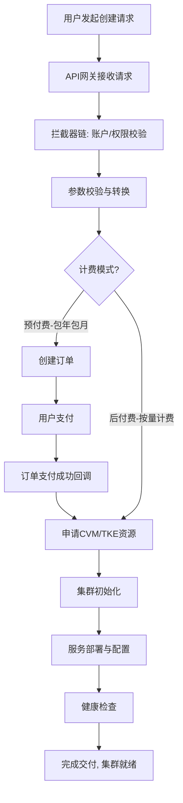

**核心环节说明：**

| 环节 | 说明 |
|------|------|
| **参数校验** | 验证资源规格、网络配置、安全组等参数的完整性和合法性 |
| **资源申请** | 预付费通过订单系统创建资源订单；后付费直接调用 CVM API 申请资源 |
| **集群初始化** | 安装大数据组件、配置服务参数、建立节点间通信、执行引导脚本 |
| **服务部署** | 通过 Woodpecker 工作流引擎编排，按 BPMN 流程逐阶段执行 |

**节点类型：**

- **Master 节点**：部署 NameNode、ResourceManager 等管理服务，需要高网络带宽和稳定性
- **Core 节点**：运行 DataNode、NodeManager 等数据存储服务，需要大存储容量
- **Task 节点**：提供额外计算能力，不存储数据，可弹性扩展
- **Router 节点**：部署路由服务（如 HDFS Router），提供联邦访问入口

**支持的部署模式：**
- CVM 集群（传统虚拟机部署）
- TKE/EKS 容器集群（Kubernetes 容器化部署）

### 2.2 集群扩容流程

扩容采用事件驱动架构，通过流程引擎编排复杂的多步骤操作。

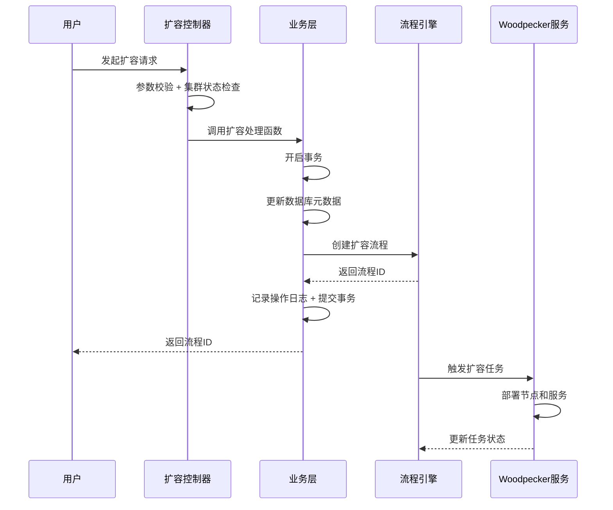

**关键特性：**
- 通过事务管理确保数据一致性
- 使用 Woodpecker 任务处理器执行实际的节点部署和服务初始化
- 扩容请求包含节点拓扑、服务列表、集群引导脚本、配置重载类型等信息
- CVM 集群调用 `ScaleoutCluster` 接口，容器集群调用 `ScaleoutNativeCluster` 接口

### 2.3 集群缩容/节点销毁流程

节点销毁支持 Master、Core、Task、Router 四种节点类型，用于集群缩容场景。

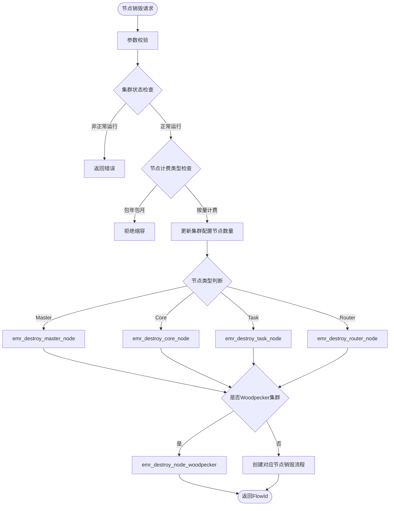

**核心业务规则：**
- 包年包月节点不允许单独缩容销毁
- 集群状态必须为 `CLUSTER_OK`（正常运行）才能执行节点缩容
- Woodpecker 集群所有节点类型统一使用 `emr_destroy_node_woodpecker` 流程

### 2.4 集群销毁流程

集群销毁是集群生命周期的最后阶段，用于释放所有计算、存储和网络资源。

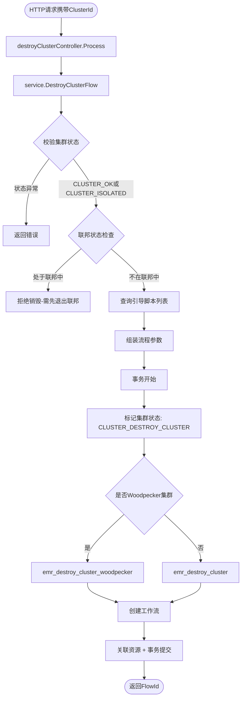

**特殊场景处理：**

| 场景 | 处理方式 |
|------|---------|
| 联邦集群销毁 | 必须先退出联邦才能执行销毁 |
| 虚拟集群销毁 | 更新 VC 状态、释放资源组、删除批调度队列 |
| Spot 实例销毁 | 通过定时任务 `SpotInstanceCheckJob` 自动检查和处理 |

### 2.5 集群状态机

集群状态通过状态机管理，涵盖 30+ 种状态：

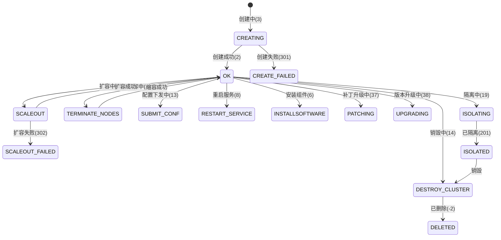

**核心状态说明：**

| 状态 | 编码 | 含义 |
|------|------|------|
| CLUSTER_OK | 2 | 集群正常运行 |
| CLUSTER_CREATING | 3 | 集群创建中 |
| CLUSTER_SCALEOUT | 4 | 集群扩容中 |
| CLUSTER_DESTROY_CLUSTER | 14 | 销毁集群中 |
| CLUSTER_TERMINATE_NODES | 24 | 缩容节点中 |
| CLUSTER_ISOLATED | 201 | 集群已隔离（预付费到期） |
| CLUSTER_NOT_AVAILABLE | 202 | 集群状态异常 |
| CLUSTER_CREATE_FAILED | 301 | 创建失败 |

---

## 三、交易计费系统

交易计费系统支持预付费（包年包月）和后付费（按量计费）两种模式，集成腾讯云交易系统完成订单创建、资源交付、续费退费等流程。

### 3.1 预付费模式（包年包月）

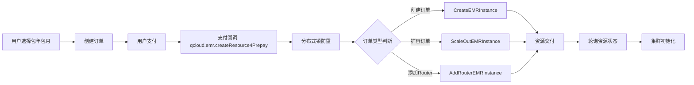

**核心流程：**
1. **订单创建**：生成大订单（集群全部资源）和小订单（单次交付资源）
2. **支付回调**：通过 `CreateResourceController` 处理，使用分布式锁确保幂等性
3. **资源交付**：调用 CVM API 申请计算资源，轮询资源状态直到就绪
4. **状态检查**：`checkOrderDelivered` 检查是否已交付，`checkOrderFailed` 检查是否失败

**支持的订单操作：**
- 创建、扩容、续费、退款、变配、销毁

### 3.2 后付费模式（按量计费）

后付费模式流程更简洁，无需订单和支付环节：


**关键差异：**

| 特性 | 预付费 | 后付费 |
|------|--------|--------|
| 支付方式 | 先付费后使用 | 先使用后付费 |
| 订单环节 | 需要创建订单和支付 | 直接申请资源 |
| 资源保障 | 资源有保障 | 按需申请 |
| 适用场景 | 稳定长期使用 | 临时或不确定时长 |
| 缩容限制 | 包年包月节点不允许单独缩容 | 可随时缩容 |

---

## 四、自动扩缩容系统

自动扩缩容提供负载驱动和时间策略两种模式，实现集群资源的弹性伸缩。

### 4.1 负载驱动扩容

当集群负载超过阈值时，系统自动触发扩容：

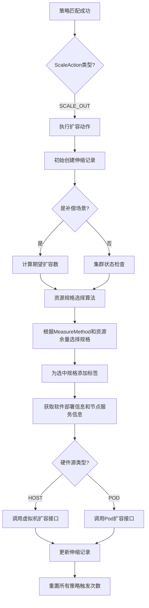

**测量方法（MeasureMethod）：**

| 方法 | 说明 |
|------|------|
| MEASURE_METHOD_DEFAULT | 默认方式 |
| MEASURE_METHOD_INSTANCE | 按机器台数 |
| MEASURE_METHOD_CPU | 按 CPU 核数 |
| MEASURE_METHOD_MEMERY_GB | 按内存 GB 数 |

### 4.2 负载驱动缩容

当负载低于阈值时，系统自动触发缩容：

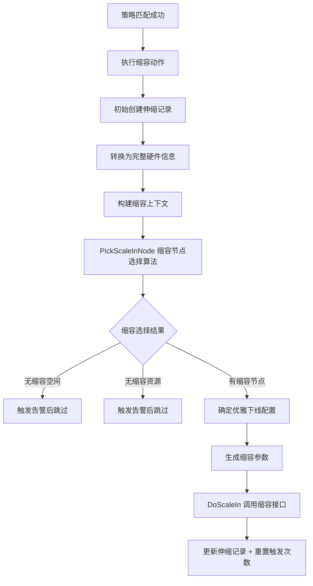

**缩容关键特性：**
- **优雅下线（GraceDownFlag）**：先停止新任务提交，等待现有任务完成后再缩容
- **节点选择算法**：优先缩容自动扩缩容节点，考虑创建时间、服务类型等因素
- **异常处理**：无缩容空间或无缩容资源时触发告警通知运维人员

### 4.3 时间驱动策略

允许用户预设扩缩容计划，按预定时间自动执行扩缩容操作，适用于有规律性负载波动的场景。

---

## 五、工作流引擎

工作流引擎是 TBDS 管控的核心执行框架，负责编排和执行所有集群管理操作。

### 5.1 三级执行模型（Job → Stage → Task）

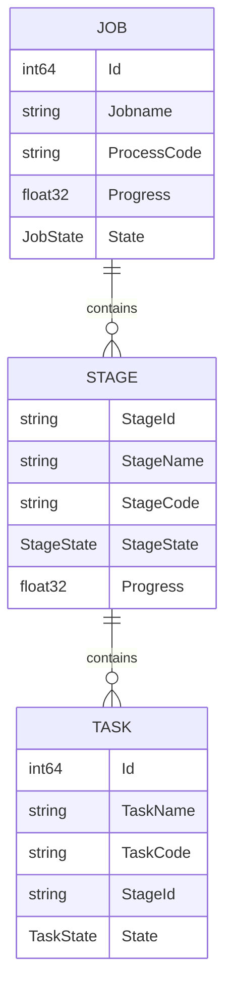

**三级结构说明：**

| 层级 | 说明 | 执行方式 |
|------|------|---------|
| **Job（作业）** | 完整的作业流程，通过 ProcessCode 标识流程类型 | 顺序执行多个 Stage |
| **Stage（阶段）** | 作业的一个执行阶段，通过 StageCode 区分类型 | 由 StageProducer 编排 |
| **Task（任务）** | 最小执行单元，通过 TaskCode 识别任务类型 | 由 TaskProducer 控制，支持并行或串行 |

### 5.2 状态流转机制

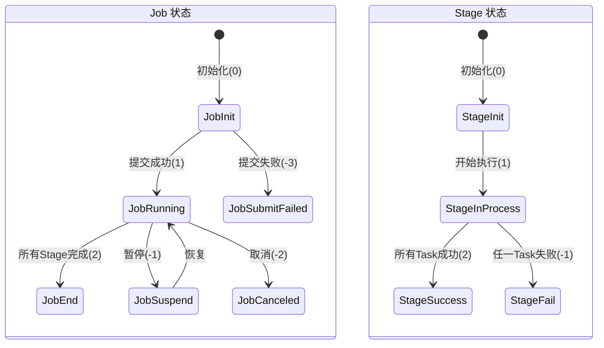

### 5.3 链式执行与断点续传

**链式执行逻辑：**
1. 通过 `SubmitJob` 提交作业
2. 系统按 ProcessCode 注册的 StageProducer 依次创建 Stage
3. 每个 Stage 通过 TaskProducer 生成并执行 Task 列表
4. 前置 Stage 完成后触发后序 Stage 创建

**断点续传机制：**
- 作业中断后通过 `LoadJobByProcessId` 查询当前状态
- 系统通过 State 字段定位断点位置
- 从失败或挂起节点的后续步骤继续执行
- 通过 ProcessId 保证幂等性，避免重复执行

### 5.4 Producer 扩展机制

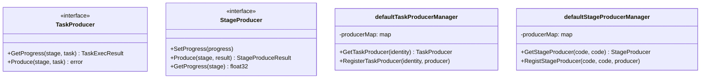

生产者通过 `Tuple(ProcessCode, StageCode)` 或 `TaskIdentity` 标识，支持动态注册，实现流程的灵活定制和类型扩展。

### 5.5 两层异步架构

TBDS 采用两层异步架构处理复杂操作：

```
┌─ emrcc 层（API Gateway）─────────────────────────────┐
│  Flow 步骤:                                           │
│    Step1: 发起请求 → POST woodpecker-server            │
│    Step2: 轮询结果 → 等待工作流完成                      │
│    Step3: endPoint → 更新集群状态                       │
└──────────────────────────────────────────────────────┘
                        │
                        ▼
┌─ woodpecker-server 层（工作流引擎）──────────────────┐
│  BPMN 阶段:                                          │
│    1. startPointStage → 流程初始化                     │
│    2. 核心业务 Stage → DB 操作 / 配置渲染              │
│    3. pushConfigStage → 推送配置到集群节点             │
│    4. 服务生命周期循环 → 重启相关服务                    │
│    5. endPointStage → 更新 DB 状态为已完成             │
└──────────────────────────────────────────────────────┘
```

### 5.6 命令执行与结果上报

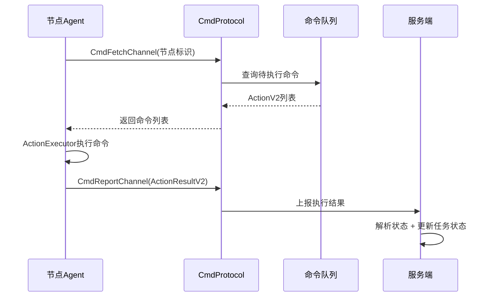

**命令执行器类型：**
- Shell 执行器：执行 Shell 命令
- 文件写入执行器：写入配置文件
- SQL 执行器：执行数据库操作

---

## 六、配置管理系统

配置管理是 TBDS 管控的核心能力之一，负责管理 54 个大数据组件的配置文件从"声明定义"到"渲染计算"再到"下发生效"的全链路。

### 6.1 三层配置架构

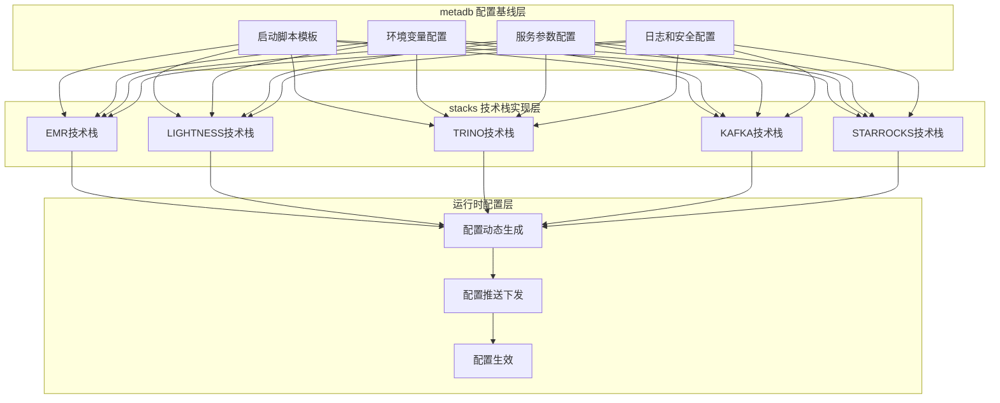

**各层职责：**

| 层级 | 职责 | 关键活动 | 输出物 |
|------|------|----------|--------|
| **metadb** | 配置标准化 | 定义 54 个组件的标准配置模板、元数据 | 配置基线文件 |
| **stacks** | 组件实现 | 为不同技术栈提供差异化配置值 | 组件元数据 + 配置值 |
| **运行时** | 动态生成 | JS 脚本动态渲染配置、处理 HA/联邦场景 | 最终配置文件 |

### 6.2 配置三件套

每个服务的配置由三部分协作生成：

| 组成部分 | 路径 | 说明 |
|---------|------|------|
| **configuration/*.json** | 静态配置项默认值 | 定义配置项名称、类型、默认值、分类 |
| **scripts/*.js** | 动态配置逻辑 | `configure()` 首次安装、`dependentConfigure()` 依赖组件加装、`writeConfiguration()` 每次下发时动态计算 |
| **templates/*.tpl** | 配置文件渲染模板 | 使用 `{{变量名.Value}}` 占位符渲染最终配置文件 |

### 6.3 配置格式支持

| 格式类型 | fileType | 典型文件 | 适用场景 |
|---------|----------|---------|---------|
| XML | sitexml | hdfs-site.xml、hive-site.xml | 组件核心配置 |
| Properties | properties | hadoop-metrics2.properties | 监控配置、日志配置 |
| Shell | shell | hadoop-env.sh、spark-env.sh | 环境变量、JVM 参数 |
| JSON | json | hdfshosts.json | 主机列表、结构化数据 |

### 6.4 配置联动机制

通过 `influenceItemNodes` 实现跨组件的配置同步：

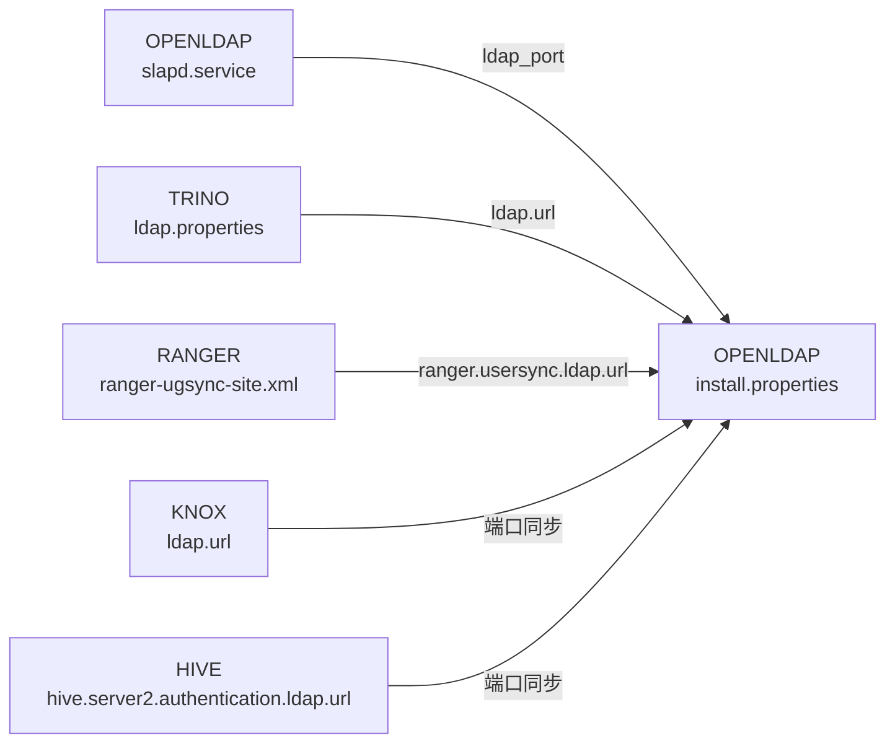

**核心依赖节点影响范围：**

| 共享组件 | 影响服务数量 | 操作类型 |
|---------|-------------|---------|
| OPENLDAP | 14 个服务 | pushconf |
| RANGER | 13 个服务 | pushconf |
| ZOOKEEPER | 4 个服务 | scaleout、destroynode、pushconf |
| KRB5 | 2 个服务 | pushconf |

### 6.5 配置继承与覆盖

配置继承遵循"就近原则"：

```
metadb 定义配置元数据（类型、范围、默认值）
    ↓ 继承
stacks 填充具体配置值（可覆盖默认值）
    ↓ 覆盖
运行时动态计算（JS 脚本根据集群状态动态生成）
```

不同技术栈对同一组件可提供不同配置：
- **EMR 技术栈**：完整的 EMR 生态集成配置
- **LIGHTNESS 技术栈**：轻量化部署的简化配置
- **TRINO 技术栈**：针对 TRINO 场景的专属配置

---

## 七、HDFS 联邦管理

HDFS 联邦是 TBDS 的高级特性，支持集群内联邦和跨集群联邦，实现 HDFS 命名空间的水平扩展。

### 7.1 联邦操作类型

| 编码 | 常量名 | 含义 |
|-----|--------|------|
| 10 | FederationOpInner | 集群内联邦 |
| 11 | FederationOpCrossCreate | 创建集群间联邦 |
| 12 | FederationOpCrossJoin | 加入已有联邦 |
| 13 | FederationOpNSExpand | 追加 NS 到已有联邦 |
| 20 | FederationOpCrossLeave | 退出集群间联邦 |
| 21 | FederationOpInnerDissolve | 解散集群内联邦 |
| 22 | FederationOpCrossDissolve | 解散集群间联邦 |

**辅助判断：**
- `IsEstablishOperation()`：10 ≤ OpType ≤ 19（建立类操作）
- `IsDestructiveOperation()`：20 ≤ OpType ≤ 29（解除类操作）

### 7.2 联邦工作流阶段

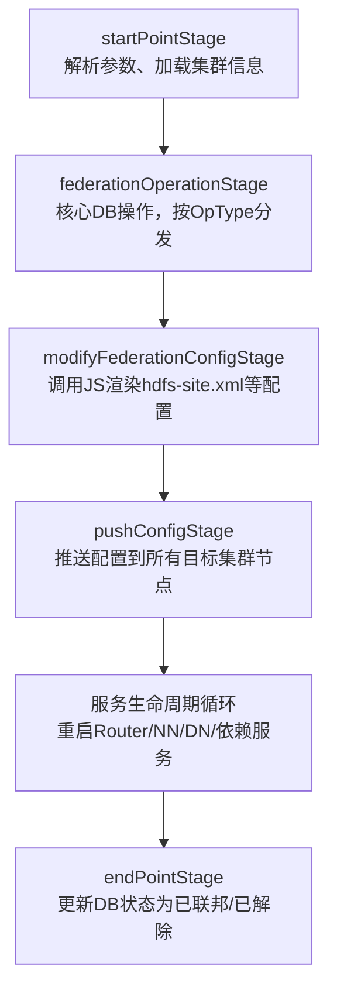

**各阶段职责：**

| 阶段 | 职责 |
|-----|------|
| **startPointStage** | 解析参数、加载集群信息、准备上下文 |
| **federationOperationStage** | 核心 DB 操作，按 OpType 分发到不同方法 |
| **modifyFederationConfigStage** | 调用 JS 渲染 hdfs-site.xml 等配置 |
| **pushConfigStage** | 推送配置到所有目标集群节点 |
| **服务生命周期循环** | 按服务循环重启 Router/NN/DN/依赖服务 |
| **endPointStage** | 更新 DB 状态为已联邦/已解除 |

### 7.3 联邦数据模型

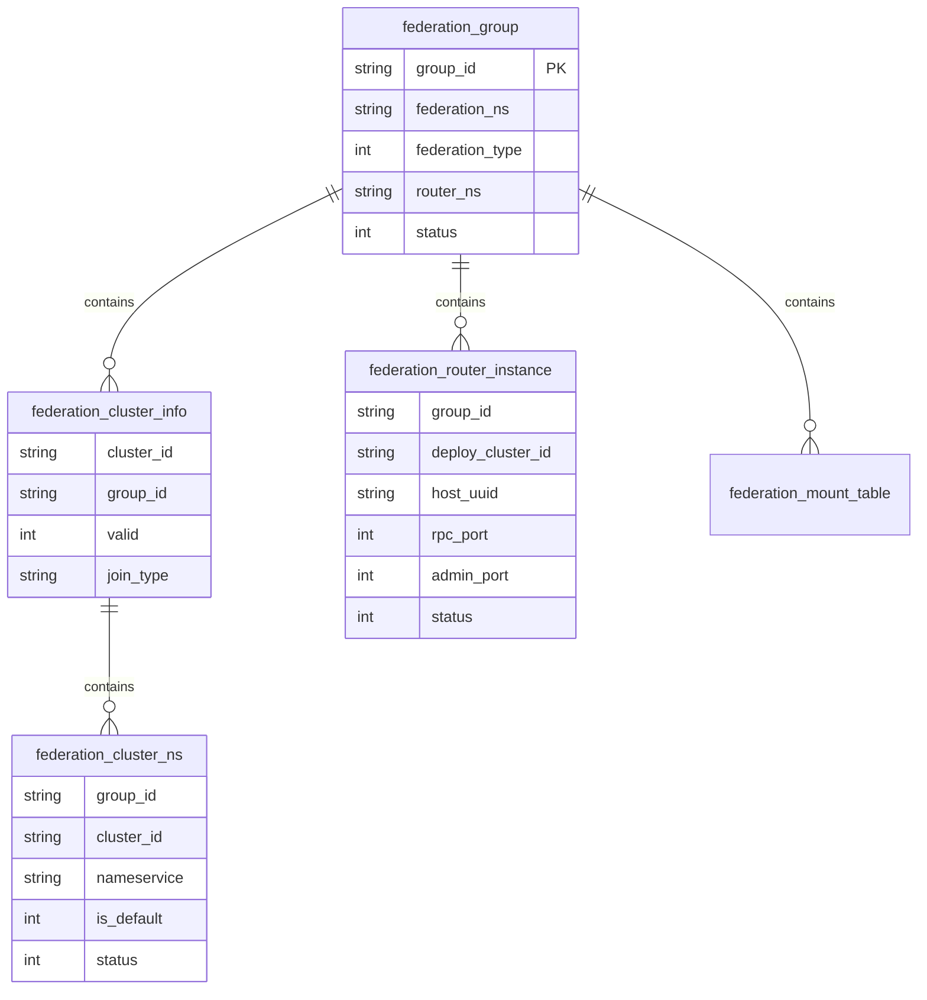

**状态流转：**

```
group/cluster/ns 状态:
  0(未联邦) → 1(联邦中) → 2(已联邦) → 3(解除联邦中) → 0/-1(清除)

router 状态:
  0(部署中) → 1(正常) → 3(卸载中) → 物理删除
                     → 2(异常) → 4(已停止)
```

### 7.4 配置渲染机制（Go → JS 调用链）

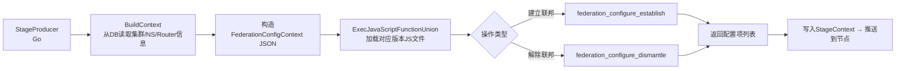

### 7.5 配置推送范围

| 操作类型 | 推送范围 |
|---------|---------|
| Inner(10) | 当前集群所有节点 |
| CrossCreate(11) | 发起集群 + 对方集群 |
| CrossJoin(12) | 加入集群 + 所有已有集群 |
| NSExpand(13) | 当前集群 + 所有联邦集群 |
| CrossLeave(20) | 退出集群 + 剩余集群 |

### 7.6 退出联邦后的状态处理

| 场景 | 操作 |
|-----|------|
| 退出成功 - 剩余≥2集群 | 恢复剩余集群状态，重算 federation_type |
| 退出成功 - 剩余1集群多NS | 降级为 Inner(1) |
| 退出成功 - 剩余1集群单NS | 自动解散，物理删除所有 DB 记录 |
| 解散成功 (21/22) | 物理删除所有联邦 DB 记录 |

---

## 八、云服务集成

TBDS 通过统一的组件层封装腾讯云基础设施服务，实现与底层云资源的解耦。

### 8.1 集成的云服务

| 服务类别 | 云服务 | 用途 |
|---------|--------|------|
| **计算资源** | CVM、TKE、EKS | 云服务器、容器服务、弹性容器实例 |
| **存储资源** | CBS、CDB | 云硬盘、云数据库 |
| **网络资源** | VPC | 私有网络、子网管理 |
| **安全认证** | CAM、TCS | 访问管理、认证服务 |
| **监控运维** | Barad、Prometheus、OpenTSDB | 云监控、指标采集、告警通知 |

### 8.2 CVM 实例管理

CVM 实例申请通过 `ApplyCvm` 函数实现：

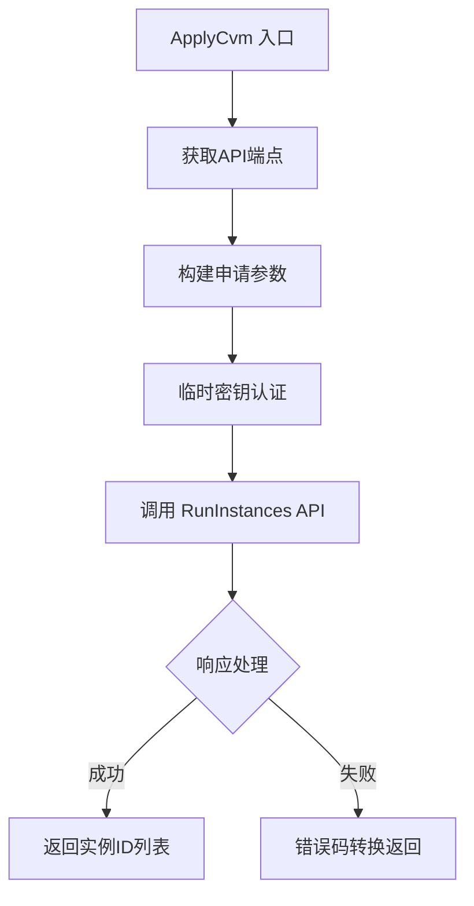

**支持的存储类型：**
- 云硬盘（数据持久化，支持快照备份）
- 本地 SSD 盘（低延迟、高吞吐）
- 高效云硬盘（平衡性能和成本）
- 增强型 SSD 云硬盘（高 IOPS）

---

## 九、监控与服务治理

### 9.1 监控体系

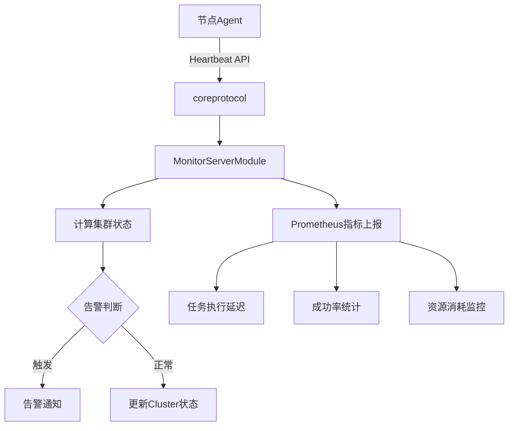

**监控能力：**
- 节点心跳检测与状态同步
- 服务健康检测（HTTP、RPC、进程等多种检测方式）
- Prometheus 指标采集（API 延迟、系统状态、错误计数）
- 告警与自动恢复

### 9.2 定时任务调度

系统内置 30+ 定时任务，覆盖多个场景：

| 场景 | 说明 |
|------|------|
| 扩缩容调度 | 负载检测、策略匹配、自动扩缩容 |
| 告警处理 | 指标采集、阈值判断、通知发送 |
| 数据清理 | 过期数据清理、日志归档 |
| 计费结算 | 用量统计、费用计算 |
| Spot 实例检查 | 竞价实例状态监控和自动处理 |

### 9.3 分布式协调

- **分布式锁**：支持 Redis/ZooKeeper 双后端，确保多节点环境下的一致性
- **领导者选举**：通过 Redis 主从选举确保单实例执行关键任务
- **消息队列**：基于 Redis 实现命令下发和结果上报

---

## 十、安全配置自动化

### 10.1 安全能力矩阵

| 安全层面 | 自动化内容 | 涉及组件 |
|---------|-----------|---------|
| **身份认证** | Kerberos principal/keytab 创建 | HDFS、HIVE、YARN、KNOX 等 |
| **凭证加密** | bind.jceks、plugin.jceks 生成 | HDFS、HIVE、RANGER、HBASE 等 |
| **通信加密** | SSL 证书生成、keystore 创建 | 所有支持 SSL 的组件 |
| **访问控制** | Ranger 插件凭证和策略 | 所有集成 RANGER 的组件 |

### 10.2 安全配置流程

```mermaid
graph TD
    A[服务初始化] --> B{检测启用模式}
    B -->|Kerberos启用| C[创建Principal]
    C --> D[生成Keytab]
    B -->|LDAP启用| E[获取LDAP密码]
    E --> F[创建bind.jceks]
    B -->|Ranger集成| G[获取Ranger密码]
    G --> H[生成plugin.jceks]
    B -->|SSL启用| I[执行createCA.sh]
    I --> J[生成keystore]
    D & F & H & J --> K[同步组件配置]
    K --> L[安全配置完成]
```

**Kerberos 支持模式：**
- MIT Kerberos
- AD Kerberos
- 共享 Kerberos

---

## 十一、核心业务流程总结

### 11.1 业务复杂度矩阵

| 业务流程 | 涉及项目 | 复杂度 | 关键技术点 |
|---------|---------|--------|-----------|
| 集群创建 | emrcc → woodpecker-server → te-stacks → agent | ⭐⭐⭐⭐⭐ | 双计费模式、资源编排、服务部署 |
| 集群扩容 | emrcc → woodpecker-server → agent | ⭐⭐⭐⭐ | 事务管理、节点部署、配置同步 |
| 集群销毁 | emrcc → woodpecker-server → agent | ⭐⭐⭐ | 联邦检查、资源释放、状态清理 |
| 配置下发 | emrcc → woodpecker-server → te-stacks → agent | ⭐⭐⭐⭐ | 三层渲染、配置联动、模板引擎 |
| HDFS 联邦 | emrcc → woodpecker-server → te-stacks → agent | ⭐⭐⭐⭐⭐ | 跨集群操作、Go→JS 调用、状态管理 |
| 自动扩缩容 | emrcc（定时任务） | ⭐⭐⭐⭐ | 负载检测、策略匹配、补偿机制 |
| 交易计费 | emrcc → 腾讯云交易系统 | ⭐⭐⭐ | 订单管理、支付回调、幂等控制 |

### 11.2 技术亮点

1. **两层异步架构**：emrcc 层 Flow + woodpecker-server 层 BPMN，实现复杂操作的可靠执行
2. **Job-Stage-Task 三级模型**：灵活的流程编排，支持断点续传和链式执行
3. **Go → JS 配置渲染**：利用 JS 的灵活性处理复杂的配置逻辑（HA、联邦等场景）
4. **配置继承与联动**：metadb → stacks → 运行时三层继承，跨组件配置自动同步
5. **分布式锁 + 事务**：确保并发操作的数据一致性和幂等性
6. **Producer 扩展机制**：通过接口注册实现流程的灵活定制，新增业务只需注册新的 Producer
