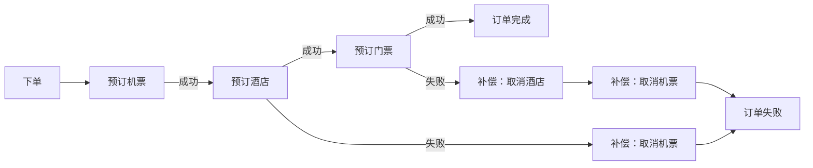
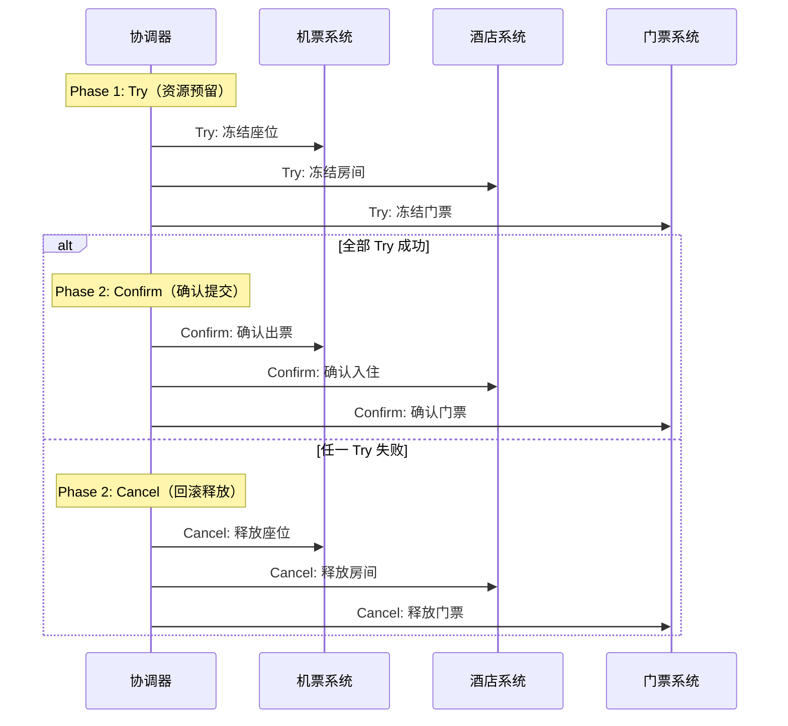
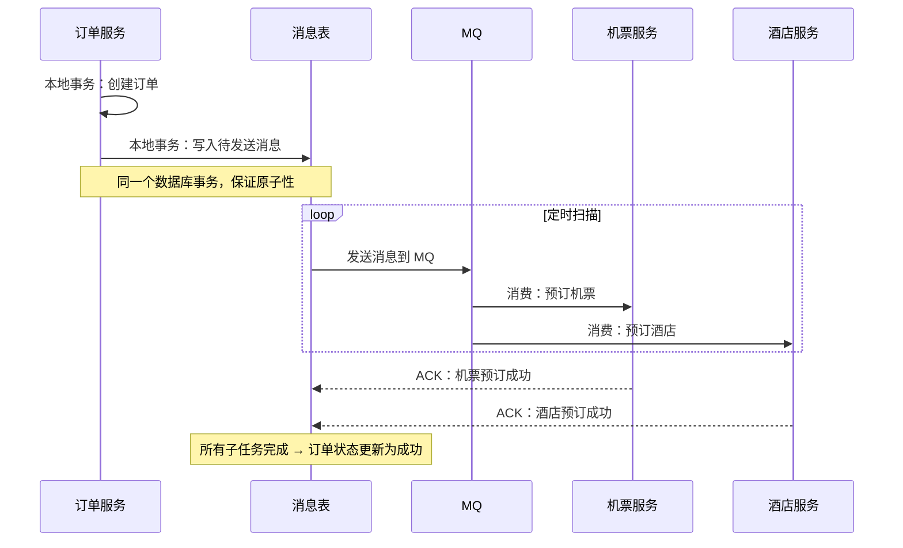
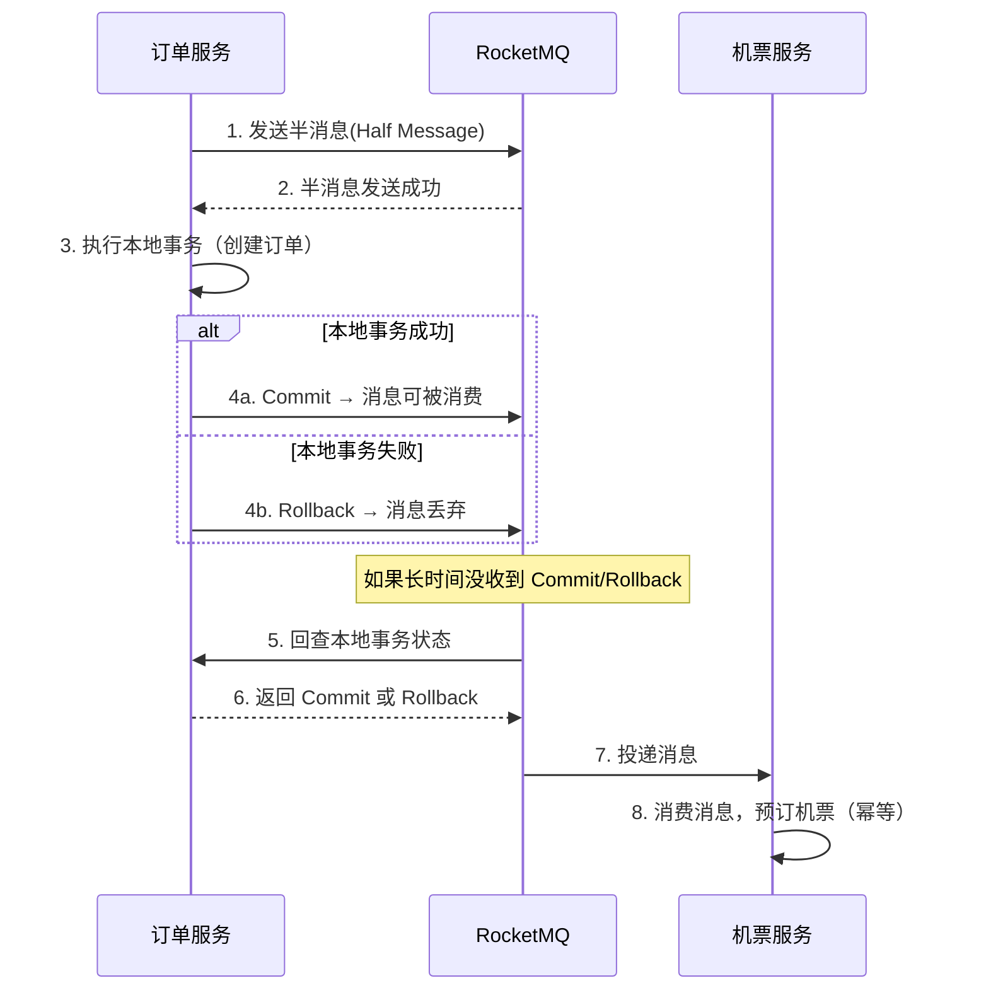
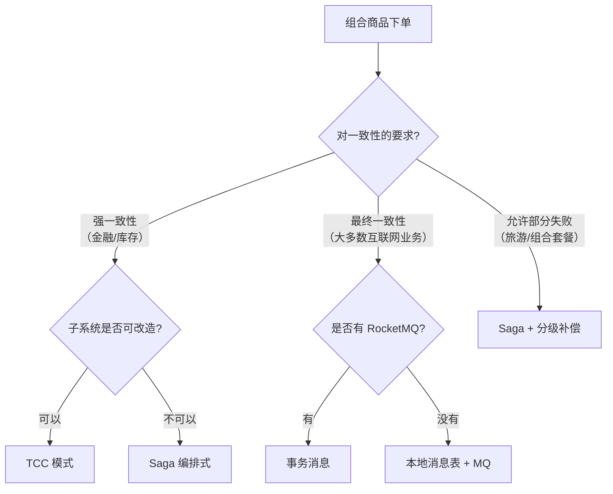
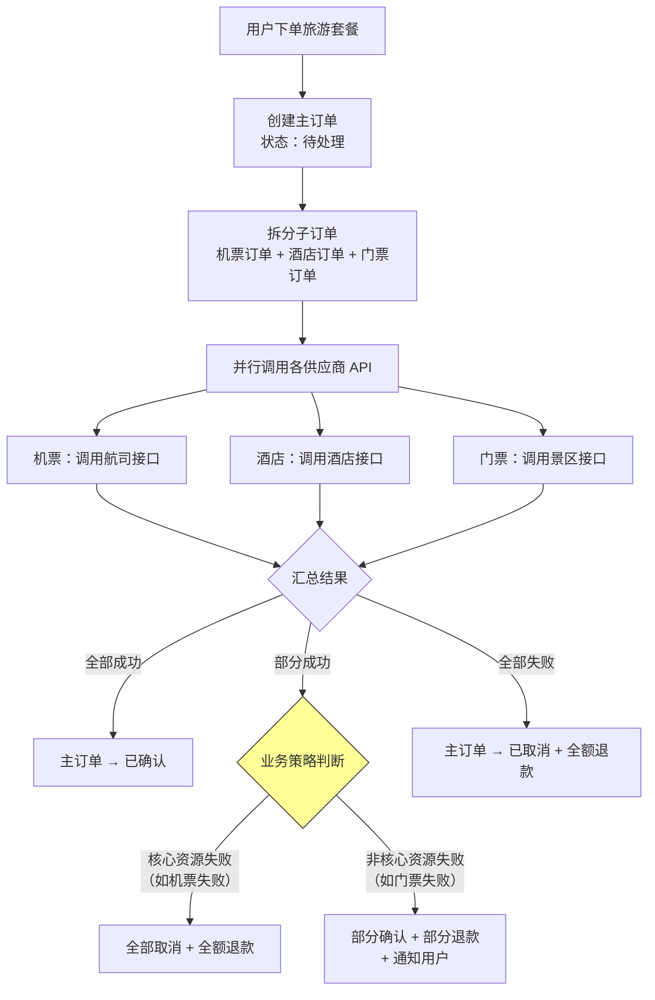
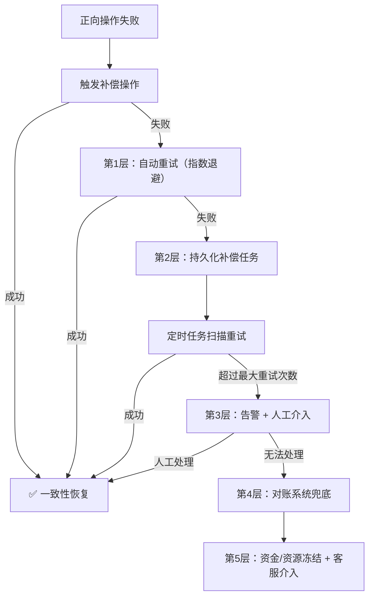
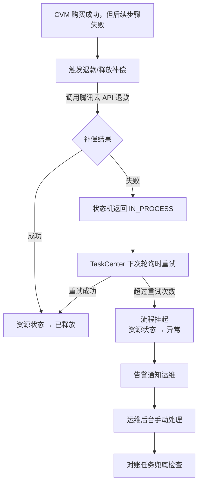

# 业界组合商品一致性方案全景

> 本文档整理了业界对于"用户下单一个组合商品"场景的分布式一致性解决方案，涵盖 Saga、TCC、本地消息表、事务消息等主流方案的完整对比分析，以及旅游套餐等典型场景的最佳实践。

---

## 一、问题本质

用户下单一个组合商品（如旅游套餐 = 机票 + 酒店 + 门票），本质上是一个 **分布式事务问题**：

- 多个独立子系统（航空公司、酒店系统、景区系统）需要协同完成
- 每个子系统有独立的库存、支付、确认流程
- 任何一步失败都需要处理已完成的部分

---

## 二、业界主流方案对比

### 方案 1：Saga 模式（编排式 / 协同式）

**最主流的方案**，被 Uber、Netflix、阿里等广泛使用。



**两种实现方式**：

| 类型 | 编排式 (Orchestration) | 协同式 (Choreography) |
|------|----------------------|----------------------|
| 协调方式 | 中心协调器统一调度 | 各服务通过事件自驱动 |
| 代表框架 | Seata Saga、Temporal、Cadence | 基于 MQ 的事件驱动 |
| 适用场景 | 步骤多、逻辑复杂 | 步骤少、服务解耦 |
| 优点 | 流程清晰、易于监控 | 松耦合、扩展性好 |
| 缺点 | 协调器是单点 | 流程难追踪、调试困难 |

**典型实现（编排式）**：
```
// 伪代码：Saga 编排器
saga := NewSaga("旅游套餐下单")
    .Step("预订机票", bookFlight, cancelFlight)    // 正向操作 + 补偿操作
    .Step("预订酒店", bookHotel, cancelHotel)
    .Step("预订门票", bookTicket, cancelTicket)
    .Build()

saga.Execute(orderRequest)
// 如果 Step3 失败 → 自动执行 cancelHotel → cancelFlight
```

**业界案例**：
- **Uber Cadence / Temporal**：Uber 的行程订单（叫车 + 支付 + 司机匹配）
- **阿里 Seata**：电商订单（扣库存 + 创建订单 + 扣余额）

---

### 方案 2：TCC（Try-Confirm-Cancel）

**金融级一致性方案**，适合对一致性要求极高的场景。



**核心特点**：
- 每个参与方必须实现 **Try / Confirm / Cancel** 三个接口
- Try 阶段只做**资源预留**（冻结库存），不真正扣减
- 所有 Try 成功后才 Confirm，任一失败则全部 Cancel
- **业务侵入性大**：每个服务都要改造

**适用场景**：
- 金融转账（A 账户冻结 → B 账户冻结 → 双方确认）
- 库存扣减（对超卖零容忍的场景）

**业界案例**：
- **蚂蚁金服 DTX**：支付宝转账
- **ByteTCC**：字节跳动内部交易系统

---

### 方案 3：本地消息表 + 最终一致性

**最务实的方案**，适合大多数互联网业务。



**核心思路**：
- 利用**本地数据库事务**保证"订单创建"和"消息写入"的原子性
- 通过**定时任务**扫描消息表，确保消息一定会被发出
- 下游服务消费消息后执行操作，**幂等处理**防止重复消费
- 最终所有子任务完成后，订单状态更新为成功

**业界案例**：
- **美团外卖**：下单 → 通知商家 → 通知骑手
- **大众点评**：团购订单 → 核销 → 结算

---

### 方案 4：可靠消息最终一致性（事务消息）

**本地消息表的升级版**，把消息可靠性交给 MQ 中间件。



**核心优势**：
- 不需要本地消息表，MQ 自身保证消息可靠性
- RocketMQ 原生支持事务消息
- 通过**回查机制**解决生产者宕机问题

**业界案例**：
- **阿里电商**：RocketMQ 事务消息是阿里内部的标准方案
- **京东**：JMQ 事务消息

---

## 三、方案选型决策树



---

## 四、旅游套餐场景的业界最佳实践

实际上，**旅游行业**的组合商品是最复杂的场景之一，因为：
- 机票、酒店、门票是**完全独立的第三方系统**
- 第三方 API 不一定支持"预留"或"补偿"语义
- 库存是实时变化的（航班座位、酒店房间）
- 部分资源可能允许"部分成功"（机票订到了但酒店满了）

**业界实际做法（携程/飞猪/美团旅行）**：



**关键设计**：

1. **预扣款 + 异步确认**：先冻结用户资金，等所有子订单确认后再实际扣款
2. **超时自动取消**：每个子订单有确认超时时间（如 15 分钟），超时自动释放
3. **分级补偿策略**：核心资源（机票）失败则全部取消，非核心资源（门票）失败可部分交付
4. **对账兜底**：每天定时对账，发现不一致的订单人工介入

---

## 五、总结对比

| 方案 | 一致性级别 | 业务侵入性 | 性能 | 复杂度 | 典型场景 |
|------|-----------|-----------|------|--------|---------|
| **TCC** | 强一致 | 高（三个接口） | 中 | 高 | 金融转账、库存扣减 |
| **Saga 编排式** | 最终一致 | 中（正向+补偿） | 高 | 中 | 订单交付、资源编排 |
| **Saga 协同式** | 最终一致 | 低（事件驱动） | 高 | 中 | 微服务解耦场景 |
| **本地消息表** | 最终一致 | 低 | 高 | 低 | 通知类、异步处理 |
| **事务消息** | 最终一致 | 低 | 高 | 低 | 阿里系标准方案 |
| **2PC/XA** | 强一致 | 低 | 低 | 高 | 传统数据库跨库事务 |

---

## 六、与 TBDS 交易计费系统的关联

**面试中的推荐话术**：

> "业界对组合商品的一致性方案主要有 TCC、Saga、本地消息表、事务消息几种。**TCC 适合金融级强一致性**，但要求每个参与方实现三个接口，侵入性大；**Saga 适合长流程编排**，通过正向操作+补偿操作实现最终一致性；**本地消息表和事务消息**适合异步场景。实际业务中，像携程这种旅游套餐，用的是 **Saga 编排式 + 分级补偿**——核心资源失败全部回滚，非核心资源失败部分交付。我们的系统也是类似思路，用异步工作流 + 三态状态机实现编排式最终一致性，没有用标准 Saga 框架，因为外部 API 不支持标准的补偿语义。"

**TBDS 方案与业界方案的对应关系**：

| TBDS 实现 | 对应的业界方案 | 说明 |
|-----------|--------------|------|
| TaskCenter 轮询 + 三态返回 | Saga 编排式 | 中心协调器驱动，支持重试 |
| Redis 分布式锁 + FlowId 重入 | 幂等性保障 | 防止重复回调 |
| 本地 MySQL 事务 | 本地消息表思路 | 订单+资源状态在同一事务 |
| tradeCheckResourcePrice | 对账兜底 | 定时校验价格一致性 |
| PartsRefundResource | 分级补偿 | 部分失败时部分退款 |
| 挂起流程 + 人工告警 | 人工兜底 | 涉及金额不自动补偿 |

---

## 七、面试中的延伸话题

如果面试官继续追问，可以延伸到以下话题：

### 7.1 为什么不用 2PC/XA？

> "2PC 需要所有参与方支持 XA 协议，但我们对接的是腾讯云 CVM/CDB 的 REST API，不支持 XA。而且 2PC 的同步阻塞特性会严重影响性能，不适合我们这种需要几分钟才能完成的长流程。"

### 7.2 Temporal/Cadence 了解吗？

> "了解，Temporal 是 Uber 开源的工作流引擎，本质上是 Saga 编排式的标准化实现。它的 Activity + Workflow 模型和我们的 TaskHandler + Flow 模型很像。如果从零开始做，我会考虑用 Temporal，但我们已有成熟的 TaskCenter 框架，迁移成本大于收益。"

### 7.3 如何处理"半成功"状态？

> "我们有三种策略：①可重试错误（网络超时）→ 状态机返回 IN_PROCESS，自动重试；②部分失败（3 台 CVM 只成功 2 台）→ 自动触发部分退款流程；③不可恢复错误 → 挂起流程 + 告警，人工介入。涉及金额的操作，人工兜底比自动补偿更安全。"

---

## 八、补偿操作失败的处理策略

### 8.1 核心矛盾

补偿操作失败是一个**递归问题**——如果补偿的补偿也失败了怎么办？业界的共识是：**不能无限递归，必须有兜底机制**。

### 8.2 业界主流的 5 层防线



---

#### 第 1 层：自动重试（最常见）

大多数补偿失败是**临时性故障**（网络抖动、服务重启、超时），重试就能解决。

```
// 伪代码：指数退避重试
func compensateWithRetry(action CompensateAction, maxRetries int) error {
    for i := 0; i < maxRetries; i++ {
        err := action.Execute()
        if err == nil {
            return nil
        }
        
        if !isRetryable(err) {
            break  // 不可重试的错误，直接跳到下一层
        }
        
        // 指数退避：1s → 2s → 4s → 8s → ...
        time.Sleep(time.Duration(math.Pow(2, float64(i))) * time.Second)
    }
    return ErrCompensateFailed
}
```

**关键点**：补偿操作必须是**幂等的**，否则重试会导致重复补偿（比如退款退了两次）。

---

#### 第 2 层：持久化补偿任务

如果即时重试失败，把补偿任务**持久化到数据库**，由后台定时任务继续重试。

```sql
-- 补偿任务表
CREATE TABLE compensate_task (
    id          BIGINT PRIMARY KEY,
    order_id    VARCHAR(64),
    action_type VARCHAR(32),    -- 'cancel_flight', 'refund_payment'
    payload     JSON,           -- 补偿所需的参数
    status      ENUM('pending', 'retrying', 'success', 'failed', 'manual'),
    retry_count INT DEFAULT 0,
    max_retries INT DEFAULT 10,
    next_retry  DATETIME,       -- 下次重试时间
    created_at  DATETIME,
    updated_at  DATETIME
);
```

定时任务每隔一段时间扫描 `status = 'pending' OR status = 'retrying'` 的记录，继续执行补偿。这样即使服务重启，补偿任务也不会丢失。

---

#### 第 3 层：告警 + 人工介入

超过最大重试次数后，**不再自动重试**，而是：
1. 将任务状态标记为 `manual`
2. 发送告警（短信/企微/钉钉）给运维或业务人员
3. 提供运维后台，支持人工查看详情并手动触发补偿

> **这是业界最重要的共识**：涉及金额的补偿操作，人工兜底比自动无限重试更安全。自动重试可能在异常场景下造成更大的损失（比如重复退款）。

---

#### 第 4 层：对账系统兜底

每天/每小时运行**对账任务**，比对各系统的数据一致性：

```
// 对账逻辑伪代码
func reconcile() {
    orders := getOrdersInTimeRange(yesterday)
    for _, order := range orders {
        // 检查：订单已取消，但 CVM 还在运行？
        if order.Status == "cancelled" && cvm.IsRunning(order.ResourceId) {
            alert("资源泄漏", order)
            autoCleanup(order.ResourceId)  // 或人工处理
        }
        
        // 检查：订单已取消，但退款未到账？
        if order.Status == "cancelled" && !payment.IsRefunded(order.PaymentId) {
            alert("退款异常", order)
            retryRefund(order.PaymentId)
        }
    }
}
```

---

#### 第 5 层：资金冻结 + 客服介入

极端情况下（如第三方系统长时间不可用），采取**防御性措施**：
- **冻结相关资金**，不让用户和商家使用
- **客服介入**，人工协调各方
- **记录完整审计日志**，便于事后追溯

---

### 8.3 不同方案对补偿失败的处理差异

| 方案 | 补偿失败处理 | 特点 |
|------|-------------|------|
| **Saga（Temporal/Cadence）** | 框架内置重试策略 + 死信队列 + 人工干预面板 | 最完善，框架帮你做了大部分 |
| **TCC** | Cancel 失败 → 记录悬挂事务 → 定时清理 | Cancel 必须幂等，框架会持续重试 |
| **本地消息表** | 消息消费失败 → MQ 重试 → 死信队列 → 人工处理 | 依赖 MQ 的重试机制 |
| **自研编排（如 TBDS）** | 状态机挂起 → 告警 → 人工介入 | 灵活但需要自己实现所有防线 |

---

### 8.4 TBDS 交易计费系统的实际做法

在我们的系统中，补偿失败的处理是这样的：



**核心设计原则**：
1. **涉及金额的操作不自动补偿** → 挂起 + 人工介入
2. **不涉及金额的操作可自动重试** → 如释放 CVM 实例
3. **所有补偿操作必须幂等** → 通过 FlowId + 分布式锁保证

---

### 8.5 面试中怎么回答这个问题

> **面试官**：补偿操作也失败了怎么办？
> 
> **回答**：这是分布式系统中的经典问题。我们的处理策略是**分层防御**：
> 
> 第一层，**自动重试**，大部分补偿失败是临时性故障，指数退避重试 3-5 次就能解决，前提是补偿操作必须是幂等的；
> 
> 第二层，**持久化重试**，如果即时重试失败，把补偿任务写入数据库，由后台定时任务继续重试；
> 
> 第三层，**人工兜底**，超过最大重试次数后不再自动重试，而是告警通知运维人工处理。特别是涉及金额的操作，人工兜底比自动无限重试更安全；
> 
> 第四层，**对账系统**，每天定时对账，发现数据不一致的记录自动修复或人工介入。
> 
> 本质上，分布式系统**不可能做到 100% 自动化处理所有异常**，关键是要有**完整的降级链路**，确保问题不会被遗漏。
