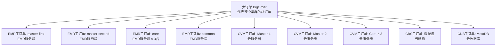
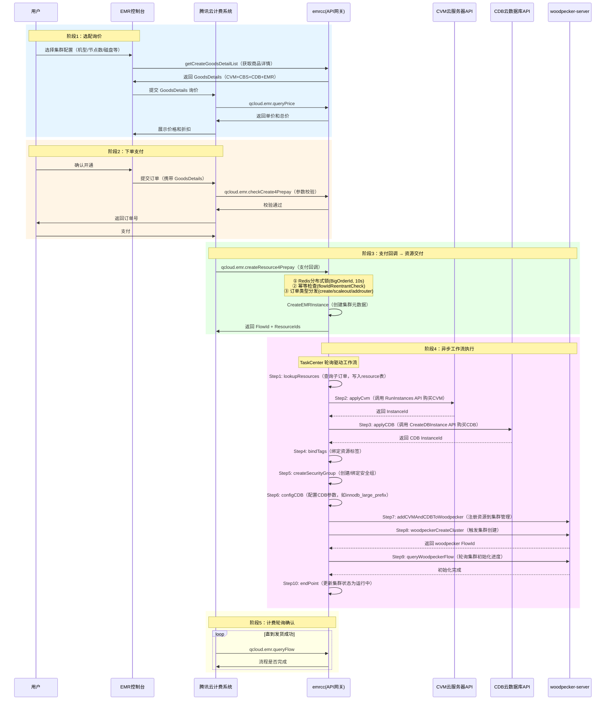
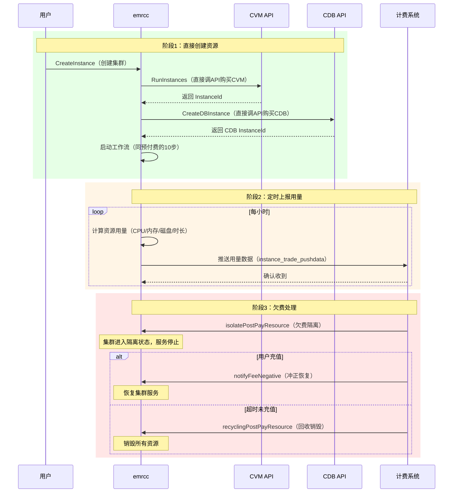
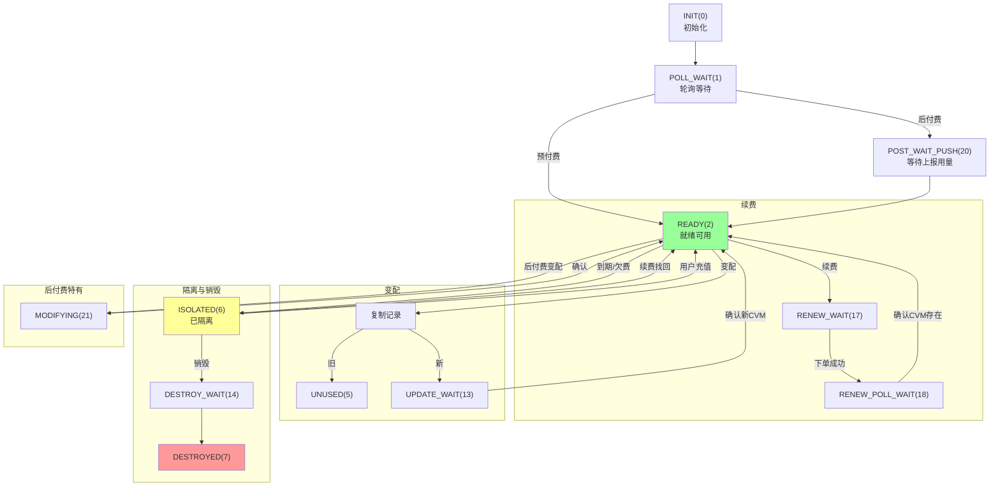
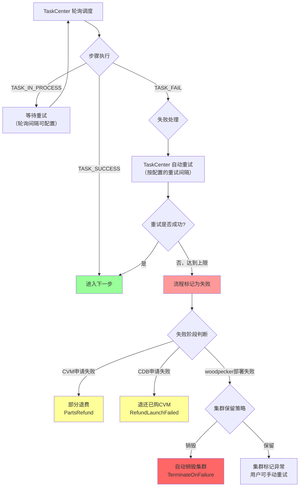

# 交易计费系统 —— 详细业务流程与失败处理机制

> 本文档详细梳理了 TBDS/EMR 交易计费系统从用户下单到资源交付的完整链路，以及工作流中每一步失败时的处理机制。

---

## 一、客户到底购买了什么？

当用户在 EMR 控制台创建一个大数据集群时，他实际上购买的是**一组云资源的组合**，而不是单个产品。以一个典型的 HA 集群为例：

```
用户购买一个 HA 集群 = 
  ├── 2 台 Master 节点 CVM（云服务器）
  ├── 3 台 Core 节点 CVM（存储+计算）
  ├── N 台 Task 节点 CVM（纯计算，可选）
  ├── N 台 Common 节点 CVM（公共服务，可选）
  ├── N 台 Router 节点 CVM（路由，可选）
  ├── 每台 CVM 附带的 CBS 云盘（系统盘 + 数据盘）
  ├── 1 个 CDB 云数据库实例（MetaDB，给 Hive/Ranger 等组件用）
  └── EMR 服务费（按节点类型和规格计费）
```

### 1.1 订单结构：大订单 + 子订单

系统采用**大订单（BigOrder）+ 子订单（ChildOrder）**的两层结构：



代码中的注释写得很清楚（来自 `EmrCreateGoodsDetail` 的注释）：

> 比如，新建一个HA集群，包含2个master节点、3个common节点、3个core节点；这里会生成一个大订单；然后，这个大订单下面，会有很多子订单；这些子订单分为**EMR订单、CVM订单、CBS订单、CDB订单**；其中，EMR订单包括 master-first、master-second、common、core 4个子订单。

### 1.2 每个子订单的商品详情（GoodsDetail）

每个子订单都有一个 `GoodsDetail`，描述了具体购买的资源规格：

**EMR 子订单（`EmrCreateGoodsDetail`）：**
```json
{
  "timeSpan": 1,           // 购买时长
  "timeUnit": "m",         // 时长单位（m=月）
  "goodsNum": 3,           // 商品数量（如3台Core节点）
  "alias": "core",         // 节点类型标识
  
  // IaaS 层规格（CVM 硬件）
  "IaasCpu": 8,            // CPU 核数
  "IaasMem": 32,           // 内存 GB
  "IaasSpec": "S5",        // 机型族
  "InstanceType": "S5.2XLARGE32",  // 具体机型
  "IaasCbsVolume": 100,    // CBS 云盘大小 GB
  "IassCbsType": "CLOUD_SSD",     // 云盘类型
  "IaasLocalVolume": 0,    // 本地盘大小
  
  // EMR 服务费规格
  "ServiceCpu": 8,
  "ServiceMem": 32,
  "ServiceSpec": "S5",
  
  // 询价参数（传给计费系统计算价格）
  "PriceParam": {}
}
```

**CVM 子订单（`CvmCreateGoodsDetail`）：**
```json
{
  "Compute": { "Cpu": 8, "Mem": 32768 },     // 计算规格
  "DiskInfo": {                                // 磁盘信息
    "Root": { "Type": "CLOUD_SSD", "Size": 50 },   // 系统盘
    "Data": { "Type": "CLOUD_SSD", "Size": 500 }   // 数据盘
  },
  "Network": {                                 // 网络配置
    "VpcId": 12345,
    "SubnetId": 67890,
    "SgIds": ["sg-xxx"]                        // 安全组
  },
  "Location": {                                // 地域信息
    "RegionId": 1,
    "ZoneId": 100001,
    "ProjectId": 0
  },
  "Payment": {                                 // 付费信息
    "GoodsNum": 1,
    "TimeUnit": "m",
    "TimeSpan": 1,
    "CvmPayMode": 1                            // 1=预付费
  }
}
```

---

## 二、预付费（包年包月）完整流程

这是最复杂的流程，涉及**用户→前端→计费系统→emrcc→CVM/CDB API→woodpecker**的完整链路。



### 2.1 阶段 1：选配询价（用户还没花钱）

用户在 EMR 控制台选择集群配置后，前端调用 `getCreateGoodsDetailList` 接口获取商品详情列表。emrcc 会根据用户选择的配置，**并行构造**四类商品详情：

```go
// 并行查询四类商品详情
func QueryEmrClusterGoodsList(...) {
    switch specType {
    case model.CVM_TYPE:   // CVM 云服务器订单
        cvmGoodsList, _ := getCvmCreateOrders(createContext)
    case model.CDB_TYPE:   // CDB 云数据库订单
        ...
    case model.CBS_TYPE:   // CBS 云硬盘订单
        ...
    case model.EMR_TYPE:   // EMR 服务费订单
        ...
    }
}
```

每种节点类型（Master/Core/Task/Common/Router）都会生成对应的 `BaseEmrGoodsDetail`，包含：
- **IaaS 层**：CPU、内存、机型（如 S5.2XLARGE32）、本地盘/云盘规格
- **服务费层**：EMR 服务费的计算基准
- **询价参数**：传给计费系统用于计算价格的参数

### 2.2 阶段 2：下单支付

用户确认开通后，计费系统会先调用 `checkCreate4Prepay` 做参数校验，然后生成订单。用户支付后，计费系统调用 `GenerateDealsAndPayV2` 生成大订单：

```go
// 预付费下单
tradeCgwService := component.NewTradeCgwService(createContext.RegionId)
_, _, Reply, err = tradeCgwService.GenerateDealsAndPayV2(
    p.Request.Uin,       // 用户 UIN
    p.Request.AppId,     // AppId
    GoodsDetails,        // 所有商品详情（CVM+CBS+CDB+EMR）
    EvenId,              // 事件ID
    0,                   // 标志位
)
```

计费系统返回 `BigDealId`（大订单号），后续所有操作都以这个大订单号为关联键。

### 2.3 阶段 3：支付回调（最核心的入口）

用户支付成功后，计费系统回调 `createResource4Prepay` 接口。这是整个流程的**核心入口**：

```
计费回调 → 解析参数 → 查询大订单 → 分布式锁 → 幂等检查 → 创建集群 → 启动工作流
```

**三重防护机制：**

1. **分布式锁**：以 `BigOrderId` 为键，10 秒超时，防止计费系统重复回调
2. **幂等检查**：`flowIdReentrantCheck` 检查是否已有关联流程，有则直接返回
3. **订单类型分发**：根据 `OrderType` 分发到 `CreateEMRInstance`（创建）/ `ScaleOutEMRInstance`（扩容）/ `AddRouterEMRInstance`（添加Router）

### 2.4 阶段 4：异步工作流（10 步流水线）

支付回调触发后，系统启动一个**异步工作流**，由 TaskCenter 轮询驱动。工作流包含 10 个步骤：

| 步骤 | Handler | 做了什么 | 详细说明 |
|------|---------|---------|---------|
| **1. lookupResources** | `LookupResourcesHandler` | 查询子订单，写入 resource 表 | 调用计费接口 `LookupChildrenOrderID` 获取大订单下的所有子订单（CVM/CDB/CBS/EMR），解析每个子订单的 ResourceId，写入 `resources` 表，状态设为 `POLL_WAIT(1)` |
| **2. applyCvm** | `applyCvmHandler` | 购买 CVM 云服务器 | 调用腾讯云 CVM API `RunInstances`，传入机型、镜像、磁盘、VPC、安全组等参数，获取 InstanceId |
| **3. applyCDB** | `applyCdbHandler` | 购买 CDB 云数据库 | 调用 CDB API 创建实例（4000MB 内存 / 100GB 磁盘），用于 Hive/Ranger 等组件的 MetaDB |
| **4. bindTags** | `bindTagsHandler` | 绑定资源标签 | 给 CVM/CDB 绑定用户自定义标签（如部门、项目等） |
| **5. createSecurityGroup** | `woodpeckerCreateSecurityGroupHandler` | 创建/绑定安全组 | 创建 EMR 专用安全组，开放集群内部通信端口 |
| **6. configCDB** | `configCDBRangerHandler` | 配置 CDB 参数 | 如果集群安装了 Ranger，需要设置 `innodb_large_prefix=ON` |
| **7. addCVMAndCDBToWoodpecker** | `woodpeckerAddCVMAndCDBHandler` | 注册资源到集群管理 | 将 CVM/CDB 信息注册到 woodpecker-server，建立集群与节点的关联 |
| **8. woodpeckerCreateCluster** | `woodpeckerCreateClusterHandler` | 触发集群创建 | 调用 woodpecker-server 的创建集群接口，开始部署大数据组件 |
| **9. queryWoodpeckerFlow** | `woodpeckerQueryFlowHandler` | 轮询集群初始化进度 | 轮询 woodpecker-server 的流程状态，等待所有组件（HDFS/YARN/Hive 等）部署完成 |
| **10. endPoint** | `endProcessHandler` | 更新集群状态 | 将集群状态更新为"运行中"，流程结束 |

### 2.5 CVM 购买的具体逻辑

`applyCvm` 步骤中，系统调用腾讯云 CVM API `RunInstances` 创建云服务器：

```go
cvmReq := cvm.NewRunInstancesRequest()
cvmReq.InstanceChargeType = "POSTPAID_BY_HOUR"  // 后付费模式直接调API
cvmReq.Placement = &cvm.Placement{
    Zone:      "ap-guangzhou-3",     // 可用区
    ProjectId: 12345,                // 项目ID
}
cvmReq.InstanceType = "S5.2XLARGE32"  // 机型
cvmReq.ImageId = "img-xxx"            // 操作系统镜像

// 系统盘
cvmReq.SystemDisk = &cvm.SystemDisk{
    DiskType: "CLOUD_SSD",
    DiskSize: 50,
}

// 数据盘（支持多块）
cvmReq.DataDisks = []*cvm.DataDisk{
    { DiskType: "CLOUD_SSD", DiskSize: 500 },
}

// VPC 网络
cvmReq.VirtualPrivateCloud = &cvm.VirtualPrivateCloud{
    VpcId:    "vpc-xxx",
    SubnetId: "subnet-xxx",
}

// 安全组
cvmReq.SecurityGroupIds = ["sg-xxx"]

// 登录方式（密码或密钥）
cvmReq.LoginSettings = &cvm.LoginSettings{
    Password: "xxx",  // 或 KeyIds
}

// 打标：标记为 TBDS 购买的 CVM
cvmReq.PurchaseSource = "QCLOUD_TBDS"
```

**关键细节：**
- 预付费模式下，CVM 是由**计费系统下单生产**的（GoodsDetail 里包含了 CVM 规格），emrcc 只需要轮询确认 CVM 是否就绪
- 后付费模式下，emrcc **直接调用 CVM API** 创建实例（`RunInstances`），然后向计费系统上报用量

### 2.6 CDB 购买的具体逻辑

CDB 的购买分两步：

**第一步：预申请（`PreApplyCdbInstance`）**
在创建集群元数据时，如果集群安装了 Hive/Sqoop/Hue/Ranger 等需要 MySQL 的组件，就会在 `cluster_cdb_info` 表中插入一条记录：

```go
// 默认规格：4000MB 内存，100GB 磁盘
sql := "insert into cluster_cdb_info(appId,clusterId,memsize,volume,...) values(?,?,?,?,...)"
// memsize=4000, volume=100
```

**第二步：实际申请（`ApplyCdbResource`）**
在工作流的 `applyCDB` 步骤中，调用 CDB API 创建实例，然后轮询等待 CDB 就绪：

```
创建 CDB → 轮询状态 → 初始化（设置密码/参数）→ 修改实例名为 "emr-cdb_{clusterId}"
```

CDB 初始化时有一个特殊逻辑：只有 `InitFlag==0 && TaskStatus==0` 时才进行初始化，保证幂等性。

---

## 三、后付费（按量计费）完整流程

后付费与预付费的核心区别在于：**不需要用户先支付，直接创建资源，然后定时上报用量给计费系统结算**。



**后付费的关键差异：**

| 维度 | 预付费 | 后付费 |
|------|--------|--------|
| **CVM 创建方式** | 计费系统下单生产 | emrcc 直接调 `RunInstances` API |
| **触发入口** | 计费系统支付回调 | 用户直接调 CreateInstance |
| **资源状态** | `POLL_WAIT(1)` → `READY(2)` | `POLL_WAIT(1)` → `POST_WAIT_PUSH(20)` → `READY(2)` |
| **计费方式** | 一次性支付 | 定时上报用量，按小时结算 |
| **欠费处理** | 到期隔离 | 欠费隔离 → 冲正恢复 / 超时销毁 |
| **用量上报** | 不需要 | 需要，写入 `resource_period` 和 `instance_trade_pushdata` 表 |

---

## 四、资源状态流转全景图

每个资源（CVM/CDB）在 `resources` 表中都有一个 `status` 字段，记录其生命周期状态：



---

## 五、关键数据表关系

```
clusterinfo（集群主表）
  ├── resource_order（订单表：记录每个大订单）
  │     └── resources（资源表：记录每个CVM/CDB的状态和生命周期）
  │           └── resource_period（后付费用量上报周期表）
  │                 └── instance_trade_pushdata（推送给计费的用量数据）
  ├── cluster_cdb_info（CDB 信息表）
  ├── server_hardwareinfo（CVM 硬件信息表）
  └── cluster_product_config（集群产品配置表）
```

---

## 六、工作流步骤失败处理机制

### 6.1 整体失败处理架构

工作流的 10 步流水线中，每一步都可能失败。系统通过**多层防线**来保证失败时的正确处理：



### 6.2 TaskHandler 三态返回机制

每个 TaskHandler 的 `CompleteTask` 方法返回三种状态之一：

```go
const (
    TASK_SUCCESS    = 0   // 成功，进入下一步
    TASK_IN_PROCESS = 1   // 处理中，等待下次轮询
    TASK_FAIL       = -1  // 失败
)
```

**关键设计**：大部分步骤在遇到临时错误时返回 `TASK_IN_PROCESS` 而非 `TASK_FAIL`，利用 TaskCenter 的轮询机制实现**自动重试**。只有在确定性失败（如参数错误、资源不存在）时才返回 `TASK_FAIL`。

```go
// 示例：CVM 申请中，CVM 还没就绪，返回 IN_PROCESS 等待下次轮询
case model.CreateClusterApplying:
    return flow.NewTaskExecResponse(flow.TASK_IN_PROCESS, 0.1, "")
// CVM 申请完成
case model.CreateClusterApplied:
    return flow.NewTaskExecResponse(flow.TASK_SUCCESS, 0.1, "")
// CVM 申请失败（确定性失败）
case model.CreateClusterUnapply:
    return flow.NewTaskExecResponse(flow.TASK_FAIL, 0.1, "")
```

### 6.3 各步骤的具体失败处理

#### Step 1: lookupResources 失败

**场景**：查询子订单失败（计费系统不可用、网络超时等）

**处理**：返回 `TASK_IN_PROCESS`，TaskCenter 下次轮询时自动重试。因为此步骤是幂等的（查询+写入，有去重逻辑），重试不会产生副作用。

#### Step 2: applyCvm 失败

**场景**：CVM 购买失败（库存不足、配额超限、API 超时等）

**处理**：这是最复杂的失败场景，分为两种情况：

**情况 A：部分 CVM 成功，部分失败（LAUNCH_FAILED）**

系统通过 `pollAndMarkResources` 轮询每台 CVM 的状态：
- 状态为 `RUNNING` → 标记为就绪
- 状态为 `LAUNCH_FAILED` → 标记为需要部分退费（`PartsRefundWait`）

然后触发**部分退费流程**（`PartsRefundResource`）：

```go
// 部分退费逻辑：同一个 dealName 下的资源作为最小退费单元
type PartsRefundResourceContext struct {
    DealName           string              // 小订单号
    ResourceRealStales []*ResourceRealStale // 该订单下的所有资源
}
```

部分退费会：
1. 调用计费系统的退费接口，退还失败 CVM 的费用
2. 将失败的 CVM 资源状态标记为 `PartsRefunded`
3. 如果剩余成功的 CVM 数量满足最小节点要求，继续后续流程
4. 如果不满足最小节点要求，触发**发货失败退费**（`RefundLaunchFailed`）

**情况 B：全部 CVM 失败**

触发 `RefundLaunchFailedResource`，退还所有已购资源：

```go
func (impl *RefundResourceImpl) processRefundLaunchFailedCVM() (ok bool, err error) {
    resource := impl.curResource
    // 预付费：先退 CBS 云盘
    if resource.IsPrePay() {
        impl.RefundCBS(impl.curResource)
    }
    // 退还 CVM 实例
    impl.refundCVMInstance(true)
    // 后付费：解除计费锁定
    if resource.IsPostPay() {
        impl.unblockHour()
    }
    // 更新元数据
    impl.updateMetaInfoForLaunchFailed()
    // 更新资源状态
    resource.StatusExitRefundLaunchFailedWithTime("").UpdateToDB(impl.tx)
    return true, nil
}
```

#### Step 3: applyCDB 失败

**场景**：CDB 创建失败（配额不足、参数错误等）

**处理**：与 CVM 类似，返回 `TASK_FAIL` 后触发退费流程。由于 CDB 只有一个实例，不存在"部分成功"的情况，直接走 `RefundLaunchFailed` 退还所有已购资源（包括已成功的 CVM）。

#### Step 4-6: bindTags / createSecurityGroup / configCDB 失败

**场景**：标签绑定失败、安全组创建失败、CDB 配置失败

**处理**：这些步骤都是**可重试**的操作，返回 `TASK_IN_PROCESS` 由 TaskCenter 自动重试。如果持续失败，最终返回 `TASK_FAIL`，流程标记为失败，但已购买的 CVM/CDB 不会自动退还（需要人工介入或用户手动销毁）。

#### Step 7-8: addCVMAndCDBToWoodpecker / woodpeckerCreateCluster 失败

**场景**：woodpecker-server 不可用、集群创建参数错误等

**处理**：返回 `TASK_FAIL`，流程标记为失败。此时 CVM/CDB 已购买成功，集群处于异常状态。用户可以通过控制台手动重试。

#### Step 9: queryWoodpeckerFlow 失败

**场景**：大数据组件部署失败（HDFS 格式化失败、YARN 启动失败等）

**处理**：这是最关键的失败场景。`woodpeckerQueryStepsHandler` 会检查 woodpecker 返回的步骤状态：

```go
func (o *woodpeckerQueryStepsHandler) CompleteTask(request *flow.TaskExecRequest) (resp *flow.TaskExecResponse) {
    destroyCluster, finish, failedStep, err := queryStepsImpl.QuerySteps()
    if finish {
        if destroyCluster {
            // woodpecker 返回需要销毁集群
            return flow.NewTaskExecResponseWithParams(flow.TASK_SUCCESS, 0.1, "",
                map[string]string{constants.FLOW_PARAM_NAME_INSTANCE_TERMINATE_ON_FAILURE: "true"})
        }
        // 有失败步骤，标记部分失败原因
        if len(failedStep) > 0 {
            failedReason := fmt.Sprintf("step execution failed, failed step name: %s", 
                strings.Join(failedStepNames, ", "))
            return flow.NewTaskExecResponseWithParams(flow.TASK_SUCCESS, 0.1, "",
                map[string]string{constants.FLOW_PARAM_NAME_FAILED_REASON: failedReason})
        }
        return flow.NewTaskExecResponse(flow.TASK_SUCCESS, 0.1, "")
    }
    // 还在执行中，继续轮询
    return flow.NewTaskExecResponse(flow.TASK_IN_PROCESS, 0.1, "")
}
```

如果 woodpecker 返回 `destroyCluster=true`，会在 endPoint 步骤中触发**自动销毁集群**。

#### Step 10: endPoint 中的自动销毁逻辑

`endProcessHandler` 在流程结束时，会检查是否需要自动销毁集群：

```go
// DestroyCluster 逻辑
func (this *DestroyClusterClusterImpl) DestroyCluster() (finish bool, err error) {
    needDestroy := false
    // 需要销毁集群的场景:
    // 1. 集群保留策略为销毁（TerminateAtComplete）
    // 2. 集群保留策略为保留，但 step 中的策略为 Terminate（TerminateOnFailure）
    if this.JobFlowRequest.TerminateAtComplete() || 
       (2 == this.JobFlow.Result && this.TerminateOnFailure) {
        needDestroy = true
    }
    
    if needDestroy {
        // 调用内部销毁接口
        emr_inner.TerminateInstanceInternal(innerReq)
    }
}
```

### 6.4 重试机制详解

TaskCenter 的重试机制通过两个可配置参数控制：

```go
const (
    // 失败任务的重试间隔（毫秒）
    PARAM_DEFAULT_FAILED_TASK_DISPATCHER_TIME  = "flow.task.failed.dispatch.time"
    // 处理中任务的轮询间隔（毫秒）
    PARAM_DEFAULT_RUNNING_TASK_DISPATCHER_TIME = "flow.task.running.dispatch.time"
)
```

- **TASK_IN_PROCESS**：TaskCenter 按 `running.dispatch.time` 间隔轮询，直到返回 SUCCESS 或 FAIL
- **TASK_FAIL**：TaskCenter 按 `failed.dispatch.time` 间隔重试，直到成功或达到上限

### 6.5 用户侧的手动重试

当工作流最终失败后，用户可以通过控制台的"重试"按钮触发 `RetryFailedAction` 接口：

```go
func (*retryFailedAction) Process(req interface{}, eventId int64) {
    retryActionRequest := &models.RetryActionRequest{
        ActionId:     repData.ActionId,
        IsCheckRetry: isCheckRetry,
    }
    woodpeckerService := component.NewWoodpeckerService(reginId)
    woodpeckerService.RetryAction(retryActionRequest, eventId)
}
```

这会将失败的 Action 重新提交到 woodpecker-server 执行。

### 6.6 后付费用量上报的失败处理

后付费模式下，用量上报失败也有专门的处理机制：

```go
// 带重试的用量推送
func (this *TradeQbillingApi) PushDataWithRetry(deadline string, datas []*TradeApiPushData, 
    retryCount int, cid string) (err error) {
    for i := 0; i < retryCount; i++ {
        err = this.PushData(deadline, datas, cid)
        if err != nil {
            continue  // 失败重试
        }
        return nil    // 成功
    }
    return err        // 重试次数用完
}
```

如果推送失败：
1. 将推送状态标记为 `PUSH_DATA_STATUS_FAIL`
2. 定时任务 `TradeEmrInstancePushFailedTimeJob` 每 10 分钟扫描失败记录，进行**补推送**
3. 如果补推送也失败，触发告警通知运维人员

### 6.7 失败处理总结

| 失败阶段 | 处理策略 | 资源影响 |
|---------|---------|---------|
| lookupResources | 自动重试（IN_PROCESS） | 无，尚未购买资源 |
| applyCvm（部分失败） | 部分退费（PartsRefund） | 退还失败的 CVM，保留成功的 |
| applyCvm（全部失败） | 发货失败退费（RefundLaunchFailed） | 退还所有资源 |
| applyCDB | 发货失败退费 | 退还所有资源（含已成功的 CVM） |
| bindTags / createSG / configCDB | 自动重试 → 失败标记异常 | CVM/CDB 已购买，不自动退还 |
| woodpecker 部署失败 | 根据保留策略决定 | 销毁或保留集群 |
| endPoint | 更新状态 | 集群标记为运行中或异常 |
| 后付费用量上报 | 自动重试 + 定时补推 + 告警 | 不影响资源，影响计费准确性 |

---

## 七、一句话总结

**用户购买的是一个大数据集群，系统将其拆解为 CVM + CBS + CDB + EMR服务费 四类子订单，通过计费系统统一下单。支付成功后，emrcc 通过一个 10 步异步工作流依次完成：查询订单 → 购买CVM → 购买CDB → 绑定标签 → 创建安全组 → 配置CDB → 注册资源 → 创建集群 → 等待初始化 → 完成。**

**系统通过"三态返回 + TaskCenter 轮询重试 + 部分退费 + 发货失败退费 + 自动销毁"五层机制，保证了工作流在任意步骤失败时都能正确处理：临时错误自动重试，CVM 部分失败自动退费，部署失败根据策略销毁或保留，用量上报失败定时补推。整个过程对用户透明，用户只需关注最终的集群状态。**
