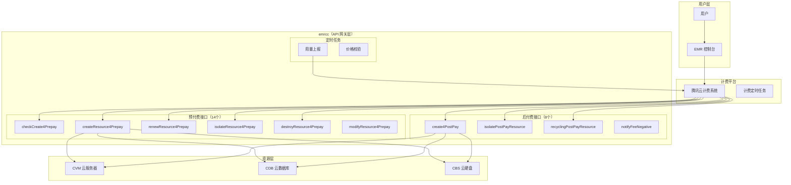
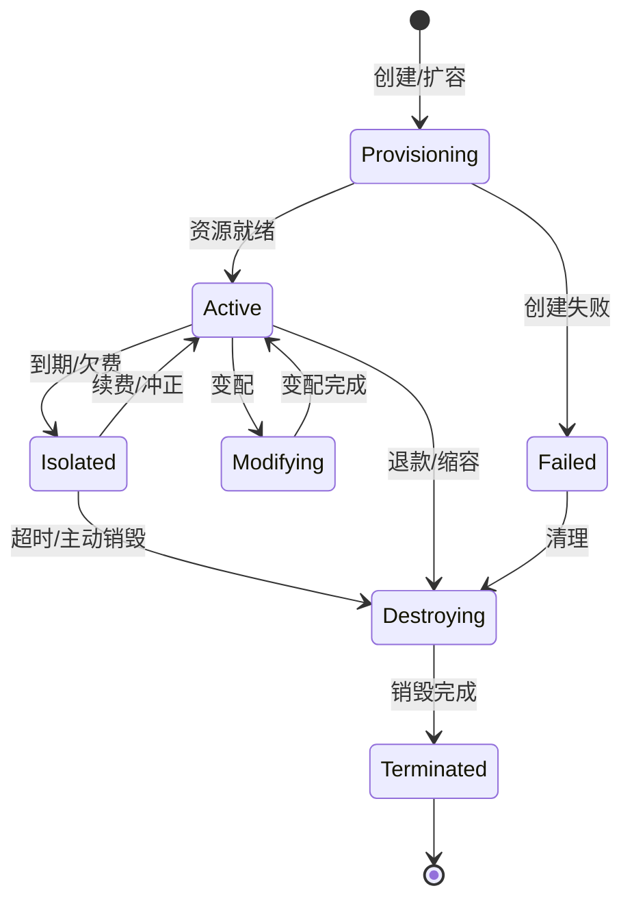
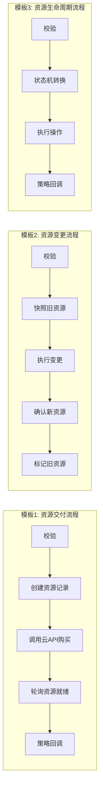
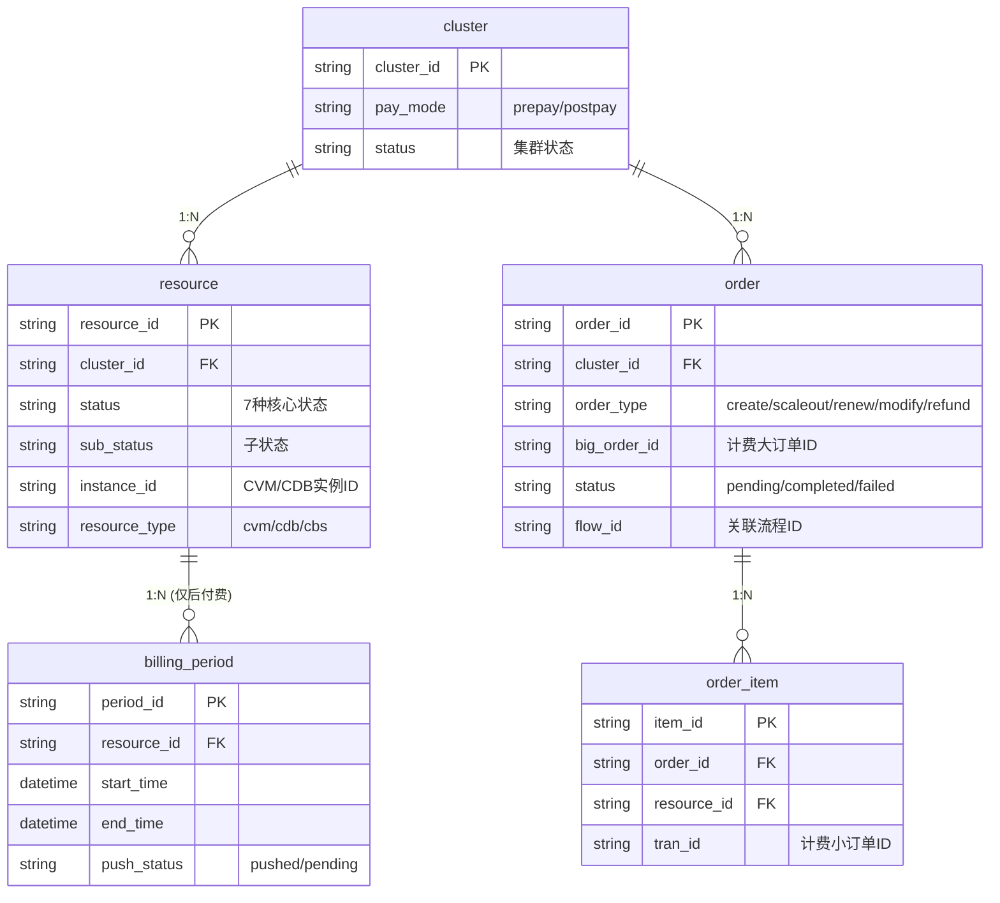
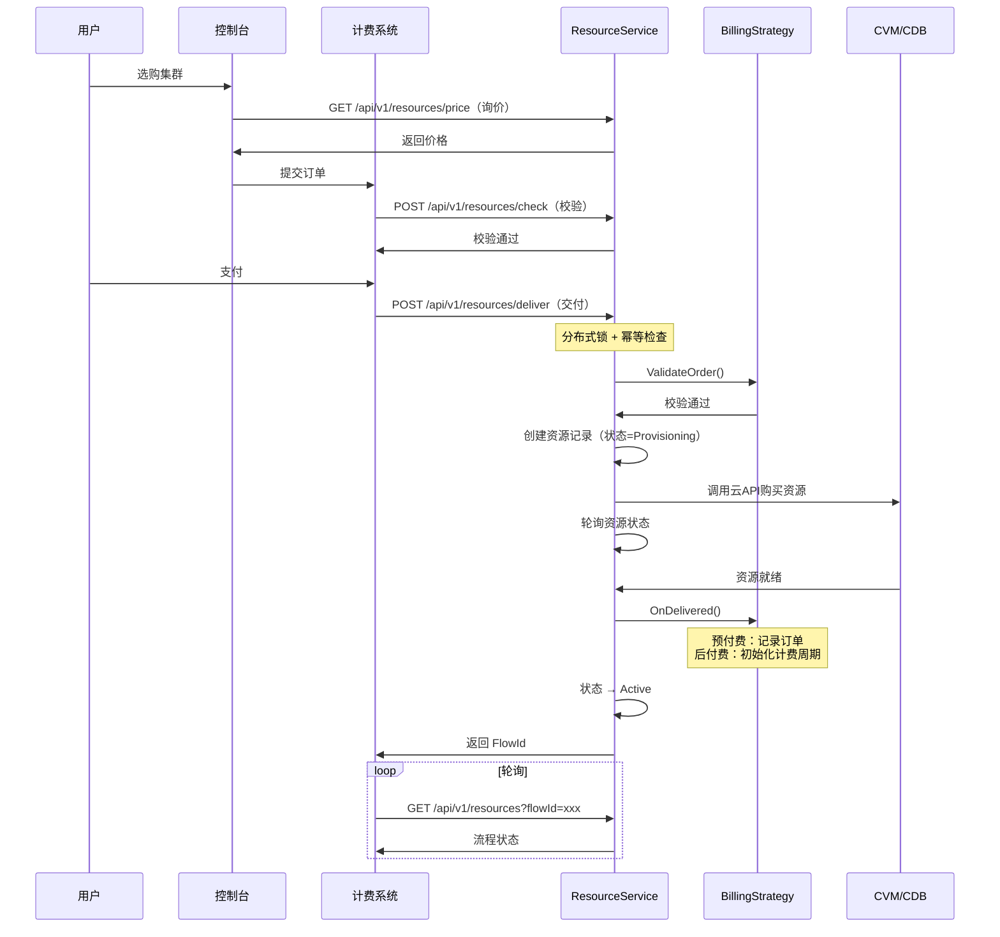
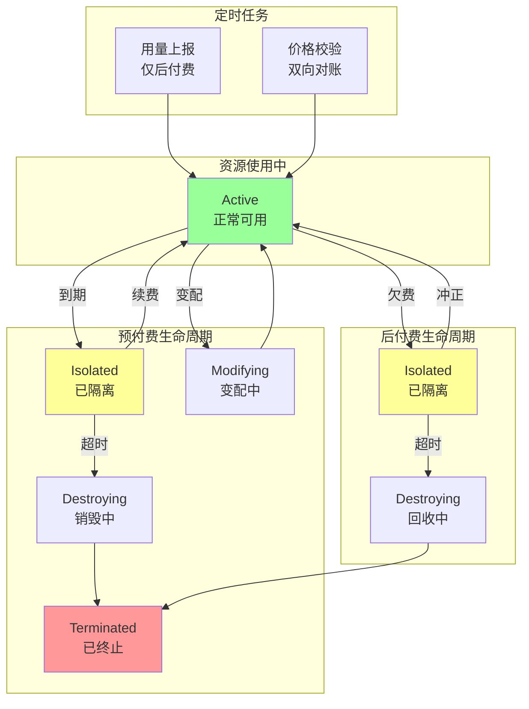
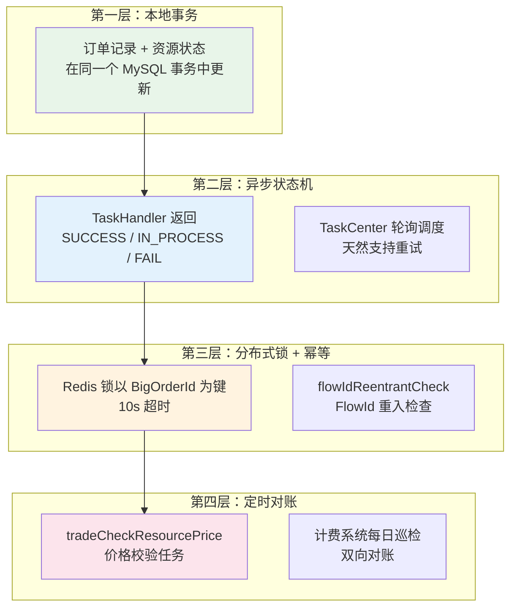
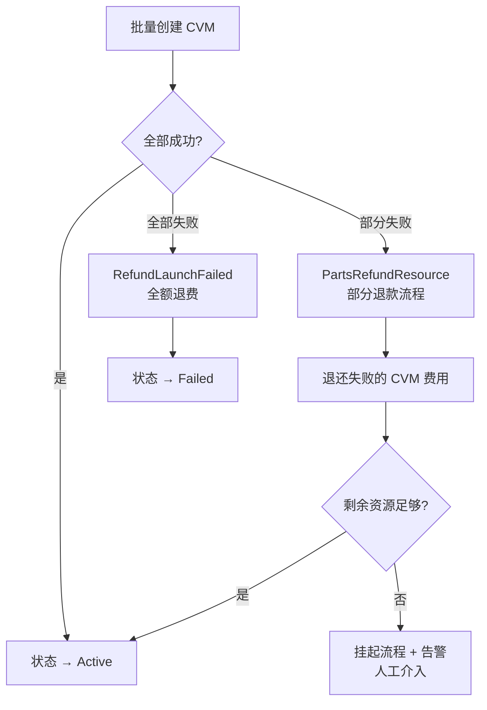
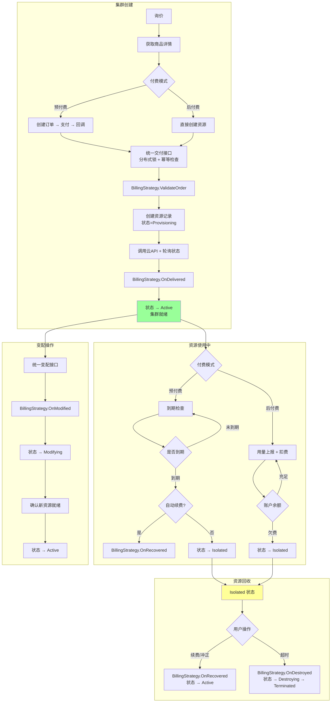

# TBDS 交易计费系统 — 优化设计方案与详细实现

> 本文档在原有交易计费系统梳理的基础上，融合了简化设计方案、私有化到公有云改造分析、以及面试中可展示的技术亮点，形成一份完整的业务功能与设计实现文档。

---

## 一、系统背景与演进

### 1.1 从私有化到公有云

TBDS 最初是一个**私有化部署**的大数据管控平台——部署在客户自己的机房里，管理客户自己的物理机/虚拟机上的大数据集群。后来对接到腾讯云公有云（EMR 产品），变成了一个同时支持私有化和公有云的系统。

系统通过全局的 `IsPrivate()` 标志来区分两种模式，几乎所有核心流程都有 `if IsPrivate()` 的分支判断。

**私有化 vs 公有云的核心差异：**

| 维度 | 私有化 | 公有云 |
|------|--------|--------|
| **资源来源** | 客户自己的物理机/虚拟机，已经存在 | 需要通过腾讯云 CVM API 动态申请 |
| **计费** | 无（客户自己的机器） | 需要集成腾讯云交易计费系统（预付费/后付费） |
| **创建链路** | 直接部署大数据服务 | 创建订单 → 用户支付 → 支付回调 → 申请 CVM → 部署服务 |
| **失败处理** | 重试即可 | 需要释放已申请的 CVM 资源（补偿机制） |
| **资源生命周期** | 简单（在线/离线） | 复杂的 26 种状态（INIT→POLL_WAIT→READY→ISOLATED→DESTROYED...） |
| **续费/隔离/回收** | 不存在 | 完整的预付费生命周期 |

### 1.2 交易计费系统定位

交易计费系统是 TBDS 管控平台的核心业务模块之一，负责管理 EMR 集群从**资源购买**到**资源释放**的完整商业化生命周期。系统集成腾讯云交易计费平台，实现订单管理、资源交付、续费退费、隔离回收等全链路能力。

**核心职责：**
- 与腾讯云计费系统对接，处理订单创建、支付回调、资源交付
- 管理 EMR 实例下所有子资源（CVM、CDB）的生命周期和状态
- 支持预付费（包年包月）和后付费（按量计费）两种计费模式
- 实现资源的续费、退款、变配、隔离、回收等全生命周期操作
- 后付费模式下定时上报资源用量给计费系统

### 1.3 核心术语

| 术语 | 说明 |
|------|------|
| **实例/资源** | 一个 EMR 集群即为一个资源实例，包含多个 CVM 和 CDB 子资源 |
| **大订单（BigOrder）** | 集群全部资源的总订单 |
| **小订单（SubOrder/TranId）** | 单次交付的子订单（如单个 CVM 实例） |
| **GoodsDetail** | 商品详情，描述集群所需的 CVM/CDB 规格、数量等信息 |
| **发货** | 计费系统术语，指资源创建和交付的过程 |
| **隔离** | 资源到期/欠费后进入的中间状态，资源暂停但未销毁 |
| **冲正** | 后付费用户欠费后充值恢复，资源从隔离状态恢复为可用 |
| **payMode** | 付费方式：0 = 后付费，1 = 预付费 |

---

## 二、当前系统复杂度分析

### 2.1 系统架构总览（当前实现）



### 2.2 复杂度问题汇总

| 问题 | 具体表现 |
|------|---------|
| **状态爆炸** | 26 种资源状态码（-2 到 25），状态流转路径极多 |
| **接口膨胀** | 预付费 14 个 + 后付费 8 个 + 公共 4 个 = 26 个接口 |
| **流程碎片化** | 15+ 种流程常量，每种操作一个独立流程 |
| **代码重复** | 预付费/后付费各自一套 Controller + 业务逻辑，底层又共享 |
| **职责模糊** | emrcc 既是 API 网关，又承担了大量业务逻辑（退款 76KB、询价 116KB） |
| **新老计费共存** | `tradeVersion` 0/1 两套逻辑残留 |

### 2.3 当前 26 种资源状态

| 状态码 | 常量名 | 含义 |
|--------|--------|------|
| 0 | `RESOURCE_STATUS_INIT` | 初始化 |
| 1 | `RESOURCE_STATUS_POLL_WAIT` | 轮询等待 |
| 2 | `RESOURCE_STATUS_READY` | 就绪/可用 |
| 3 | `RESOURCE_STATUS_POST_MODIFY` | 按量变配 |
| 4 | `RESOURCE_STATUS_ERROR` | 错误 |
| 5 | `RESOURCE_STATUS_UNUSED` | 未使用 |
| 6 | `RESOURCE_STATUS_ISOLATED` | 已隔离 |
| 7 | `RESOURCE_STATUS_DESTROYED` | 已销毁 |
| 8 | `RESOURCE_STATUS_REFUND_WAIT` | 等待退款 |
| 9 | `RESOURCE_STATUS_REFUND_CONFIRM_WAIT` | 退款确认等待 |
| 10 | `RESOURCE_STATUS_REFUND` | 已退款 |
| 11 | `RESOURCE_STATUS_ISOLATED_WAIT` | 隔离等待 |
| 12 | `RESOURCE_STATUS_ISOLATED_IN_PROGRESS` | 隔离进行中 |
| 13 | `RESOURCE_STATUS_UPDATE_WAIT` | 更新等待 |
| 14 | `RESOURCE_STATUS_DESTORY_WAIT` | 销毁等待 |
| 15 | `RESOURCE_STATUS_DESTORY_FINISH` | 销毁完成 |
| 17 | `RESOURCE_STATUS_RENEW_WAIT` | 续费等待 |
| 18 | `RESOURCE_STATUS_RENEW_POLL_WAIT` | 续费轮询等待 |
| 19 | `RESOURCE_STATUS_RENEW_IN_CONFIRM` | 续费确认中 |
| 20 | `RESOURCE_STATUS_POST_WAIT_PUSH` | 按量等待上报 |
| 21 | `RESOURCE_STATUS_MODIFING` | 变配中 |
| 22 | `ResourceStatusForLaunchFailed` | 发货失败处理 |
| 23 | `resourceStatusReadyWait` | 就绪等待 |
| 24 | `resourcePartsRefundWait` | 部分退款等待 |
| 25 | `resourcePartsRefunded` | 部分已退款 |
| -1 | `RESOURCE_STATUS_ERROR_CVM_FATAL_RETURN` | CVM 致命错误 |
| -2 | `RESOURCE_STATUS_ERROR_EMR_FATAL_RETURN` | EMR 致命错误 |

---

## 三、优化设计方案

### 3.1 核心设计理念

> **"统一抽象 + 状态机驱动 + 策略模式"**
>
> 把预付费和后付费视为同一个资源生命周期的两种**计费策略**，而不是两套独立系统。

### 3.2 统一资源状态机（26 → 7 种核心状态）

当前 26 种状态的根本问题是：**把"过程中间态"和"业务终态"混在了一起**。



**7 种核心状态映射：**

| 新状态 | 含义 | 替代原来的 |
|--------|------|-----------|
| `Provisioning` | 资源创建中 | INIT(0), POLL_WAIT(1), POST_WAIT_PUSH(20) |
| `Active` | 正常可用 | READY(2) |
| `Modifying` | 变配中 | UPDATE_WAIT(13), MODIFING(21), POST_MODIFY(3) |
| `Isolated` | 已隔离 | ISOLATED(6), ISOLATED_WAIT(11), ISOLATED_IN_PROGRESS(12) |
| `Destroying` | 销毁中 | DESTORY_WAIT(14), REFUND_WAIT(8), REFUND_CONFIRM_WAIT(9) |
| `Terminated` | 已终止 | DESTROYED(7), UNUSED(5), REFUND(10), DESTORY_FINISH(15) |
| `Failed` | 失败 | ERROR(4), CVM_FATAL(-1), EMR_FATAL(-2) |

**关键设计：过程中间态用子状态/进度字段表示，不污染主状态**

```go
type Resource struct {
    ID         string
    Status     ResourceStatus  // 7 种核心状态
    SubStatus  string          // 子状态/进度："renewing", "polling_cvm", "refunding" 等
    Progress   int             // 进度百分比 0-100
    PayMode    PayMode
    // ...
}
```

**好处：**
- **主状态只有 7 种**，状态流转图清晰可控
- **子状态是自由文本**，不需要每加一个中间步骤就新增一个状态码
- **查询简单**：`WHERE status = 'Active'` 就能查到所有可用资源，不需要 `WHERE status IN (2, 20, 23, ...)`

### 3.3 统一接口层（26 → 6 个核心接口）

当前的问题是：预付费和后付费各自一套接口，但底层逻辑大量重复。

**简化后的接口设计：**

```
POST   /api/v1/resources/check      # 统一校验
POST   /api/v1/resources/deliver     # 统一交付
PUT    /api/v1/resources/modify      # 统一变配
POST   /api/v1/resources/lifecycle   # 统一生命周期操作
GET    /api/v1/resources             # 统一查询
GET    /api/v1/resources/price       # 统一询价
```

**接口映射关系：**

| 新接口 | 替代的旧接口 |
|--------|-------------|
| `check` | checkCreate4Prepay, checkCreate4PostPay, checkModify4Prepay, checkModify4PostPay, checkRenew4Prepay |
| `deliver` | createResource4Prepay, create4PostPay |
| `modify` | modifyResource4Prepay, modifyPostPayResource |
| `lifecycle` | isolateResource4Prepay, destroyResource4Prepay, renewResource4Prepay, setRenewFlag4Prepay, isolatePostPayResource, recyclingPostPayResource, notifyFeeNegative |
| `resources` | queryUserResources, queryResources, getPostPayResource, getDeadlineList, getAllAppids |
| `price` | queryPrice, getCreateGoodsDetailList, getModifyGoodsDetailList |

**核心思路：通过请求体中的 `action` 字段区分操作，而不是每个操作一个接口**

```go
// 统一生命周期操作接口
type LifecycleRequest struct {
    ClusterID  string          `json:"clusterId"`
    Action     LifecycleAction `json:"action"`  // isolate | destroy | renew | recover | recycle
    PayMode    PayMode         `json:"payMode"`  // prepay | postpay
    // ... 各 action 特有的参数用 map 或 oneof
}

// 统一交付接口
type DeliverRequest struct {
    BigOrderID string    `json:"bigOrderId"`
    OrderType  OrderType `json:"orderType"`  // create | scaleout | addrouter
    PayMode    PayMode   `json:"payMode"`
    // ...
}
```

### 3.4 策略模式替代 if-else 分支

当前代码中大量存在 `if payMode == 0 { ... } else { ... }` 的分支。用策略模式统一：

```go
// 计费策略接口
type BillingStrategy interface {
    // 交付前校验
    ValidateOrder(ctx context.Context, req *DeliverRequest) error
    // 交付后处理（预付费：记录订单；后付费：初始化计费周期）
    OnDelivered(ctx context.Context, resource *Resource) error
    // 变配处理
    OnModified(ctx context.Context, oldRes, newRes *Resource) error
    // 隔离处理
    OnIsolated(ctx context.Context, resource *Resource) error
    // 恢复处理（预付费：续费；后付费：冲正）
    OnRecovered(ctx context.Context, resource *Resource) error
    // 销毁处理（预付费：退款；后付费：停止计费）
    OnDestroyed(ctx context.Context, resource *Resource) error
}

// 预付费策略
type PrepayStrategy struct{}

func (s *PrepayStrategy) OnDelivered(ctx context.Context, resource *Resource) error {
    // 记录订单信息、等待支付回调确认
    return nil
}

func (s *PrepayStrategy) OnRecovered(ctx context.Context, resource *Resource) error {
    // 续费逻辑：向计费系统下单续费 → 轮询确认 CVM 存在
    return nil
}

// 后付费策略
type PostpayStrategy struct{}

func (s *PostpayStrategy) OnDelivered(ctx context.Context, resource *Resource) error {
    // 初始化计费周期、插入 billing_period 记录
    return nil
}

func (s *PostpayStrategy) OnRecovered(ctx context.Context, resource *Resource) error {
    // 冲正逻辑：复制资源记录、插入新的 billing_period
    return nil
}

// 工厂
func NewBillingStrategy(payMode PayMode) BillingStrategy {
    switch payMode {
    case Prepay:
        return &PrepayStrategy{}
    case Postpay:
        return &PostpayStrategy{}
    }
    return nil
}
```

**统一的资源服务：**

```go
type ResourceService struct {
    strategies   map[PayMode]BillingStrategy
    stateMachine *ResourceStateMachine
}

func (s *ResourceService) Deliver(ctx context.Context, req *DeliverRequest) (*Flow, error) {
    strategy := s.strategies[req.PayMode]

    // 1. 分布式锁（以 BigOrderId 为键，10s 超时）
    lock := acquireLock(req.BigOrderID)
    defer lock.Release()

    // 2. 幂等检查（flowIdReentrantCheck）
    if flow := checkIdempotent(req.BigOrderID); flow != nil {
        return flow, nil
    }

    // 3. 策略校验
    if err := strategy.ValidateOrder(ctx, req); err != nil {
        return nil, err
    }

    // 4. 创建资源（共享逻辑）
    resource := createResource(req)

    // 5. 策略特有的交付后处理
    strategy.OnDelivered(ctx, resource)

    // 6. 启动工作流
    return startFlow(req.OrderType, resource)
}

func (s *ResourceService) Lifecycle(ctx context.Context, req *LifecycleRequest) (*Flow, error) {
    strategy := s.strategies[req.PayMode]

    // 1. 状态机校验（当前状态是否允许该操作）
    if err := s.stateMachine.ValidateTransition(req.CurrentStatus, req.Action); err != nil {
        return nil, err
    }

    // 2. 执行状态转换
    s.stateMachine.Transition(req.ResourceID, req.Action)

    // 3. 策略回调
    switch req.Action {
    case ActionIsolate:
        return nil, strategy.OnIsolated(ctx, req.Resource)
    case ActionRecover:
        return nil, strategy.OnRecovered(ctx, req.Resource)
    case ActionDestroy:
        return nil, strategy.OnDestroyed(ctx, req.Resource)
    }
    return nil, nil
}
```

### 3.5 简化工作流（15 → 3 种模板）

当前 15+ 种流程常量，每种操作一个独立流程。实际上可以归纳为 **3 种工作流模板**：



| 模板 | 覆盖的操作 |
|------|-----------|
| **资源交付** | 创建集群、扩容、添加 Router |
| **资源变更** | 预付费变配、后付费变配 |
| **生命周期** | 隔离、续费、冲正、销毁、回收、退款 |

每个模板通过**参数化 + 策略回调**来处理差异，而不是每个操作一个独立的 BPMN 流程。

### 3.6 简化数据模型



**简化点：**
1. **删除 `resource_order` 表的冗余字段**，拆分为 `order` + `order_item`，职责更清晰
2. **删除 `instance_trade_pushdata` 表**，上报状态直接放在 `billing_period.push_status` 中
3. **resource 表只保留 7 种主状态**，中间态用 `sub_status` 表示
4. **彻底删除 `tradeVersion` 字段**，不再兼容老计费

---

## 四、核心业务流程（优化后）

### 4.1 统一资源交付流程



### 4.2 统一生命周期管理



### 4.3 分布式一致性保障（四层防线）

这是整个系统最核心的技术亮点——**没有引入 Saga 框架，而是设计了一套更务实的工作流编排式最终一致性方案**。



**为什么不用 Saga 框架：**

1. **外部云 API 不支持补偿语义**——"购买 CVM"的补偿是"销毁 CVM"，但销毁本身也可能失败
2. **业务天然是异步的**——用户创建集群本来就要等几分钟，不需要同步强一致性
3. **涉及金额的操作**——出现异常时挂起流程让人工确认，比自动补偿更安全

### 4.4 部分失败处理



---

## 五、预付费 vs 后付费详细对比

| 维度 | 预付费（包年包月） | 后付费（按量计费） |
|------|-------------------|-------------------|
| **支付方式** | 先付费后使用 | 先使用后付费 |
| **订单环节** | 需要创建订单 → 支付 → 回调 | 直接创建资源 |
| **资源保障** | 资源有保障，到期前不会被回收 | 按需申请，欠费可能被隔离 |
| **计费触发** | 支付回调触发 | 直接触发 |
| **用量上报** | 不需要 | 需要定时上报 CPU/内存用量 |
| **到期处理** | 到期 → 隔离 → 续费/销毁 | 欠费 → 隔离 → 冲正/回收 |
| **变配流程** | 经过计费系统变配回调 | 不经过计费，直接影响 CVM |
| **冲正机制** | 无 | 有（notifyFeeNegative） |
| **适用场景** | 稳定长期使用 | 临时或不确定时长 |

**在优化设计中，这些差异全部通过 BillingStrategy 接口封装，核心流程代码完全统一。**

---

## 六、技术亮点总结

### 6.1 分布式锁防重

预付费支付回调使用 Redis 分布式锁（`NewDlocker`），以 `BigOrderId` 为锁键，防止计费系统重复回调导致重复创建资源。

```go
redisLocker, err := dlocker.NewDlocker(LOCKER_CREATE_RESOURCE_BIZ_TYPE, BigOrderId, 10)
```

### 6.2 幂等性设计

通过 `flowIdReentrantCheck` 机制实现幂等性：
- 首次请求：创建资源并返回 FlowId
- 重复请求：直接返回已有的 FlowId，不重复创建

### 6.3 大小订单机制

- **大订单（BigOrder）**：代表集群全部资源的总订单
- **小订单（SubOrder/TranId）**：代表单次交付的子订单
- 通过 `LookupParentOrderID` 从小订单反查大订单

### 6.4 资源轮询与状态确认

资源创建后不是立即可用，需要轮询确认：
- CVM 资源：轮询 CVM API 确认实例状态为 RUNNING
- CDB 资源：轮询 CDB API 确认实例就绪
- 续费/变配后：需要再次确认资源实例仍然存在

### 6.5 事件足迹（Event Footprint）

通过 `event_footprint` 模块记录交易过程中的关键事件，用于问题排查和审计追踪。

### 6.6 价格校验定时任务

`tradeCheckResourcePrice` 定时任务对比订单价格和实时询价结果，发现价格不一致时触发告警，防止计费异常。

### 6.7 退款处理器（RefundHandler）

退款处理器在轮询资源时检查订单状态：
- 如果订单状态为已退款（refunded）
- 且资源数量不足以构建 EMR 集群
- 则挂起流程并发出告警

---

## 七、优化收益量化

### 7.1 整体对比

```
┌─────────────────────────────────────────────────────────────┐
│                        优化前                                │
│                                                             │
│  26 个接口 → 26 个 Controller → 各自的业务逻辑              │
│  15+ 种流程 → 15+ 个 BPMN → 各自的 TaskHandler             │
│  26 种状态 → 复杂的状态流转 → 大量 if-else                  │
│  预付费/后付费 → 两套代码 → 底层又共享 → 维护噩梦           │
│                                                             │
│  代码量：Controller 层 ~20 个文件                            │
│          业务逻辑层 ~30 个文件（含多个 60KB+ 大文件）         │
└─────────────────────────────────────────────────────────────┘

                          ↓ 优化后 ↓

┌─────────────────────────────────────────────────────────────┐
│                        优化后                                │
│                                                             │
│  6 个接口 → 6 个 Handler → 统一 ResourceService             │
│  3 种流程模板 → 参数化 + 策略回调                            │
│  7 种状态 → 清晰的状态机 → 子状态处理中间态                  │
│  BillingStrategy 接口 → PrepayStrategy / PostpayStrategy    │
│                                                             │
│  代码量：Handler 层 ~6 个文件                                │
│          核心服务层 ~10 个文件                                │
│          策略层 ~2 个文件                                    │
└─────────────────────────────────────────────────────────────┘
```

### 7.2 量化指标

| 维度 | 优化前 | 优化后 | 收益 |
|------|--------|--------|------|
| **接口数** | 26 | 6 | **-77%** |
| **资源状态数** | 26 | 7（+子状态） | **-73%** |
| **流程类型** | 15+ | 3 模板 | **-80%** |
| **Controller 文件** | ~20 | ~6 | **-70%** |
| **业务逻辑文件** | ~30（含多个 60KB+） | ~12 | **-60%** |
| **新增操作成本** | 新增接口+Controller+流程+状态 | 在模板中加一个 action | **极低** |
| **预付费/后付费切换** | 两套代码 | 切换 Strategy | **一行代码** |

---

## 八、代码目录结构（优化后）

```
emrcc/src/emr/
├── handler/                        # 统一 Handler 层（6 个文件）
│   ├── check_handler.go            # 统一校验
│   ├── deliver_handler.go          # 统一交付
│   ├── modify_handler.go           # 统一变配
│   ├── lifecycle_handler.go        # 统一生命周期操作
│   ├── query_handler.go            # 统一查询
│   └── price_handler.go            # 统一询价
│
├── service/                        # 核心服务层
│   ├── resource_service.go         # 资源服务（核心入口）
│   ├── resource_state_machine.go   # 资源状态机
│   ├── order_service.go            # 订单服务
│   └── flow_service.go             # 流程服务
│
├── strategy/                       # 计费策略层
│   ├── billing_strategy.go         # 策略接口定义
│   ├── prepay_strategy.go          # 预付费策略
│   └── postpay_strategy.go         # 后付费策略
│
├── workflow/                       # 工作流模板
│   ├── deliver_workflow.go         # 资源交付模板
│   ├── modify_workflow.go          # 资源变更模板
│   └── lifecycle_workflow.go       # 生命周期模板
│
├── model/                          # 数据模型
│   ├── resource.go                 # 资源模型（7 种状态）
│   ├── order.go                    # 订单模型
│   └── billing_period.go           # 计费周期模型
│
├── infra/                          # 基础设施
│   ├── lock.go                     # 分布式锁
│   ├── idempotent.go               # 幂等检查
│   └── event_footprint.go          # 事件足迹
│
└── job/                            # 定时任务
    ├── usage_report_job.go         # 用量上报
    └── price_check_job.go          # 价格校验
```

---

## 九、完整业务流程总览（优化后）



---

## 十、接口清单（优化后 vs 优化前）

### 10.1 优化后的 6 个统一接口

| 接口 | 方法 | 路径 | 说明 |
|------|------|------|------|
| 统一校验 | POST | `/api/v1/resources/check` | 替代 5 个 check 接口 |
| 统一交付 | POST | `/api/v1/resources/deliver` | 替代 2 个 create 接口 |
| 统一变配 | PUT | `/api/v1/resources/modify` | 替代 2 个 modify 接口 |
| 统一生命周期 | POST | `/api/v1/resources/lifecycle` | 替代 7 个生命周期接口 |
| 统一查询 | GET | `/api/v1/resources` | 替代 5 个查询接口 |
| 统一询价 | GET | `/api/v1/resources/price` | 替代 3 个询价接口 |

### 10.2 优化前的 26 个接口（参考）

<details>
<summary>点击展开完整接口列表</summary>

**预付费接口（14个）：**
- `qcloud.emr.checkCreate4Prepay` — 创建订单参数校验
- `qcloud.emr.createResource4Prepay` — 支付回调，触发资源创建
- `qcloud.emr.checkModify4Prepay` — 变配订单参数校验
- `qcloud.emr.modifyResource4Prepay` — 变配资源
- `qcloud.emr.checkRenew4Prepay` — 续费订单参数校验
- `qcloud.emr.renewResource4Prepay` — 续费资源
- `qcloud.emr.setRenewFlag4Prepay` — 设置自动续费标志
- `qcloud.emr.isolateResource4Prepay` — 隔离资源
- `qcloud.emr.destroyResource4Prepay` — 销毁资源
- `qcloud.emr.getAllAppids` — 获取所有 AppId
- `qcloud.emr.queryUserResources` — 查询用户资源列表
- `qcloud.emr.queryResources` — 查询资源详情
- `qcloud.emr.getDeadlineList` — 获取到期列表
- `qcloud.emr.queryFlow` — 查询流程状态

**后付费接口（8个）：**
- `qcloud.emr.checkCreate4PostPay` — 创建订单参数校验
- `qcloud.emr.create4PostPay` — 创建资源
- `qcloud.emr.checkModify4PostPay` — 变配参数校验
- `qcloud.emr.modifyPostPayResource` — 变配资源
- `qcloud.emr.isolatePostPayResource` — 隔离资源
- `qcloud.emr.recyclingPostPayResource` — 回收资源
- `qcloud.emr.notifyFeeNegative` — 冲正通知
- `qcloud.emr.getPostPayResource` — 查询欠费资源

**公共接口（4个）：**
- `qcloud.emr.queryPrice` — 询价
- `qcloud.emr.trade.getCreateGoodsDetailList` — 获取创建商品详情
- `qcloud.emr.trade.getModifyGoodsDetailList` — 获取变配商品详情
- `qcloud.emr.queryBillExtendFields` — 查询账单扩展字段

</details>

---

## 十一、定时任务

| 任务名 | 说明 | 优化点 |
|--------|------|--------|
| **用量上报** | 定时推送后付费资源用量给计费系统 | 上报状态合并到 billing_period 表 |
| **价格校验** | 定时校验订单价格是否一致 | 保持不变，作为对账兜底 |
| **生命周期巡检** | 计费系统每天巡检所有资源状态 | 配合统一查询接口简化 |

---

## 十二、总结

### 12.1 优化设计的核心价值

这个简化设计的核心价值不在于"删代码"，而在于**用正确的抽象降低系统的认知复杂度**：

1. **统一状态机**：将 26 种资源状态收敛为 7 种核心状态 + 子状态
2. **统一接口层**：将 26 个接口收敛为 6 个 RESTful 接口
3. **统一计费策略**：用策略模式抽象预付费/后付费的差异，共享 90% 的核心逻辑
4. **统一工作流**：将 15+ 种流程归纳为 3 种模板

### 12.2 面试中的定位

> **"一个有工程判断力的开发者，能在复杂的跨系统集成场景中做出务实的技术选型（不盲目追求 Saga/TCC），并且对现有系统有清晰的优化思路。"**
