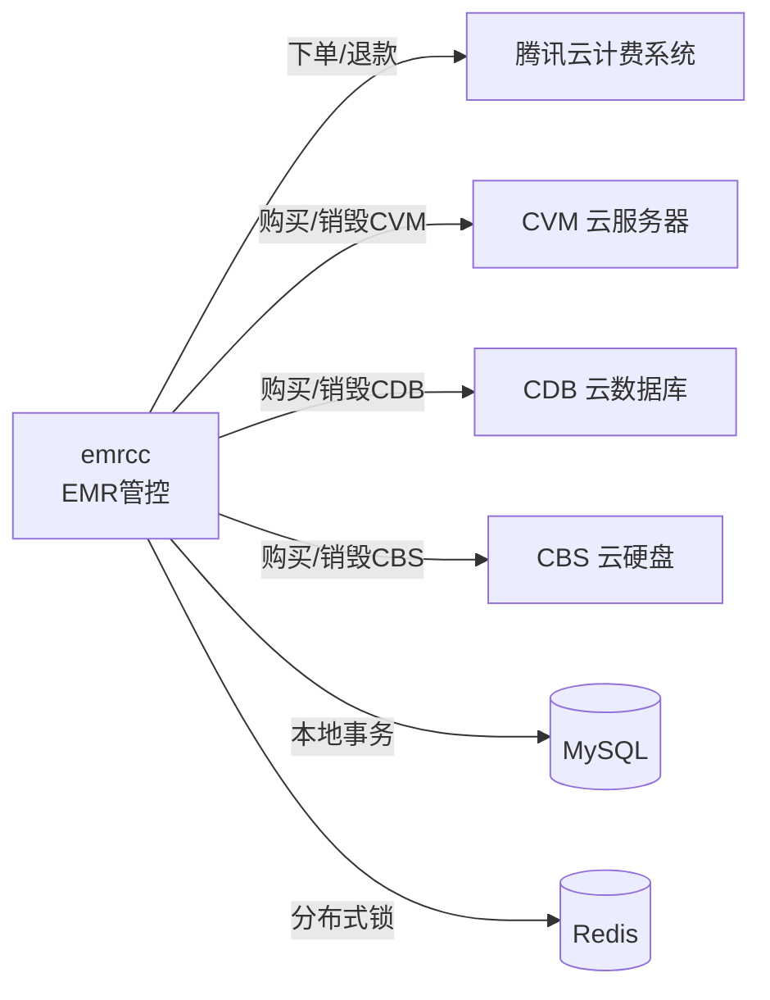

# 交易计费系统 —— 分布式一致性方案分析

> 本文档分析 TBDS 交易计费系统的分布式一致性保障机制，包括"是否需要 Saga"的技术选型分析，以及"编排式一致性作为简历亮点"的包装策略。

---

## 第一部分：系统是否需要 Saga？

### 一、一句话结论

**不需要 Saga 等分布式事务框架。** TBDS 交易计费系统当前采用的是 **"本地事务 + 异步工作流 + 轮询重试 + 幂等性"** 的组合方案，这在实际工程中是比 Saga 更务实、更可靠的选择。

---

### 二、系统的"分布式"在哪里

这个交易计费系统涉及多个外部系统的协调：



一次"创建集群"操作，需要：
1. 在 **MySQL** 中写入 resource_order、resource 等记录
2. 调用 **CVM API** 购买云服务器
3. 调用 **CDB API** 购买数据库
4. 调用 **CBS API** 购买云硬盘
5. 向 **计费系统** 确认发货状态

这些操作跨越了多个独立系统，确实存在分布式一致性问题。

---

### 三、当前系统实际使用的一致性保证机制（四层防线）

#### 3.1 第一层：本地数据库事务

系统使用了自研的 `DataSourceTransactionManager`，通过 `DoTransaction` 方法保证本地操作的原子性：

```go
// transaction_template.go
func (this *transactionTemplate) DoTransaction(fn func(tx *Transaction) error) *transactionTemplate {
    // 开启事务
    tx, err := this.txManager.datasource.Begin()
    // 执行业务逻辑
    err := fn(this.transaction)
    // 失败则 Rollback，成功则 Commit
}
```

**典型使用场景**：退款时标记资源状态 + 更新订单状态，这些本地 DB 操作在一个事务里完成：

```go
// refund_resources.go - MarkRefundResources
trade.GetTxManager().GetTransactionTemplate().DoTransaction(func(tx *dao.Transaction) error {
    for _, resource := range Resources {
        resource.StatusEntryPartsRefundWait().
            MarkPartsRefundReason(...).UpdateToDB(tx)
    }
    return nil
}).Close()
```

#### 3.2 第二层：异步工作流 + 轮询重试（核心机制）

这是系统保证最终一致性的**核心手段**。Flow 框架定义了三种任务状态：

```go
// flow.go
const (
    TASK_SUCCESS    = 0   // 成功，进入下一步
    TASK_IN_PROCESS = 1   // 进行中，稍后重试
    TASK_FAIL       = -1  // 失败，流程挂起
)
```

**工作原理**：每个 TaskHandler 的 `CompleteTask` 方法会被 TaskCenter 反复调用（轮询），直到返回 `TASK_SUCCESS` 或 `TASK_FAIL`。这本质上就是一个 **状态机驱动的最终一致性模型**：

```
TaskCenter 调度 → TaskHandler.CompleteTask()
  → 返回 TASK_IN_PROCESS → TaskCenter 等待一段时间后再次调度
  → 返回 TASK_SUCCESS → 进入下一个 Task
  → 返回 TASK_FAIL → 流程挂起，人工介入
```

**举例**：创建集群时，轮询 CVM 状态直到 RUNNING：

```go
// lookup_resources_handler.go
// 轮询 CVM 实例状态
if detail.InstanceState == "RUNNING" {
    return flow.NewTaskExecResponse(flow.TASK_SUCCESS, ...)
}
return flow.NewTaskExecResponse(flow.TASK_IN_PROCESS, ...) // 还没好，继续等
```

#### 3.3 第三层：分布式锁 + 幂等性

- **分布式锁**：Redis `NewDlocker`，防止计费系统重复回调
- **幂等检查**：`flowIdReentrantCheck`，同一个订单重复请求直接返回已有 FlowId

```go
// create_resource_controller.go
redisLocker, err := dlocker.NewDlocker(LOCKER_CREATE_RESOURCE_BIZ_TYPE, BigOrderId, 10)
// 幂等检查
flowId := flowIdReentrantCheck(BigOrderId)
if flowId > 0 {
    return flowId // 直接返回，不重复创建
}
```

#### 3.4 第四层：补偿机制（人工 + 自动）

当出现不一致时，系统有多种补偿手段：

| 补偿机制 | 说明 |
|---------|------|
| **部分退款** (`PartsRefundResource`) | 发货部分失败时，自动退还失败的子资源 |
| **流程挂起 + 告警** | 遇到不可恢复错误时挂起流程，发送告警通知人工处理 |
| **价格校验定时任务** | `tradeCheckResourcePrice` 定时对账，发现价格不一致时告警 |
| **资源状态确认** | 每次操作后都轮询确认 CVM/CDB 的真实状态 |
| **计费系统巡检** | 计费系统每天巡检所有资源的生命周期状态 |

---

### 四、为什么不用 Saga？

| 维度 | Saga 方案 | 当前方案（工作流+轮询） |
|------|----------|---------------------|
| **复杂度** | 需要为每个正向操作编写补偿操作，补偿逻辑本身也可能失败 | 工作流天然支持重试，失败挂起人工介入 |
| **适用场景** | 多个独立服务之间的事务协调 | 一个中心服务协调多个外部 API 调用 |
| **一致性模型** | 最终一致性（通过补偿） | 最终一致性（通过轮询重试） |
| **失败处理** | 自动补偿回滚 | 重试 + 挂起 + 人工介入 |
| **实现成本** | 需要引入 Saga 框架，改造现有代码 | 已有 Flow 框架天然支持 |
| **可观测性** | 需要额外的 Saga 日志 | Flow 状态天然可查询（queryFlow） |

**关键原因**：

1. **EMR 是中心化协调者**：所有操作都由 emrcc 发起和协调，不是多个对等服务之间的协调。这种场景下，工作流编排比 Saga 更自然。

2. **外部 API 不支持补偿**：CVM/CDB 的 API 不是为 Saga 设计的。比如"购买 CVM"的补偿操作是"销毁 CVM"，但销毁 CVM 本身也可能失败，补偿链条会越来越复杂。

3. **业务容忍异步**：用户创建集群本身就是异步的（计费系统通过 `queryFlow` 轮询），不需要同步的强一致性。

4. **人工兜底是合理的**：对于金额相关的操作（退款、计费），出现异常时挂起流程让人工确认，比自动补偿更安全。代码中大量的 `SuspendProcessInstance` + 告警就是这个思路。

---

### 五、总结

TBDS 交易计费系统采用的是一种**非常务实的最终一致性方案**：

```
本地事务（保证单库原子性）
  + 异步工作流（状态机驱动，天然支持重试）
  + 分布式锁 + 幂等（防重复）
  + 轮询确认（确保外部系统状态一致）
  + 定时对账（发现不一致）
  + 人工兜底（处理极端情况）
```

这个方案在工程实践中比 Saga 更常见，也更适合 EMR 这种"一个中心服务协调多个云 API"的场景。Saga 更适合的是"多个独立微服务之间需要事务协调"的场景（比如电商的订单服务、库存服务、支付服务各自独立部署）。

如果非要给这个方案一个名字，它更接近于 **"编排式（Orchestration）的最终一致性"**，而 Saga 只是实现最终一致性的手段之一。

---

---

## 第二部分：编排式一致性是否是简历亮点？

### 一、结论：是亮点，但需要正确包装，否则容易翻车

---

### 二、为什么说它是亮点？

**编排式最终一致性**在面试中是一个有区分度的话题，原因如下：

| 维度 | 分析 |
|------|------|
| **区分度高** | 大多数候选人只会背"Saga/TCC/2PC"三件套，能结合实际项目讲清楚"为什么不用 Saga"的人很少 |
| **体现工程判断力** | 面试官最看重的不是你用了什么技术，而是你**为什么选这个方案**。"不用 Saga"比"用了 Saga"更能体现思考深度 |
| **有真实代码支撑** | 你的项目里有分布式锁、幂等性、轮询重试、定时对账、部分退款补偿等完整实现，不是空谈理论 |
| **面试官容易追问** | 这个话题天然能引出很多深入讨论：CAP、最终一致性、幂等设计、补偿策略等 |

---

### 三、关键风险

**如果你直接说"我们用了编排式最终一致性"，面试官大概率会追问：**

> "那你和 Saga 的编排模式（Orchestration Saga）有什么区别？"

如果答不好，反而会减分。因为从学术定义上看，你们的方案**本质上就是 Saga 的编排模式的一种工程实现**：

```
Saga 编排模式（学术定义）：
  - 一个中心协调者（Orchestrator）
  - 按顺序执行一系列本地事务
  - 失败时执行补偿操作

你们的实际实现：
  - emrcc 作为中心协调者
  - Flow 框架按步骤执行（TaskHandler 链）
  - 失败时：重试 + 挂起 + 人工介入（而非自动补偿）
```

**区别在于补偿策略**：经典 Saga 强调自动补偿回滚，而你们的方案更务实——能重试就重试，不能重试就挂起告警让人工处理。

---

### 四、推荐的简历写法和面试话术

#### 4.1 简历上怎么写（一句话）

> 设计并实现了基于工作流编排的分布式最终一致性方案，通过**本地事务 + 异步状态机 + 幂等重试 + 定时对账**四层机制，保障跨多个云服务（CVM/CDB/计费系统）的订单交付一致性

#### 4.2 面试中怎么讲（分层递进）

**第一层：场景引入**（30秒）
> "EMR 集群创建涉及多个外部系统的协调——要调 CVM API 买机器、调 CDB API 建数据库、向计费系统确认发货状态。这是一个典型的分布式一致性问题。"

**第二层：方案选型**（1分钟，这是核心亮点）
> "我们评估过 Saga 和 TCC，但最终没有采用：
> 1. **TCC 不适用**——外部云 API（CVM/CDB）不支持 Try-Confirm-Cancel 语义
> 2. **经典 Saga 的自动补偿不现实**——'购买 CVM'的补偿是'销毁 CVM'，但销毁本身也可能失败，补偿链会越来越复杂
> 3. **业务天然是异步的**——用户创建集群本来就要等几分钟，不需要同步强一致性
> 
> 所以我们选择了更务实的方案：编排式工作流 + 最终一致性。"

**第三层：具体实现**（1-2分钟）
> "四层防线：
> 1. **本地事务**保证单库原子性（订单+资源状态在一个事务里更新）
> 2. **异步状态机**驱动流程推进（TaskHandler 返回 SUCCESS/IN_PROCESS/FAIL，TaskCenter 轮询调度）
> 3. **分布式锁 + 幂等**防止重复操作（Redis 锁 + FlowId 重入检查）
> 4. **定时对账**兜底（价格校验任务每天对比订单价格和实时询价，发现不一致告警）"

**第四层：应对追问**

| 面试官追问 | 你的回答 |
|-----------|---------|
| "这和 Saga 有什么区别？" | "本质上是 Saga 编排模式的工程化实现，核心区别在补偿策略：我们用**重试+挂起+人工介入**替代了自动补偿回滚，因为涉及金额的操作，人工确认比自动补偿更安全" |
| "为什么不用消息队列做最终一致性？" | "我们的场景是一个中心服务协调多个外部 API，不是多个对等服务之间的协调。工作流编排比消息驱动更直观，流程状态也更容易查询和排障" |
| "如果中间步骤失败了怎么办？" | "三种策略：①可重试的错误（网络超时）→ 状态机返回 IN_PROCESS，TaskCenter 自动重试；②部分失败（3台CVM只成功2台）→ 自动触发部分退款流程；③不可恢复错误 → 挂起流程 + 告警，人工介入" |
| "怎么保证幂等？" | "两层：①Redis 分布式锁以 BigOrderId 为键，防止计费系统重复回调；②flowIdReentrantCheck 检查是否已有关联流程，有则直接返回已有 FlowId" |
| "对账怎么做的？" | "定时任务 tradeCheckResourcePrice，拿订单实际价格和实时询价结果对比，不一致就告警。相当于事后校验的兜底机制" |

---

### 五、总结评估

| 评估维度 | 评分 | 说明 |
|---------|------|------|
| **技术深度** | ⭐⭐⭐⭐ | 涉及分布式事务、状态机、幂等、对账等多个知识点 |
| **面试区分度** | ⭐⭐⭐⭐⭐ | "为什么不用 Saga"比"我用了 Saga"更有区分度 |
| **可追问空间** | ⭐⭐⭐⭐⭐ | 能引出 CAP、最终一致性、补偿策略、幂等设计等深入话题 |
| **包装难度** | ⭐⭐⭐ | 需要理清"编排式一致性 vs Saga"的关系，避免被追问时翻车 |
| **通用性** | ⭐⭐⭐⭐ | 几乎所有涉及外部 API 调用的系统都有类似问题，面试官容易共鸣 |

**建议**：**写到简历里，但不要用"编排式一致性"这个自造词**。建议用更通用的表述：

> "基于工作流状态机的分布式最终一致性方案"

这样既准确，又不会让面试官觉得你在造概念。面试时再展开讲"为什么没用 Saga/TCC"，这才是真正的加分项。
