# TBDS 交易计费系统详细梳理

> 本文档详细梳理 TBDS 管控平台的交易计费系统，涵盖预付费（包年包月）和后付费（按量计费）两种模式的完整业务流程、资源生命周期管理、与腾讯云计费系统的交互机制、核心数据模型及技术实现细节。

---

## 一、系统概述

### 1.1 交易计费系统定位

交易计费系统是 TBDS 管控平台的核心业务模块之一，负责管理 EMR 集群从**资源购买**到**资源释放**的完整商业化生命周期。系统集成腾讯云交易计费平台，实现订单管理、资源交付、续费退费、隔离回收等全链路能力。

**核心职责：**
- 与腾讯云计费系统对接，处理订单创建、支付回调、资源交付
- 管理 EMR 实例下所有子资源（CVM、CDB）的生命周期和状态
- 支持预付费（包年包月）和后付费（按量计费）两种计费模式
- 实现资源的续费、退款、变配、隔离、回收等全生命周期操作
- 后付费模式下定时上报资源用量给计费系统

### 1.2 新老计费体系

EMR 存在新计费和老计费两套体系：

| 特性 | 老计费 | 新计费（当前线上） |
|------|--------|-------------------|
| EMR 角色 | 中间商（不赚差价） | 作为产品接入计费平台 |
| CVM 管理 | 用户可在 CVM 控制台销毁 | 只能通过 EMR 缩容操作销毁 |
| 标识 | `tradeVersion = 0` | `tradeVersion = 1` |
| 状态 | 已废弃 | 线上所有集群均为新计费 |

### 1.3 系统架构总览


```mermaid
graph TB
    subgraph "用户层"
        User[用户]
        Console[EMR 控制台]
    end

    subgraph "计费平台"
        Trade[腾讯云计费系统]
        TradeJob[计费定时任务]
    end

    subgraph "emrcc（API 网关层）"
        subgraph "预付费接口"
            PrepayCheck[checkCreate4Prepay<br/>订单参数校验]
            PrepayCreate[createResource4Prepay<br/>支付回调/资源交付]
            PrepayRenew[renewResource4Prepay<br/>续费]
            PrepayIsolate[isolateResource4Prepay<br/>隔离]
            PrepayDestroy[destroyResource4Prepay<br/>销毁]
            PrepayModify[modifyResource4Prepay<br/>变配]
            PrepayQuery[queryUserResources<br/>资源查询]
        end
        subgraph "后付费接口"
            PostpayCheck[checkCreate4PostPay<br/>订单参数校验]
            PostpayCreate[create4PostPay<br/>资源创建]
            PostpayIsolate[isolatePostPayResource<br/>隔离]
            PostpayRecycle[recyclingPostPayResource<br/>回收]
            PostpayNotify[notifyFeeNegative<br/>冲正]
        end
        subgraph "公共接口"
            QueryPrice[queryPrice<br/>询价]
            QueryFlow[queryFlow<br/>流程查询]
            GetGoods[getCreateGoodsDetailList<br/>商品详情]
        end
        subgraph "定时任务"
            PushJob[LaunchTradeEmrInstancePushJobTask<br/>用量上报]
            PriceCheck[tradeCheckResourcePrice<br/>价格校验]
        end
    end

    subgraph "资源层"
        CVM[CVM 云服务器]
        CDB[CDB 云数据库]
        CBS[CBS 云硬盘]
    end

    User --> Console
    Console --> Trade
    Trade --> PrepayCheck & PrepayCreate & PrepayRenew & PrepayIsolate & PrepayDestroy
    Trade --> PostpayCheck & PostpayCreate & PostpayIsolate & PostpayRecycle
    Console --> QueryPrice & GetGoods
    Trade --> QueryFlow
    PrepayCreate & PostpayCreate --> CVM & CDB & CBS
    PushJob --> Trade

    style Trade fill:#f9f,stroke:#333
    style PrepayCreate fill:#bbf,stroke:#333
    style PostpayCreate fill:#bfb,stroke:#333
```

### 1.4 核心术语

| 术语 | 说明 |
|------|------|
| **实例/资源** | 一个 EMR 集群即为一个资源实例，包含多个 CVM 和 CDB 子资源 |
| **大订单（BigOrder）** | 集群全部资源的总订单 |
| **小订单（SubOrder/TranId）** | 单次交付的子订单（如单个 CVM 实例） |
| **GoodsDetail** | 商品详情，描述集群所需的 CVM/CDB 规格、数量等信息 |
| **发货** | 计费系统术语，指资源创建和交付的过程 |
| **隔离** | 资源到期/欠费后进入的中间状态，资源暂停但未销毁 |
| **冲正** | 后付费用户欠费后充值恢复，资源从隔离状态恢复为可用 |
| **payMode** | 付费方式：0 = 后付费，1 = 预付费 |

---

## 二、预付费模式（包年包月）

预付费模式是 EMR 的主要计费模式，用户先付费后使用，资源有保障，适用于稳定长期使用场景。

### 2.1 完整交互流程

#### 2.1.1 询价流程

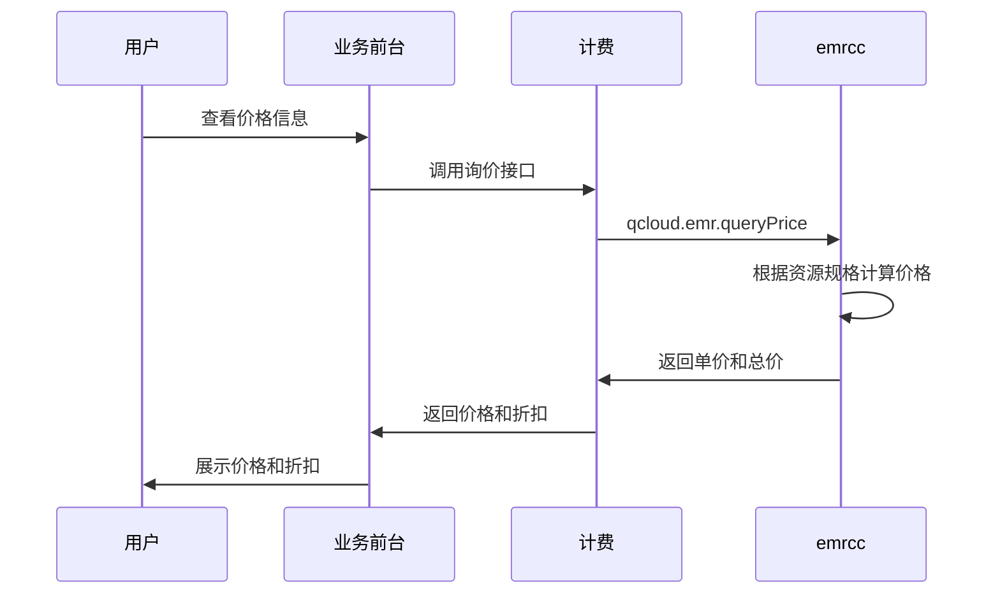
```mermaid
sequenceDiagram
    participant 用户
    participant 业务前台
    participant 计费
    participant emrcc

    用户->>业务前台: 查看价格信息
    业务前台->>计费: 调用询价接口
    计费->>emrcc: qcloud.emr.queryPrice
    emrcc->>emrcc: 根据资源规格计算价格
    emrcc->>计费: 返回单价和总价
    计费->>业务前台: 返回价格和折扣
    业务前台->>用户: 展示价格和折扣
```

**询价接口说明：**
- 接口名：`qcloud.emr.queryPrice`
- 支持创建询价和扩容询价
- 计算维度包括：CVM 实例费用、CBS 云硬盘费用、CDB 数据库费用
- 预付费询价阶梯始终为 0

#### 2.1.2 新购流程（创建集群/扩容/添加 Router）

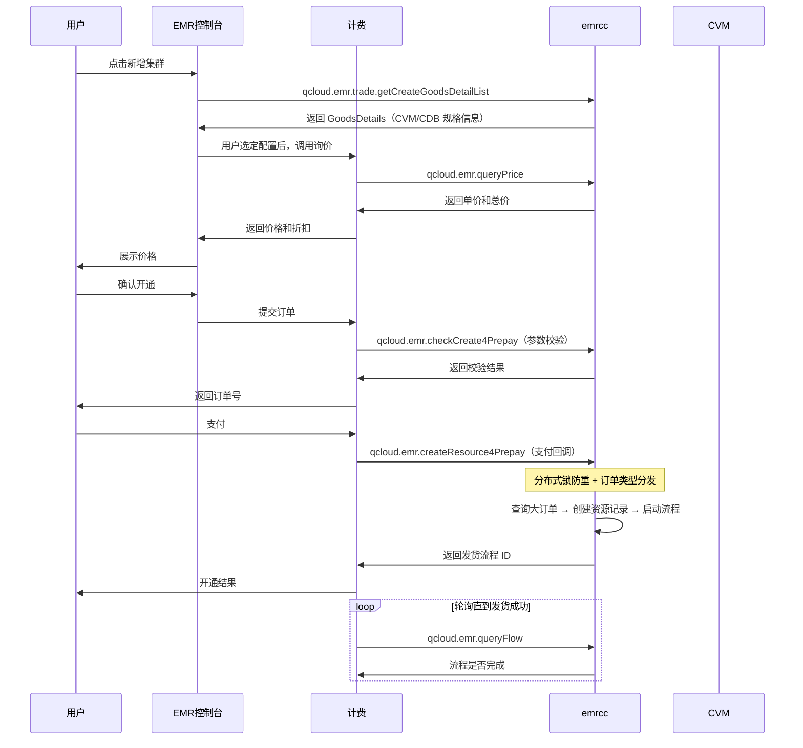
```mermaid
sequenceDiagram
    participant 用户
    participant EMR控制台
    participant 计费
    participant emrcc
    participant CVM

    用户->>EMR控制台: 点击新增集群
    EMR控制台->>emrcc: qcloud.emr.trade.getCreateGoodsDetailList
    emrcc->>EMR控制台: 返回 GoodsDetails（CVM/CDB 规格信息）
    EMR控制台->>计费: 用户选定配置后，调用询价
    计费->>emrcc: qcloud.emr.queryPrice
    emrcc->>计费: 返回单价和总价
    计费->>EMR控制台: 返回价格和折扣
    EMR控制台->>用户: 展示价格
    用户->>EMR控制台: 确认开通
    EMR控制台->>计费: 提交订单
    计费->>emrcc: qcloud.emr.checkCreate4Prepay（参数校验）
    emrcc->>计费: 返回校验结果
    计费->>用户: 返回订单号
    用户->>计费: 支付
    计费->>emrcc: qcloud.emr.createResource4Prepay（支付回调）
    Note over emrcc: 分布式锁防重 + 订单类型分发
    emrcc->>emrcc: 查询大订单 → 创建资源记录 → 启动流程
    emrcc->>计费: 返回发货流程 ID
    计费->>用户: 开通结果
    loop 轮询直到发货成功
        计费->>emrcc: qcloud.emr.queryFlow
        emrcc->>计费: 流程是否完成
    end
```

**关键说明：**
- EMR 集群的 CVM/CDB 均由计费系统下单（GoodsDetail）去生产
- 支付回调是整个流程的核心入口，通过 `createResource4Prepay` 接口触发

#### 2.1.3 支付回调核心逻辑（createResource4Prepay）

支付回调是预付费模式最核心的接口，代码位于 `emrcc/src/emr/controller/trade/prepay/create_resource_controller.go`。

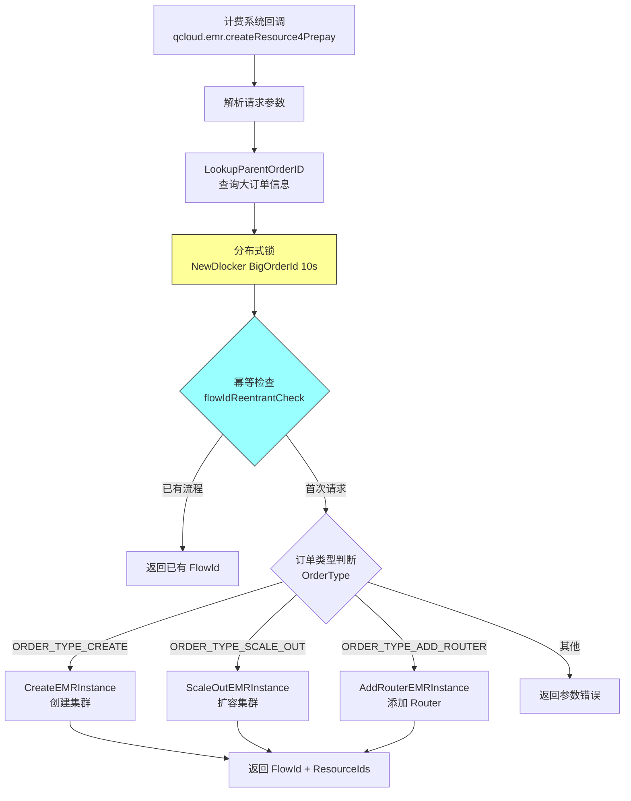
```mermaid
flowchart TD
    A[计费系统回调<br/>qcloud.emr.createResource4Prepay] --> B[解析请求参数]
    B --> C[LookupParentOrderID<br/>查询大订单信息]
    C --> D[分布式锁<br/>NewDlocker BigOrderId 10s]
    D --> E{幂等检查<br/>flowIdReentrantCheck}
    E -->|已有流程| F[返回已有 FlowId]
    E -->|首次请求| G{订单类型判断<br/>OrderType}
    G -->|ORDER_TYPE_CREATE| H[CreateEMRInstance<br/>创建集群]
    G -->|ORDER_TYPE_SCALE_OUT| I[ScaleOutEMRInstance<br/>扩容集群]
    G -->|ORDER_TYPE_ADD_ROUTER| J[AddRouterEMRInstance<br/>添加 Router]
    G -->|其他| K[返回参数错误]
    H & I & J --> L[返回 FlowId + ResourceIds]

    style D fill:#ff9,stroke:#333
    style E fill:#9ff,stroke:#333
```

**核心技术点：**

1. **分布式锁防重**：使用 Redis 分布式锁（`NewDlocker`），以 `BigOrderId` 为锁键，超时时间 10 秒，防止计费系统重复回调导致重复创建资源
2. **幂等性保证**：通过 `flowIdReentrantCheck` 检查是否已有关联流程，如果已存在则直接返回已有的 FlowId
3. **订单类型分发**：根据 `OrderType` 分发到不同的处理函数

**订单类型常量：**

| 常量 | 值 | 含义 |
|------|-----|------|
| `ORDER_TYPE_CREATE` | create | 创建集群 |
| `ORDER_TYPE_SCALE_OUT` | scaleout | 扩容集群 |
| `ORDER_TYPE_ADD_ROUTER` | addrouter | 添加 Router 节点 |
| `ORDER_TYPE_CREATE_NATIVE_RESOURCE` | create_native_resource | 创建容器资源 |

### 2.2 续费流程

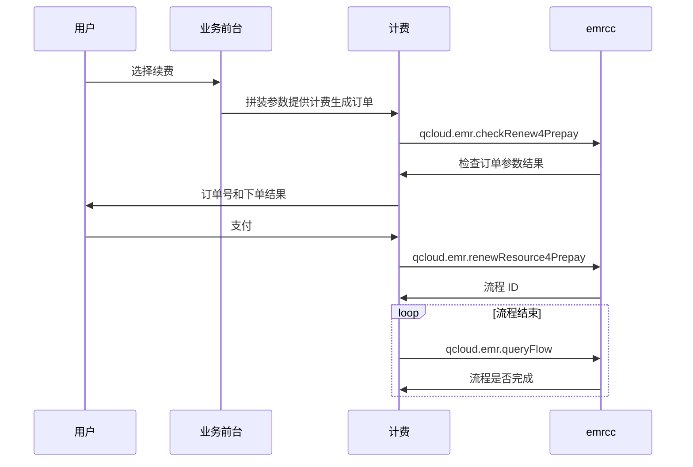
```mermaid
sequenceDiagram
    participant 用户
    participant 业务前台
    participant 计费
    participant emrcc

    用户->>业务前台: 选择续费
    业务前台->>计费: 拼装参数提供计费生成订单
    计费->>emrcc: qcloud.emr.checkRenew4Prepay
    emrcc->>计费: 检查订单参数结果
    计费->>用户: 订单号和下单结果
    用户->>计费: 支付
    计费->>emrcc: qcloud.emr.renewResource4Prepay
    emrcc->>计费: 流程 ID
    loop 流程结束
        计费->>emrcc: qcloud.emr.queryFlow
        emrcc->>计费: 流程是否完成
    end
```

**续费资源状态流转：**
```
RESOURCE_STATUS_READY(2) 
  → RESOURCE_STATUS_RENEW_WAIT(17)     // 等待续费
    → RESOURCE_STATUS_RENEW_POLL_WAIT(18)  // 续费下单成功，等待确认
      → RESOURCE_STATUS_READY(2)           // 续费成功，恢复就绪
    → RESOURCE_STATUS_RENEW_WAIT(17)       // 下单失败，挂起续费流程
```

**续费关键逻辑：**
- 续费流程标识：`FLOW_EMR_RENEW_RESOURCE = "emr_renew_resource"`
- 给计费下单续费成功后，需要轮询确认 CVM 实例仍然存在
- 支持自动续费设置（`qcloud.emr.setRenewFlag4Prepay`）

### 2.3 变配流程（变更配置）

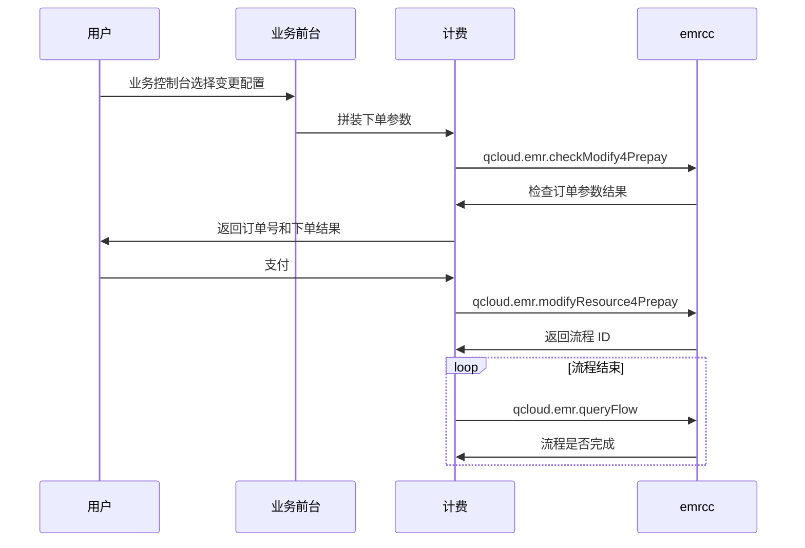
```mermaid
sequenceDiagram
    participant 用户
    participant 业务前台
    participant 计费
    participant emrcc

    用户->>业务前台: 业务控制台选择变更配置
    业务前台->>计费: 拼装下单参数
    计费->>emrcc: qcloud.emr.checkModify4Prepay
    emrcc->>计费: 检查订单参数结果
    计费->>用户: 返回订单号和下单结果
    用户->>计费: 支付
    计费->>emrcc: qcloud.emr.modifyResource4Prepay
    emrcc->>计费: 返回流程 ID
    loop 流程结束
        计费->>emrcc: qcloud.emr.queryFlow
        emrcc->>计费: 流程是否完成
    end
```

**预付费变配资源状态流转：**
```
RESOURCE_STATUS_READY(2) 
  → 复制记录
    → 旧记录: RESOURCE_STATUS_UNUSED(5)        // 旧资源标记为未使用
    → 新记录: RESOURCE_STATUS_UPDATE_WAIT(13)   // 新资源等待更新
      → RESOURCE_STATUS_READY(2)                // 确认新 CVM 存在后恢复就绪
```

### 2.4 隔离流程

预付费资源到期后，如果未设置自动续费或续费失败，资源将被隔离。

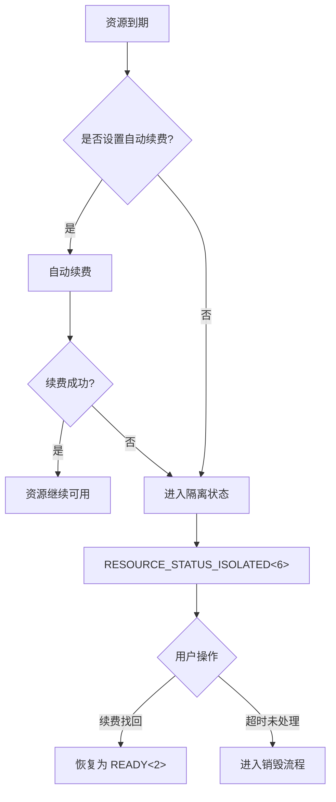
```mermaid
flowchart TD
    A[资源到期] --> B{是否设置自动续费?}
    B -->|是| C[自动续费]
    C --> D{续费成功?}
    D -->|是| E[资源继续可用]
    D -->|否| F[进入隔离状态]
    B -->|否| F
    F --> G[RESOURCE_STATUS_ISOLATED<6>]
    G --> H{用户操作}
    H -->|续费找回| I[恢复为 READY<2>]
    H -->|超时未处理| J[进入销毁流程]
```

**隔离接口：** `qcloud.emr.isolateResource4Prepay`

### 2.5 销毁/退款流程

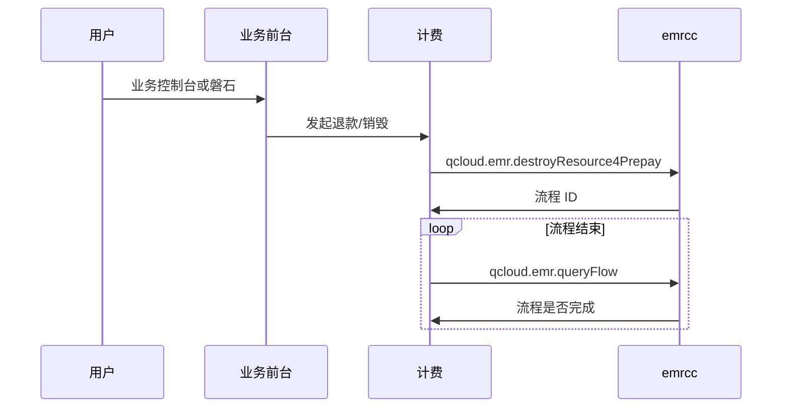
```mermaid
sequenceDiagram
    participant 用户
    participant 业务前台
    participant 计费
    participant emrcc

    用户->>业务前台: 业务控制台或磐石
    业务前台->>计费: 发起退款/销毁
    计费->>emrcc: qcloud.emr.destroyResource4Prepay
    emrcc->>计费: 流程 ID
    loop 流程结束
        计费->>emrcc: qcloud.emr.queryFlow
        emrcc->>计费: 流程是否完成
    end
```

**销毁资源状态流转：**
```
RESOURCE_STATUS_ISOLATED(6) 
  → RESOURCE_STATUS_DESTORY_WAIT(14)   // 等待销毁
    → RESOURCE_STATUS_DESTROYED(7)     // 已销毁
```

### 2.6 生命周期定时巡检

计费系统每天执行定时任务，巡检所有 EMR 资源的生命周期状态：

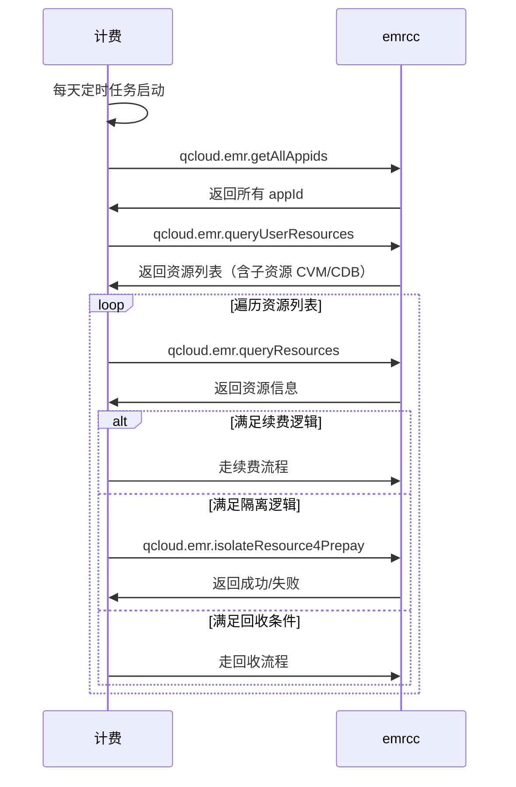
```mermaid
sequenceDiagram
    participant 计费
    participant emrcc

    计费->>计费: 每天定时任务启动
    计费->>emrcc: qcloud.emr.getAllAppids
    emrcc->>计费: 返回所有 appId
    计费->>emrcc: qcloud.emr.queryUserResources
    emrcc->>计费: 返回资源列表（含子资源 CVM/CDB）
    loop 遍历资源列表
        计费->>emrcc: qcloud.emr.queryResources
        emrcc->>计费: 返回资源信息
        alt 满足续费逻辑
            计费->>emrcc: 走续费流程
        else 满足隔离逻辑
            计费->>emrcc: qcloud.emr.isolateResource4Prepay
            emrcc->>计费: 返回成功/失败
        else 满足回收条件
            计费->>emrcc: 走回收流程
        end
    end
```

---

## 三、后付费模式（按量计费）

后付费模式下用户先使用后付费，按实际使用时长计费，适用于临时或不确定时长的使用场景。

### 3.1 开通流程

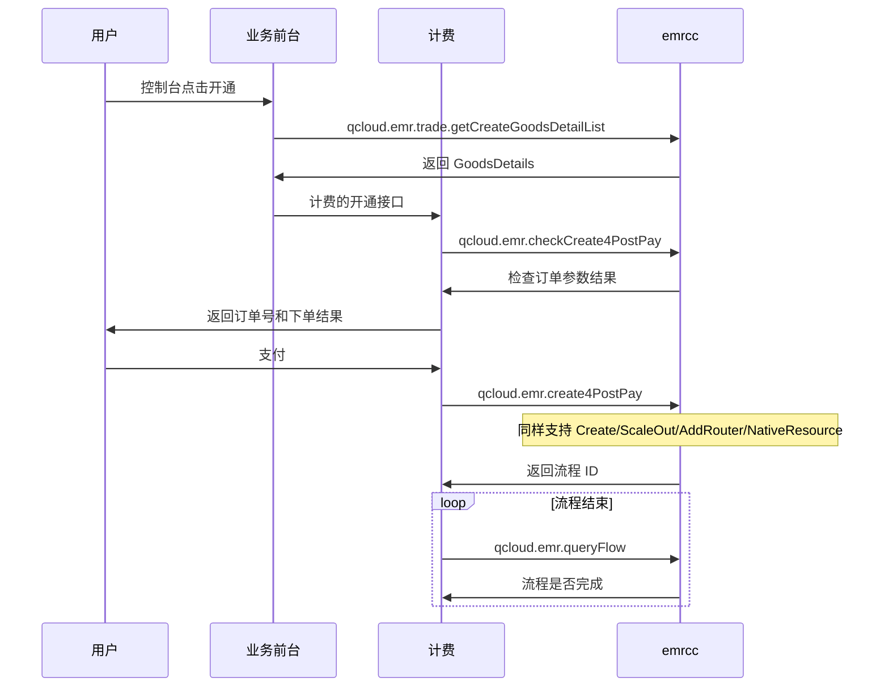
```mermaid
sequenceDiagram
    participant 用户
    participant 业务前台
    participant 计费
    participant emrcc

    用户->>业务前台: 控制台点击开通
    业务前台->>emrcc: qcloud.emr.trade.getCreateGoodsDetailList
    emrcc->>业务前台: 返回 GoodsDetails
    业务前台->>计费: 计费的开通接口
    计费->>emrcc: qcloud.emr.checkCreate4PostPay
    emrcc->>计费: 检查订单参数结果
    计费->>用户: 返回订单号和下单结果
    用户->>计费: 支付
    计费->>emrcc: qcloud.emr.create4PostPay
    Note over emrcc: 同样支持 Create/ScaleOut/AddRouter/NativeResource
    emrcc->>计费: 返回流程 ID
    loop 流程结束
        计费->>emrcc: qcloud.emr.queryFlow
        emrcc->>计费: 流程是否完成
    end
```

**后付费创建核心逻辑：**

后付费的资源创建逻辑（`create_emr_vm.go`）与预付费共享底层实现，同样根据 `OrderType` 分发：

| OrderType | 处理函数 | 说明 |
|-----------|---------|------|
| `ORDER_TYPE_CREATE` | `CreateEMRInstance` | 创建集群（复用预付费逻辑） |
| `ORDER_TYPE_SCALE_OUT` | `ScaleOutEMRInstance` | 扩容集群 |
| `ORDER_TYPE_ADD_ROUTER` | `AddRouterEMRInstance` | 添加 Router |
| `ORDER_TYPE_CREATE_NATIVE_RESOURCE` | `CreateNativePodResource` | 创建容器资源（后付费独有） |

### 3.2 用量上报机制

后付费模式的核心特点是需要 EMR 定时向计费系统上报资源用量：

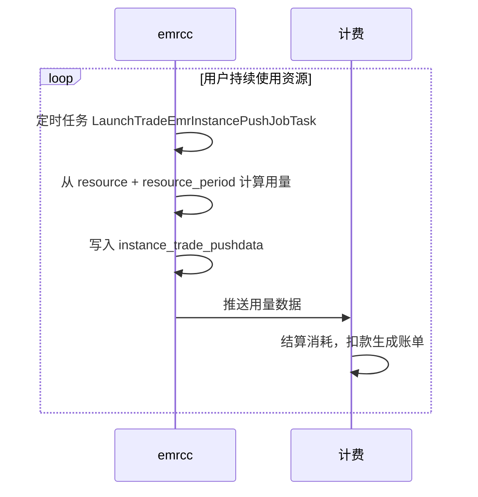
```mermaid
sequenceDiagram
    participant emrcc
    participant 计费

    loop 用户持续使用资源
        emrcc->>emrcc: 定时任务 LaunchTradeEmrInstancePushJobTask
        emrcc->>emrcc: 从 resource + resource_period 计算用量
        emrcc->>emrcc: 写入 instance_trade_pushdata
        emrcc->>计费: 推送用量数据
        计费->>计费: 结算消耗，扣款生成账单
    end
```

**上报说明：**
- EMR 只上报 CVM 的 CPU 和内存用量，不需要上报云盘用量
- 上报数据保存在 `instance_trade_pushdata` 表中
- 通过定时任务 `LaunchTradeEmrInstancePushJobTask` 驱动

### 3.3 欠费处理流程

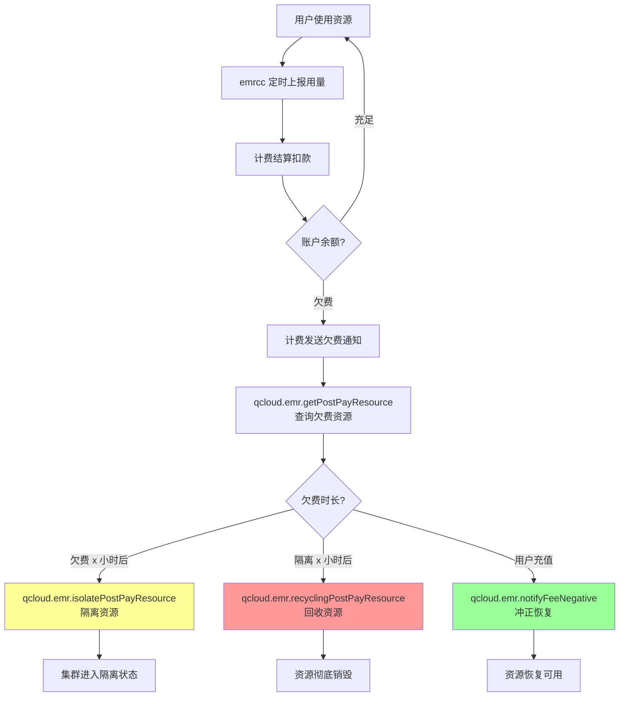
```mermaid
flowchart TD
    A[用户使用资源] --> B[emrcc 定时上报用量]
    B --> C[计费结算扣款]
    C --> D{账户余额?}
    D -->|充足| A
    D -->|欠费| E[计费发送欠费通知]
    E --> F[qcloud.emr.getPostPayResource<br/>查询欠费资源]
    F --> G{欠费时长?}
    G -->|欠费 x 小时后| H[qcloud.emr.isolatePostPayResource<br/>隔离资源]
    G -->|隔离 x 小时后| I[qcloud.emr.recyclingPostPayResource<br/>回收资源]
    G -->|用户充值| J[qcloud.emr.notifyFeeNegative<br/>冲正恢复]

    H --> K[集群进入隔离状态]
    I --> L[资源彻底销毁]
    J --> M[资源恢复可用]

    style H fill:#ff9
    style I fill:#f99
    style J fill:#9f9
```

### 3.4 后付费变配

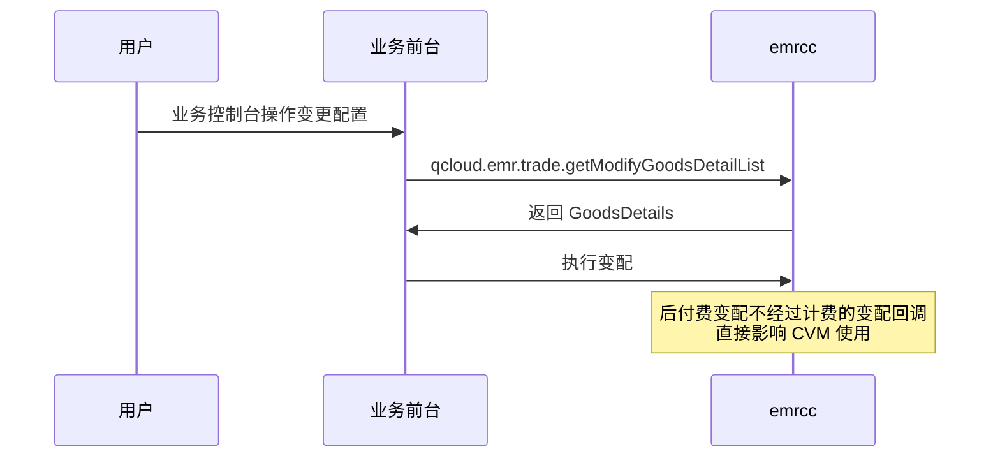
```mermaid
sequenceDiagram
    participant 用户
    participant 业务前台
    participant emrcc

    用户->>业务前台: 业务控制台操作变更配置
    业务前台->>emrcc: qcloud.emr.trade.getModifyGoodsDetailList
    emrcc->>业务前台: 返回 GoodsDetails
    业务前台->>emrcc: 执行变配
    Note over emrcc: 后付费变配不经过计费的变配回调<br/>直接影响 CVM 使用
```

**后付费变配资源状态流转：**
```
RESOURCE_STATUS_READY(2) 
  → RESOURCE_STATUS_MODIFING(21)       // 变配中
    → 复制记录
      → 旧记录: RESOURCE_STATUS_UNUSED(5)   // 旧资源标记未使用
      → 新记录: RESOURCE_STATUS_READY(2)     // 新资源就绪
      → 插入 resource_period 记录            // 用于后续用量上报
```

---

## 四、资源状态全景

### 4.1 资源状态常量定义

资源状态定义在 `emrcc/src/emr/model/trade/resource_status.go` 中：

| 状态码 | 常量名 | 含义 | 适用场景 |
|--------|--------|------|---------|
| 0 | `RESOURCE_STATUS_INIT` | 初始化 | 资源记录刚创建 |
| 1 | `RESOURCE_STATUS_POLL_WAIT` | 轮询等待 | 等待资源创建完成 |
| 2 | `RESOURCE_STATUS_READY` | 就绪/可用 | 资源正常使用中 |
| 3 | `RESOURCE_STATUS_POST_MODIFY` | 按量变配 | 按量变配流程（不流经计费） |
| 4 | `RESOURCE_STATUS_ERROR` | 错误 | 资源异常 |
| 5 | `RESOURCE_STATUS_UNUSED` | 未使用 | 变配/退款后旧资源标记 |
| 6 | `RESOURCE_STATUS_ISOLATED` | 已隔离 | 到期/欠费隔离 |
| 7 | `RESOURCE_STATUS_DESTROYED` | 已销毁 | 资源已彻底销毁 |
| 8 | `RESOURCE_STATUS_REFUND_WAIT` | 等待退款 | 退款流程中 |
| 9 | `RESOURCE_STATUS_REFUND_CONFIRM_WAIT` | 退款确认等待 | 等待退款确认 |
| 10 | `RESOURCE_STATUS_REFUND` | 已退款 | 退款完成 |
| 11 | `RESOURCE_STATUS_ISOLATED_WAIT` | 隔离等待 | 等待隔离 |
| 12 | `RESOURCE_STATUS_ISOLATED_IN_PROGRESS` | 隔离进行中 | 隔离执行中 |
| 13 | `RESOURCE_STATUS_UPDATE_WAIT` | 更新等待 | 预付费变配新资源等待 |
| 14 | `RESOURCE_STATUS_DESTORY_WAIT` | 销毁等待 | 等待销毁 |
| 15 | `RESOURCE_STATUS_DESTORY_FINISH` | 销毁完成 | 销毁流程结束 |
| 17 | `RESOURCE_STATUS_RENEW_WAIT` | 续费等待 | 等待续费下单 |
| 18 | `RESOURCE_STATUS_RENEW_POLL_WAIT` | 续费轮询等待 | 续费下单成功，等待确认 |
| 19 | `RESOURCE_STATUS_RENEW_IN_CONFIRM` | 续费确认中 | 续费确认阶段 |
| 20 | `RESOURCE_STATUS_POST_WAIT_PUSH` | 按量等待上报 | 按量资源就绪，等待上报用量 |
| 21 | `RESOURCE_STATUS_MODIFING` | 变配中 | 后付费变配进行中 |
| 22 | `ResourceStatusForLaunchFailed` | 发货失败处理 | 自动化处理 launch_failed 状态 |
| 23 | `resourceStatusReadyWait` | 就绪等待 | 等待就绪 |
| 24 | `resourcePartsRefundWait` | 部分退款等待 | 等待清理非正常状态机器 |
| 25 | `resourcePartsRefunded` | 部分已退款 | 部分退款完成 |
| -1 | `RESOURCE_STATUS_ERROR_CVM_FATAL_RETURN` | CVM 致命错误 | CVM 层面不可恢复错误 |
| -2 | `RESOURCE_STATUS_ERROR_EMR_FATAL_RETURN` | EMR 致命错误 | EMR 层面不可恢复错误 |

### 4.2 预付费资源状态流转图

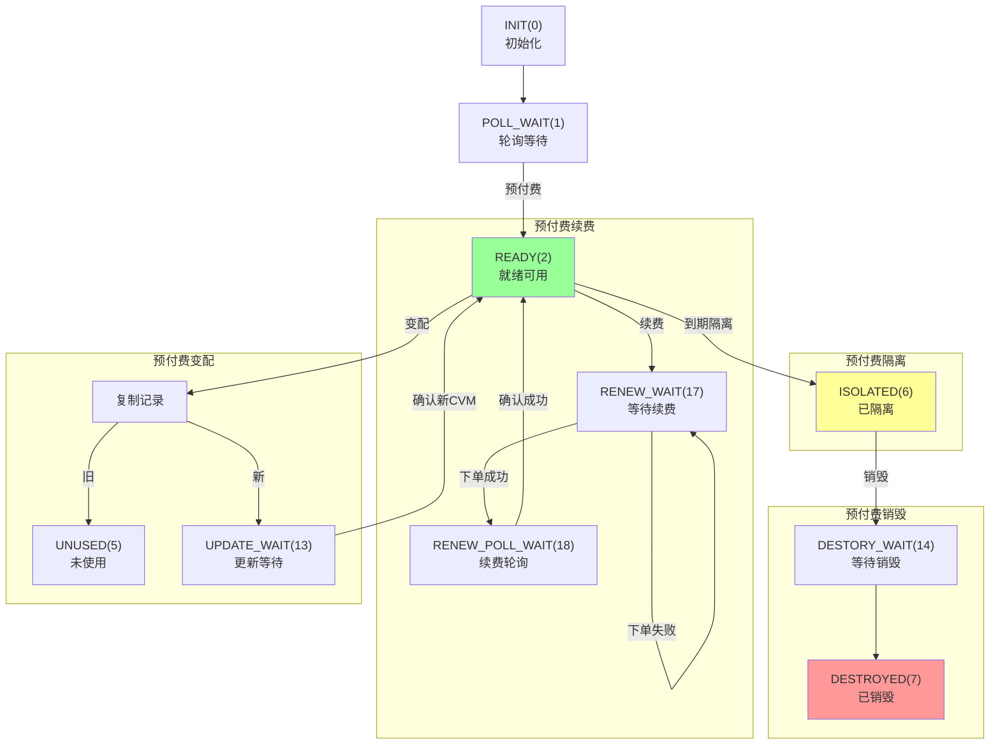
```mermaid
graph TB
    %% 创建流程
    INIT["INIT(0)<br/>初始化"] --> POLL["POLL_WAIT(1)<br/>轮询等待"]
    POLL -->|预付费| READY["READY(2)<br/>就绪可用"]

    %% 续费流程
    subgraph 预付费续费
        READY -->|续费| RENEW_WAIT["RENEW_WAIT(17)<br/>等待续费"]
        RENEW_WAIT -->|下单成功| RENEW_POLL["RENEW_POLL_WAIT(18)<br/>续费轮询"]
        RENEW_WAIT -->|下单失败| RENEW_WAIT
        RENEW_POLL -->|确认成功| READY
    end

    %% 隔离流程
    subgraph 预付费隔离
        READY -->|到期隔离| ISOLATED["ISOLATED(6)<br/>已隔离"]
    end

    %% 销毁流程
    subgraph 预付费销毁
        ISOLATED -->|销毁| DESTROY_WAIT["DESTORY_WAIT(14)<br/>等待销毁"]
        DESTROY_WAIT --> DESTROYED["DESTROYED(7)<br/>已销毁"]
    end

    %% 变配流程
    subgraph 预付费变配
        READY -->|变配| COPY1["复制记录"]
        COPY1 -->|旧| UNUSED["UNUSED(5)<br/>未使用"]
        COPY1 -->|新| UPDATE_WAIT["UPDATE_WAIT(13)<br/>更新等待"]
        UPDATE_WAIT -->|确认新CVM| READY
    end

    style READY fill:#9f9
    style ISOLATED fill:#ff9
    style DESTROYED fill:#f99
```

### 4.3 后付费资源状态流转图

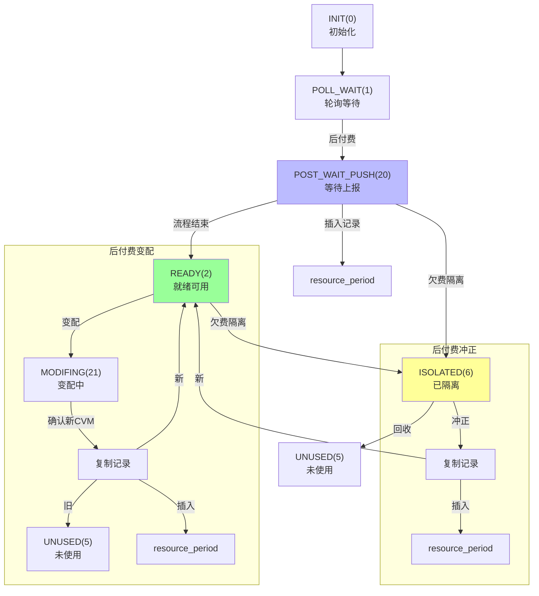
```mermaid
graph TB
    %% 创建流程
    INIT["INIT(0)<br/>初始化"] --> POLL["POLL_WAIT(1)<br/>轮询等待"]
    POLL -->|后付费| POST_WAIT["POST_WAIT_PUSH(20)<br/>等待上报"]
    POST_WAIT -->|流程结束| READY["READY(2)<br/>就绪可用"]
    POST_WAIT -->|插入记录| RP["resource_period"]

    %% 变配流程
    subgraph 后付费变配
        READY -->|变配| MODIFING["MODIFING(21)<br/>变配中"]
        MODIFING -->|确认新CVM| COPY["复制记录"]
        COPY -->|旧| UNUSED["UNUSED(5)<br/>未使用"]
        COPY -->|新| READY
        COPY -->|插入| RP2["resource_period"]
    end

    %% 隔离流程
    READY -->|欠费隔离| ISOLATED["ISOLATED(6)<br/>已隔离"]
    POST_WAIT -->|欠费隔离| ISOLATED

    %% 回收流程
    ISOLATED -->|回收| UNUSED2["UNUSED(5)<br/>未使用"]

    %% 冲正流程
    subgraph 后付费冲正
        ISOLATED -->|冲正| COPY2["复制记录"]
        COPY2 -->|新| READY
        COPY2 -->|插入| RP3["resource_period"]
    end

    style READY fill:#9f9
    style ISOLATED fill:#ff9
    style POST_WAIT fill:#bbf
```

---

## 五、数据库表设计

### 5.1 核心表关系

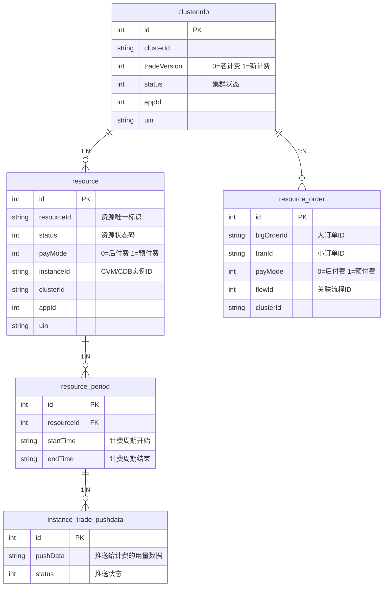
```mermaid
erDiagram
    clusterinfo ||--o{ resource : "1:N"
    clusterinfo ||--o{ resource_order : "1:N"
    resource ||--o{ resource_period : "1:N"
    resource_period ||--o{ instance_trade_pushdata : "1:N"

    clusterinfo {
        int id PK
        string clusterId
        int tradeVersion "0=老计费 1=新计费"
        int status "集群状态"
        int appId
        string uin
    }

    resource_order {
        int id PK
        string bigOrderId "大订单ID"
        string tranId "小订单ID"
        int payMode "0=后付费 1=预付费"
        int flowId "关联流程ID"
        string clusterId
    }

    resource {
        int id PK
        string resourceId "资源唯一标识"
        int status "资源状态码"
        int payMode "0=后付费 1=预付费"
        string instanceId "CVM/CDB实例ID"
        string clusterId
        int appId
        string uin
    }

    resource_period {
        int id PK
        int resourceId FK
        string startTime "计费周期开始"
        string endTime "计费周期结束"
    }

    instance_trade_pushdata {
        int id PK
        string pushData "推送给计费的用量数据"
        int status "推送状态"
    }
```

### 5.2 各表说明

| 表名 | 说明 | 关键字段 |
|------|------|---------|
| **clusterinfo** | EMR 集群信息主表 | `tradeVersion` 标识新/老计费 |
| **resource_order** | 计费发过来的每个订单记录 | `bigOrderId`（大订单）、`tranId`（小订单）、`payMode` |
| **resource** | EMR 实例下的子资源（CVM/CDB） | `status`（资源状态）、`payMode`（付费方式） |
| **resource_period** | 后付费资源的上报周期信息 | 记录按量资源的计费周期 |
| **instance_trade_pushdata** | 推送给计费的用量数据 | 根据 resource + resource_period 计算得出 |

---

## 六、交易相关流程标识

### 6.1 流程常量定义

交易计费相关的流程标识定义在 `emrcc/src/constants/constants.go` 中：

| 流程常量 | 流程名 | 说明 |
|---------|--------|------|
| `FLOW_EMR_CREATE_CLUSTER_WOODPECKER` | `emr_create_cluster_woodpecker` | Woodpecker 集群创建 |
| `FLOW_EMR_SCALEOUT_CLUSTER_WOODPECKER` | `emr_scaleout_cluster_woodpecker` | Woodpecker 集群扩容 |
| `FLOW_EMR_REFUND` | `emr_refund_resources` | 退款 |
| `FLOW_EMR_REFUND_WOODPECKER` | `emr_refund_resources_woodpecker` | Woodpecker 退款 |
| `FLOW_EMR_RENEW_RESOURCE` | `emr_renew_resource` | 续费 |
| `FLOW_EMR_ISOLATION_CLUSTER` | `emr_isolation_cluster` | 集群隔离 |
| `FLOW_EMR_ISOLATION_INSTANCE` | `emr_isolation_instance` | 预付费实例隔离 |
| `FLOW_EMR_ISOLATION_POSTPAY_INSTANCE` | `emr_isolation_postpay_instance` | 后付费实例隔离 |
| `FLOW_EMR_DESTROY_INSTANCE` | `emr_destroy_instance` | 预付费实例销毁 |
| `FLOW_EMR_DESTROY_INSTANCE_WOODPECKER` | `emr_destroy_instance_woodpecker` | Woodpecker 实例销毁 |
| `FLOW_EMR_UPDATE_INSTANCE` | `emr_update_instance` | 变配 |
| `FLOW_EMR_NOTIFY_FEE_NEGATIVE` | `emr_notify_fee_negative` | 后付费冲正 |
| `FLOW_EMR_RECYCLING_POSTPAY_INSTANCE` | `emr_recycling_postpay_instance` | 后付费回收 |
| `FLOW_EMR_RECYCLING_POSTPAY_INSTANCE_WOODPECKER` | `emr_recycling_postpay_instance_woodpecker` | Woodpecker 后付费回收 |

---

## 七、接口清单

### 7.1 预付费接口

| 接口名 | Controller | 说明 |
|--------|-----------|------|
| `qcloud.emr.checkCreate4Prepay` | `CheckCreateController4Prepay` | 创建订单参数校验 |
| `qcloud.emr.createResource4Prepay` | `CreateResourceController` | 支付回调，触发资源创建 |
| `qcloud.emr.checkModify4Prepay` | `CheckModifyController4Prepay` | 变配订单参数校验 |
| `qcloud.emr.modifyResource4Prepay` | `ModifyResourceController` | 变配资源 |
| `qcloud.emr.checkRenew4Prepay` | `CheckRenewController4Prepay` | 续费订单参数校验 |
| `qcloud.emr.renewResource4Prepay` | `RenewResourceController` | 续费资源 |
| `qcloud.emr.setRenewFlag4Prepay` | `SetRenewFlagController` | 设置自动续费标志 |
| `qcloud.emr.isolateResource4Prepay` | `IsolateResourceController` | 隔离资源 |
| `qcloud.emr.destroyResource4Prepay` | `DestroyResourceController` | 销毁资源 |
| `qcloud.emr.getAllAppids` | `GetAllAppidController` | 获取所有 AppId |
| `qcloud.emr.queryUserResources` | `GetUserResourcesController` | 查询用户资源列表 |
| `qcloud.emr.queryResources` | `GetResourcesController` | 查询资源详情 |
| `qcloud.emr.getDeadlineList` | `GetDeadlineListController` | 获取到期列表 |
| `qcloud.emr.queryFlow` | `QueryFlowController` | 查询流程状态 |

### 7.2 后付费接口

| 接口名 | Controller | 说明 |
|--------|-----------|------|
| `qcloud.emr.checkCreate4PostPay` | `CheckCreateController4PostPay` | 创建订单参数校验 |
| `qcloud.emr.create4PostPay` | `CreateResourceController4PostPay` | 创建资源 |
| `qcloud.emr.checkModify4PostPay` | `CheckModifyController4PostPay` | 变配参数校验 |
| `qcloud.emr.modifyPostPayResource` | `ModifyResourceController4PostPay` | 变配资源 |
| `qcloud.emr.isolatePostPayResource` | `IsolateResourceController4PostPay` | 隔离资源 |
| `qcloud.emr.recyclingPostPayResource` | `RecyclingResourceController4PostPay` | 回收资源 |
| `qcloud.emr.notifyFeeNegative` | `NotifyFeeNegativeController` | 冲正通知 |
| `qcloud.emr.getPostPayResource` | `GetPostPayInstanceArrearsController` | 查询欠费资源 |

### 7.3 公共接口

| 接口名 | 说明 |
|--------|------|
| `qcloud.emr.queryPrice` | 询价（支持创建/扩容） |
| `qcloud.emr.trade.getCreateGoodsDetailList` | 获取创建商品详情 |
| `qcloud.emr.trade.getModifyGoodsDetailList` | 获取变配商品详情 |
| `qcloud.emr.queryBillExtendFields` | 查询账单扩展字段 |

---

## 八、定时任务

### 8.1 用量上报任务

| 任务名 | 说明 |
|--------|------|
| `LaunchTradeEmrInstancePushJobTask` | 定时推送后付费资源用量给计费系统 |

**上报流程：**
1. 从 `resource` 表查询所有后付费且状态为 READY 的资源
2. 从 `resource_period` 表获取计费周期信息
3. 计算 CPU 和内存用量
4. 写入 `instance_trade_pushdata` 表
5. 推送给腾讯云计费系统

### 8.2 价格校验任务

| 任务名 | 说明 |
|--------|------|
| `tradeCheckResourcePrice` | 定时校验订单价格是否一致 |

**校验逻辑：**
1. 查询需要校验的流程信息
2. 根据流程类型分发：
   - 续费流程 → `checkPrePayByReNew`
   - 创建/扩容流程 → `checkPrePayByCreateAbdScale`
3. 调用询价接口获取当前价格
4. 与订单实际价格对比
5. 价格不一致时记录告警

---

## 九、代码目录结构

```
emrcc/src/emr/
├── controller/trade/              # 交易计费 Controller 层
│   ├── README.md                  # 交易计费总体说明
│   ├── common/                    # 公共模型
│   │   └── model.go
│   ├── prepay/                    # 预付费接口
│   │   ├── README.md              # 预付费说明文档
│   │   ├── check_create_controller.go      # 创建校验
│   │   ├── create_resource_controller.go   # 支付回调（核心）
│   │   ├── check_modify_controller.go      # 变配校验
│   │   ├── modify_resource_controller.go   # 变配
│   │   ├── check_renew_controller.go       # 续费校验
│   │   ├── renew_resource_controller.go    # 续费
│   │   ├── isolate_resource_controller.go  # 隔离
│   │   ├── destroy_resource_controller.go  # 销毁
│   │   ├── get_all_appid_controller.go     # 获取所有AppId
│   │   ├── get_user_resources_controller.go # 用户资源查询
│   │   ├── get_resources_controller.go     # 资源详情查询
│   │   ├── get_deadline_list_controller.go # 到期列表
│   │   ├── query_flow_controllor.go        # 流程查询
│   │   └── setrenewflag_controller.go      # 设置自动续费
│   ├── postpay/                   # 后付费接口
│   │   ├── README.md              # 后付费说明文档
│   │   ├── check_create_controller.go      # 创建校验
│   │   ├── create_resource_controller.go   # 创建资源
│   │   ├── check_modify_controller.go      # 变配校验
│   │   ├── modify_resource_controller.go   # 变配
│   │   ├── isolate_resource_controller.go  # 隔离
│   │   ├── recycling_resource_controller.go # 回收
│   │   ├── notify_Fee_Negative_controller.go # 冲正
│   │   └── get_postpay_instance_arrears_controller.go # 欠费查询
│   └── query_bill_extend_fields.go # 账单扩展字段
│
├── trade/                         # 交易计费业务逻辑层
│   ├── prepay/                    # 预付费业务逻辑
│   │   ├── create_emr_instance.go          # 创建 EMR 实例
│   │   ├── scale_out_emr_instance.go       # 扩容 EMR 实例
│   │   ├── add_router_emr_instance.go      # 添加 Router
│   │   ├── renew_resource.go               # 续费
│   │   ├── modify_emr_instance.go          # 变配
│   │   ├── isolate_emr_instance.go         # 隔离
│   │   ├── destroy_emr_instance.go         # 销毁
│   │   ├── refund_resources.go             # 退款（76KB 大文件）
│   │   ├── poll_and_save_resource.go       # 轮询保存资源
│   │   ├── poll_and_save_resource_cvm.go   # CVM 资源轮询
│   │   ├── poll_and_save_resource_cdb.go   # CDB 资源轮询
│   │   └── lookup_resources.go             # 查询资源
│   ├── postpay/                   # 后付费业务逻辑
│   │   ├── create_emr_vm.go                # 创建 VM
│   │   ├── create_native_resource.go       # 创建容器资源
│   │   ├── push_trade_emr_instance.go      # 用量上报
│   │   ├── modify_emr_resource.go          # 变配
│   │   ├── isolation_postpay_resource.go   # 隔离
│   │   ├── recycling_postpay_resource.go   # 回收
│   │   ├── destory_postpay_resource.go     # 销毁
│   │   ├── notify_fee_negative.go          # 冲正
│   │   ├── unblock_emr.go                  # 解封
│   │   ├── get_cvm_deal.go                 # CVM 订单查询
│   │   └── get_cvm_status.go              # CVM 状态查询
│   ├── goods_detail/              # 商品详情构造
│   │   ├── create_goods_detail.go          # 创建商品详情（82KB）
│   │   ├── scale_out_goods_detail.go       # 扩容商品详情
│   │   ├── renew_goods_detail.go           # 续费商品详情
│   │   ├── modify_goods_detail.go          # 变配商品详情
│   │   └── pricing_field.go               # 定价字段
│   ├── price/                     # 询价逻辑
│   │   └── query_price.go
│   ├── delivery/                  # 交付管理
│   │   ├── delivery_record.go
│   │   └── delivery_record_manager.go
│   ├── account_verify/            # 账户校验
│   │   ├── account_verify_service.go
│   │   └── cvm_resource_account.go
│   ├── event_footprint/           # 事件足迹
│   │   ├── event_footprint.go
│   │   └── event_name_hub.go
│   ├── utils/                     # 工具函数
│   │   ├── cvm_util.go                     # CVM 工具（59KB）
│   │   ├── tke_utils.go                    # TKE 工具
│   │   └── trade_utils.go                  # 交易工具
│   ├── resource_handler_base.go   # 资源处理基类（30KB）
│   ├── query_price_instance.go    # 询价实例（116KB）
│   └── type_conversion/           # 类型转换
│       └── context_type_conversion.go      # 上下文类型转换（61KB）
│
├── model/trade/                   # 交易数据模型
│   └── resource_status.go         # 资源状态常量定义
│
├── taskhandler/                   # 流程任务处理器
│   └── refund_handler.go          # 退款处理器
│
└── schjob/                        # 定时任务
    └── tradeCheckResourcePrice.go # 价格校验定时任务
```

---

## 十、预付费 vs 后付费对比

| 维度 | 预付费（包年包月） | 后付费（按量计费） |
|------|-------------------|-------------------|
| **支付方式** | 先付费后使用 | 先使用后付费 |
| **订单环节** | 需要创建订单 → 支付 → 回调 | 直接创建资源 |
| **资源保障** | 资源有保障，到期前不会被回收 | 按需申请，欠费可能被隔离 |
| **计费触发** | 支付回调触发（`createResource4Prepay`） | 直接触发（`create4PostPay`） |
| **用量上报** | 不需要 | 需要定时上报 CPU/内存用量 |
| **到期处理** | 到期 → 隔离 → 续费/销毁 | 欠费 → 隔离 → 冲正/回收 |
| **变配流程** | 经过计费系统变配回调 | 不经过计费，直接影响 CVM |
| **缩容限制** | 包年包月节点不允许单独缩容 | 可随时缩容 |
| **冲正机制** | 无 | 有（`notifyFeeNegative`） |
| **适用场景** | 稳定长期使用 | 临时或不确定时长 |
| **核心接口数** | 14 个 | 8 个 |

---

## 十一、技术亮点与设计要点

### 11.1 分布式锁防重

预付费支付回调使用 Redis 分布式锁（`NewDlocker`），以 `BigOrderId` 为锁键，防止计费系统重复回调导致重复创建资源。这是因为计费系统在未收到成功响应时会重试回调。

```go
redisLocker, err := dlocker.NewDlocker(LOCKER_CREATE_RESOURCE_BIZ_TYPE, BigOrderId, 10)
```

### 11.2 幂等性设计

通过 `flowIdReentrantCheck` 机制实现幂等性：
- 首次请求：创建资源并返回 FlowId
- 重复请求：直接返回已有的 FlowId，不重复创建

### 11.3 大小订单机制

- **大订单（BigOrder）**：代表集群全部资源的总订单
- **小订单（SubOrder/TranId）**：代表单次交付的子订单
- 通过 `LookupParentOrderID` 从小订单反查大订单

### 11.4 资源轮询与状态确认

资源创建后不是立即可用，需要轮询确认：
- CVM 资源：轮询 CVM API 确认实例状态为 RUNNING
- CDB 资源：轮询 CDB API 确认实例就绪
- 续费/变配后：需要再次确认资源实例仍然存在

### 11.5 事件足迹（Event Footprint）

通过 `event_footprint` 模块记录交易过程中的关键事件，用于问题排查和审计追踪。

### 11.6 价格校验定时任务

`tradeCheckResourcePrice` 定时任务对比订单价格和实时询价结果，发现价格不一致时触发告警，防止计费异常。

### 11.7 预付费与后付费共享底层

后付费的资源创建逻辑（`create_emr_vm.go`）复用了预付费的 `CreateEMRInstance`、`ScaleOutEMRInstance`、`AddRouterEMRInstance` 等核心函数，实现了代码复用，降低了维护成本。

### 11.8 退款处理器（RefundHandler）

退款处理器在轮询资源时检查订单状态：
- 如果订单状态为已退款（refunded）
- 且资源数量不足以构建 EMR 集群
- 则挂起流程并发出告警

---

## 十二、完整业务流程总览

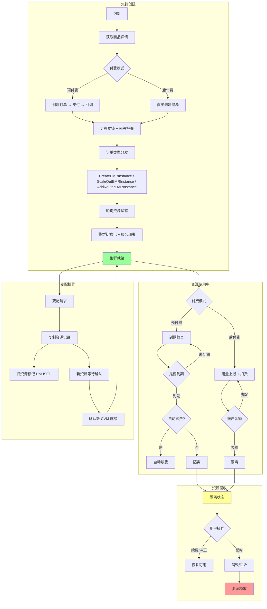
```mermaid
flowchart TB
    subgraph "集群创建"
        A1[询价] --> A2[获取商品详情]
        A2 --> A3{付费模式}
        A3 -->|预付费| A4[创建订单 → 支付 → 回调]
        A3 -->|后付费| A5[直接创建资源]
        A4 --> A6[分布式锁 + 幂等检查]
        A5 --> A6
        A6 --> A7[订单类型分发]
        A7 --> A8[CreateEMRInstance / ScaleOutEMRInstance / AddRouterEMRInstance]
        A8 --> A9[轮询资源状态]
        A9 --> A10[集群初始化 + 服务部署]
        A10 --> A11[集群就绪]
    end

    subgraph "资源使用中"
        A11 --> B1{付费模式}
        B1 -->|预付费| B2[到期检查]
        B1 -->|后付费| B3[用量上报 + 扣费]
        B2 --> B4{是否到期}
        B4 -->|未到期| B2
        B4 -->|到期| B5{自动续费?}
        B5 -->|是| B6[自动续费]
        B5 -->|否| B7[隔离]
        B3 --> B8{账户余额}
        B8 -->|充足| B3
        B8 -->|欠费| B9[隔离]
    end

    subgraph "资源回收"
        B7 & B9 --> C1[隔离状态]
        C1 --> C2{用户操作}
        C2 -->|续费/冲正| C3[恢复可用]
        C2 -->|超时| C4[销毁/回收]
        C4 --> C5[资源释放]
    end

    subgraph "变配操作"
        A11 --> D1[变配请求]
        D1 --> D2[复制资源记录]
        D2 --> D3[旧资源标记 UNUSED]
        D2 --> D4[新资源等待确认]
        D4 --> D5[确认新 CVM 就绪]
        D5 --> A11
    end

    style A11 fill:#9f9
    style C1 fill:#ff9
    style C5 fill:#f99
```

---

## 十三、详细业务流程：从用户下单到资源交付

### 13.1 客户到底购买了什么？

当用户在 EMR 控制台创建一个大数据集群时，他实际上购买的是**一组云资源的组合**，而不是单个产品。以一个典型的 HA 集群为例：

```
用户购买一个 HA 集群 = 
  ├── 2 台 Master 节点 CVM（云服务器）
  ├── 3 台 Core 节点 CVM（存储+计算）
  ├── N 台 Task 节点 CVM（纯计算，可选）
  ├── N 台 Common 节点 CVM（公共服务，可选）
  ├── N 台 Router 节点 CVM（路由，可选）
  ├── 每台 CVM 附带的 CBS 云盘（系统盘 + 数据盘）
  ├── 1 个 CDB 云数据库实例（MetaDB，给 Hive/Ranger 等组件用）
  └── EMR 服务费（按节点类型和规格计费）
```

#### 13.1.1 订单结构：大订单 + 子订单

系统采用**大订单（BigOrder）+ 子订单（ChildOrder）**的两层结构：

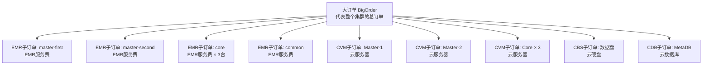
```mermaid
graph TD
    BIG["大订单 BigOrder<br/>代表整个集群的总订单"]
    BIG --> EMR1["EMR子订单: master-first<br/>EMR服务费"]
    BIG --> EMR2["EMR子订单: master-second<br/>EMR服务费"]
    BIG --> EMR3["EMR子订单: core<br/>EMR服务费 × 3台"]
    BIG --> EMR4["EMR子订单: common<br/>EMR服务费"]
    BIG --> CVM1["CVM子订单: Master-1<br/>云服务器"]
    BIG --> CVM2["CVM子订单: Master-2<br/>云服务器"]
    BIG --> CVM3["CVM子订单: Core × 3<br/>云服务器"]
    BIG --> CBS1["CBS子订单: 数据盘<br/>云硬盘"]
    BIG --> CDB1["CDB子订单: MetaDB<br/>云数据库"]
```

代码中的注释写得很清楚（来自 `EmrCreateGoodsDetail` 的注释）：

> 比如，新建一个HA集群，包含2个master节点、3个common节点、3个core节点；这里会生成一个大订单；然后，这个大订单下面，会有很多子订单；这些子订单分为**EMR订单、CVM订单、CBS订单、CDB订单**；其中，EMR订单包括 master-first、master-second、common、core 4个子订单。

#### 13.1.2 每个子订单的商品详情（GoodsDetail）

每个子订单都有一个 `GoodsDetail`，描述了具体购买的资源规格：

**EMR 子订单（`EmrCreateGoodsDetail`）：**
```json
{
  "timeSpan": 1,           // 购买时长
  "timeUnit": "m",         // 时长单位（m=月）
  "goodsNum": 3,           // 商品数量（如3台Core节点）
  "alias": "core",         // 节点类型标识
  
  // IaaS 层规格（CVM 硬件）
  "IaasCpu": 8,            // CPU 核数
  "IaasMem": 32,           // 内存 GB
  "IaasSpec": "S5",        // 机型族
  "InstanceType": "S5.2XLARGE32",  // 具体机型
  "IaasCbsVolume": 100,    // CBS 云盘大小 GB
  "IassCbsType": "CLOUD_SSD",     // 云盘类型
  "IaasLocalVolume": 0,    // 本地盘大小
  
  // EMR 服务费规格
  "ServiceCpu": 8,
  "ServiceMem": 32,
  "ServiceSpec": "S5",
  
  // 询价参数（传给计费系统计算价格）
  "PriceParam": {}
}
```

**CVM 子订单（`CvmCreateGoodsDetail`）：**
```json
{
  "Compute": { "Cpu": 8, "Mem": 32768 },     // 计算规格
  "DiskInfo": {                                // 磁盘信息
    "Root": { "Type": "CLOUD_SSD", "Size": 50 },   // 系统盘
    "Data": { "Type": "CLOUD_SSD", "Size": 500 }   // 数据盘
  },
  "Network": {                                 // 网络配置
    "VpcId": 12345,
    "SubnetId": 67890,
    "SgIds": ["sg-xxx"]                        // 安全组
  },
  "Location": {                                // 地域信息
    "RegionId": 1,
    "ZoneId": 100001,
    "ProjectId": 0
  },
  "Payment": {                                 // 付费信息
    "GoodsNum": 1,
    "TimeUnit": "m",
    "TimeSpan": 1,
    "CvmPayMode": 1                            // 1=预付费
  }
}
```

### 13.2 预付费（包年包月）完整流程

这是最复杂的流程，涉及**用户→前端→计费系统→emrcc→CVM/CDB API→woodpecker**的完整链路。

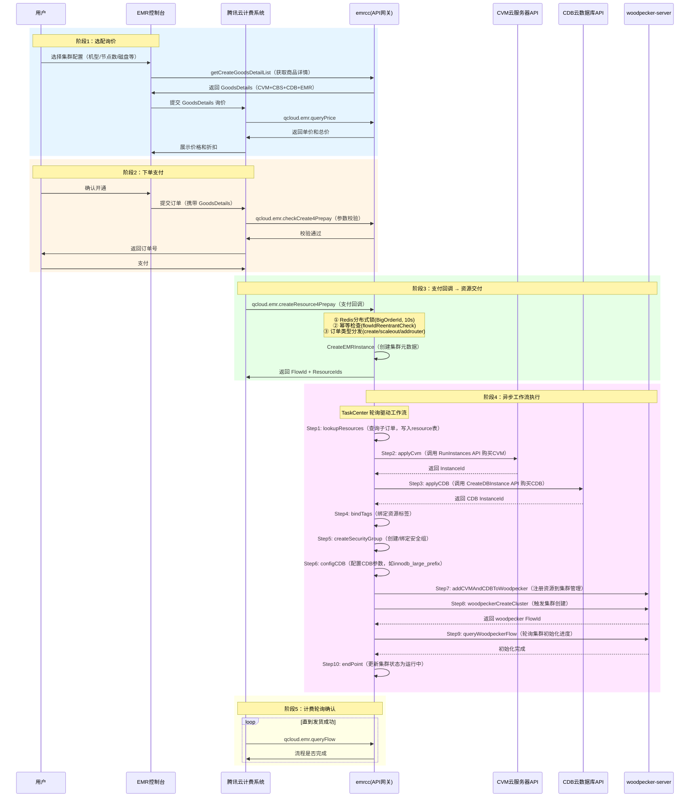
```mermaid
sequenceDiagram
    participant 用户
    participant 前端 as EMR控制台
    participant 计费 as 腾讯云计费系统
    participant emrcc as emrcc(API网关)
    participant CVM as CVM云服务器API
    participant CDB as CDB云数据库API
    participant wood as woodpecker-server

    rect rgb(230, 245, 255)
    Note over 用户,前端: 阶段1：选配询价
    用户->>前端: 选择集群配置（机型/节点数/磁盘等）
    前端->>emrcc: getCreateGoodsDetailList（获取商品详情）
    emrcc->>前端: 返回 GoodsDetails（CVM+CBS+CDB+EMR）
    前端->>计费: 提交 GoodsDetails 询价
    计费->>emrcc: qcloud.emr.queryPrice
    emrcc->>计费: 返回单价和总价
    计费->>前端: 展示价格和折扣
    end

    rect rgb(255, 245, 230)
    Note over 用户,计费: 阶段2：下单支付
    用户->>前端: 确认开通
    前端->>计费: 提交订单（携带 GoodsDetails）
    计费->>emrcc: qcloud.emr.checkCreate4Prepay（参数校验）
    emrcc->>计费: 校验通过
    计费->>用户: 返回订单号
    用户->>计费: 支付
    end

    rect rgb(230, 255, 230)
    Note over 计费,wood: 阶段3：支付回调 → 资源交付
    计费->>emrcc: qcloud.emr.createResource4Prepay（支付回调）
    Note over emrcc: ① Redis分布式锁(BigOrderId, 10s)<br/>② 幂等检查(flowIdReentrantCheck)<br/>③ 订单类型分发(create/scaleout/addrouter)
    emrcc->>emrcc: CreateEMRInstance（创建集群元数据）
    emrcc->>计费: 返回 FlowId + ResourceIds
    end

    rect rgb(255, 230, 255)
    Note over emrcc,wood: 阶段4：异步工作流执行
    Note over emrcc: TaskCenter 轮询驱动工作流
    emrcc->>emrcc: Step1: lookupResources（查询子订单，写入resource表）
    emrcc->>CVM: Step2: applyCvm（调用 RunInstances API 购买CVM）
    CVM-->>emrcc: 返回 InstanceId
    emrcc->>CDB: Step3: applyCDB（调用 CreateDBInstance API 购买CDB）
    CDB-->>emrcc: 返回 CDB InstanceId
    emrcc->>emrcc: Step4: bindTags（绑定资源标签）
    emrcc->>emrcc: Step5: createSecurityGroup（创建/绑定安全组）
    emrcc->>emrcc: Step6: configCDB（配置CDB参数，如innodb_large_prefix）
    emrcc->>wood: Step7: addCVMAndCDBToWoodpecker（注册资源到集群管理）
    emrcc->>wood: Step8: woodpeckerCreateCluster（触发集群创建）
    wood-->>emrcc: 返回 woodpecker FlowId
    emrcc->>wood: Step9: queryWoodpeckerFlow（轮询集群初始化进度）
    wood-->>emrcc: 初始化完成
    emrcc->>emrcc: Step10: endPoint（更新集群状态为运行中）
    end

    rect rgb(255, 255, 230)
    Note over 计费,emrcc: 阶段5：计费轮询确认
    loop 直到发货成功
        计费->>emrcc: qcloud.emr.queryFlow
        emrcc->>计费: 流程是否完成
    end
    end
```

#### 13.2.1 阶段 1：选配询价（用户还没花钱）

用户在 EMR 控制台选择集群配置后，前端调用 `getCreateGoodsDetailList` 接口获取商品详情列表。emrcc 会根据用户选择的配置，**并行构造**四类商品详情：

```go
// 并行查询四类商品详情
func QueryEmrClusterGoodsList(...) {
    switch specType {
    case model.CVM_TYPE:   // CVM 云服务器订单
        cvmGoodsList, _ := getCvmCreateOrders(createContext)
    case model.CDB_TYPE:   // CDB 云数据库订单
        ...
    case model.CBS_TYPE:   // CBS 云硬盘订单
        ...
    case model.EMR_TYPE:   // EMR 服务费订单
        ...
    }
}
```

每种节点类型（Master/Core/Task/Common/Router）都会生成对应的 `BaseEmrGoodsDetail`，包含：
- **IaaS 层**：CPU、内存、机型（如 S5.2XLARGE32）、本地盘/云盘规格
- **服务费层**：EMR 服务费的计算基准
- **询价参数**：传给计费系统用于计算价格的参数

#### 13.2.2 阶段 2：下单支付

用户确认开通后，计费系统会先调用 `checkCreate4Prepay` 做参数校验，然后生成订单。用户支付后，计费系统调用 `GenerateDealsAndPayV2` 生成大订单：

```go
// 预付费下单
tradeCgwService := component.NewTradeCgwService(createContext.RegionId)
_, _, Reply, err = tradeCgwService.GenerateDealsAndPayV2(
    p.Request.Uin,       // 用户 UIN
    p.Request.AppId,     // AppId
    GoodsDetails,        // 所有商品详情（CVM+CBS+CDB+EMR）
    EvenId,              // 事件ID
    0,                   // 标志位
)
```

计费系统返回 `BigDealId`（大订单号），后续所有操作都以这个大订单号为关联键。

#### 13.2.3 阶段 3：支付回调（最核心的入口）

用户支付成功后，计费系统回调 `createResource4Prepay` 接口。这是整个流程的**核心入口**：

```
计费回调 → 解析参数 → 查询大订单 → 分布式锁 → 幂等检查 → 创建集群 → 启动工作流
```

**三重防护机制：**

1. **分布式锁**：以 `BigOrderId` 为键，10 秒超时，防止计费系统重复回调
2. **幂等检查**：`flowIdReentrantCheck` 检查是否已有关联流程，有则直接返回
3. **订单类型分发**：根据 `OrderType` 分发到 `CreateEMRInstance`（创建）/ `ScaleOutEMRInstance`（扩容）/ `AddRouterEMRInstance`（添加Router）

#### 13.2.4 阶段 4：异步工作流（10 步流水线）

支付回调触发后，系统启动一个**异步工作流**，由 TaskCenter 轮询驱动。工作流包含 10 个步骤：

| 步骤 | Handler | 做了什么 | 详细说明 |
|------|---------|---------|---------|
| **1. lookupResources** | `LookupResourcesHandler` | 查询子订单，写入 resource 表 | 调用计费接口 `LookupChildrenOrderID` 获取大订单下的所有子订单（CVM/CDB/CBS/EMR），解析每个子订单的 ResourceId，写入 `resources` 表，状态设为 `POLL_WAIT(1)` |
| **2. applyCvm** | `applyCvmHandler` | 购买 CVM 云服务器 | 调用腾讯云 CVM API `RunInstances`，传入机型、镜像、磁盘、VPC、安全组等参数，获取 InstanceId |
| **3. applyCDB** | `applyCdbHandler` | 购买 CDB 云数据库 | 调用 CDB API 创建实例（4000MB 内存 / 100GB 磁盘），用于 Hive/Ranger 等组件的 MetaDB |
| **4. bindTags** | `bindTagsHandler` | 绑定资源标签 | 给 CVM/CDB 绑定用户自定义标签（如部门、项目等） |
| **5. createSecurityGroup** | `woodpeckerCreateSecurityGroupHandler` | 创建/绑定安全组 | 创建 EMR 专用安全组，开放集群内部通信端口 |
| **6. configCDB** | `configCDBRangerHandler` | 配置 CDB 参数 | 如果集群安装了 Ranger，需要设置 `innodb_large_prefix=ON` |
| **7. addCVMAndCDBToWoodpecker** | `woodpeckerAddCVMAndCDBHandler` | 注册资源到集群管理 | 将 CVM/CDB 信息注册到 woodpecker-server，建立集群与节点的关联 |
| **8. woodpeckerCreateCluster** | `woodpeckerCreateClusterHandler` | 触发集群创建 | 调用 woodpecker-server 的创建集群接口，开始部署大数据组件 |
| **9. queryWoodpeckerFlow** | `woodpeckerQueryFlowHandler` | 轮询集群初始化进度 | 轮询 woodpecker-server 的流程状态，等待所有组件（HDFS/YARN/Hive 等）部署完成 |
| **10. endPoint** | `endProcessHandler` | 更新集群状态 | 将集群状态更新为"运行中"，流程结束 |

#### 13.2.5 CVM 购买的具体逻辑

`applyCvm` 步骤中，系统调用腾讯云 CVM API `RunInstances` 创建云服务器：

```go
cvmReq := cvm.NewRunInstancesRequest()
cvmReq.InstanceChargeType = "POSTPAID_BY_HOUR"  // 后付费模式直接调API
cvmReq.Placement = &cvm.Placement{
    Zone:      "ap-guangzhou-3",     // 可用区
    ProjectId: 12345,                // 项目ID
}
cvmReq.InstanceType = "S5.2XLARGE32"  // 机型
cvmReq.ImageId = "img-xxx"            // 操作系统镜像

// 系统盘
cvmReq.SystemDisk = &cvm.SystemDisk{
    DiskType: "CLOUD_SSD",
    DiskSize: 50,
}

// 数据盘（支持多块）
cvmReq.DataDisks = []*cvm.DataDisk{
    { DiskType: "CLOUD_SSD", DiskSize: 500 },
}

// VPC 网络
cvmReq.VirtualPrivateCloud = &cvm.VirtualPrivateCloud{
    VpcId:    "vpc-xxx",
    SubnetId: "subnet-xxx",
}

// 安全组
cvmReq.SecurityGroupIds = ["sg-xxx"]

// 登录方式（密码或密钥）
cvmReq.LoginSettings = &cvm.LoginSettings{
    Password: "xxx",  // 或 KeyIds
}

// 打标：标记为 TBDS 购买的 CVM
cvmReq.PurchaseSource = "QCLOUD_TBDS"
```

**关键细节：**
- 预付费模式下，CVM 是由**计费系统下单生产**的（GoodsDetail 里包含了 CVM 规格），emrcc 只需要轮询确认 CVM 是否就绪
- 后付费模式下，emrcc **直接调用 CVM API** 创建实例（`RunInstances`），然后向计费系统上报用量

#### 13.2.6 CDB 购买的具体逻辑

CDB 的购买分两步：

**第一步：预申请（`PreApplyCdbInstance`）**
在创建集群元数据时，如果集群安装了 Hive/Sqoop/Hue/Ranger 等需要 MySQL 的组件，就会在 `cluster_cdb_info` 表中插入一条记录：

```go
// 默认规格：4000MB 内存，100GB 磁盘
sql := "insert into cluster_cdb_info(appId,clusterId,memsize,volume,...) values(?,?,?,?,...)"
// memsize=4000, volume=100
```

**第二步：实际申请（`ApplyCdbResource`）**
在工作流的 `applyCDB` 步骤中，调用 CDB API 创建实例，然后轮询等待 CDB 就绪：

```
创建 CDB → 轮询状态 → 初始化（设置密码/参数）→ 修改实例名为 "emr-cdb_{clusterId}"
```

CDB 初始化时有一个特殊逻辑：只有 `InitFlag==0 && TaskStatus==0` 时才进行初始化，保证幂等性。

### 13.3 后付费（按量计费）完整流程

后付费与预付费的核心区别在于：**不需要用户先支付，直接创建资源，然后定时上报用量给计费系统结算**。

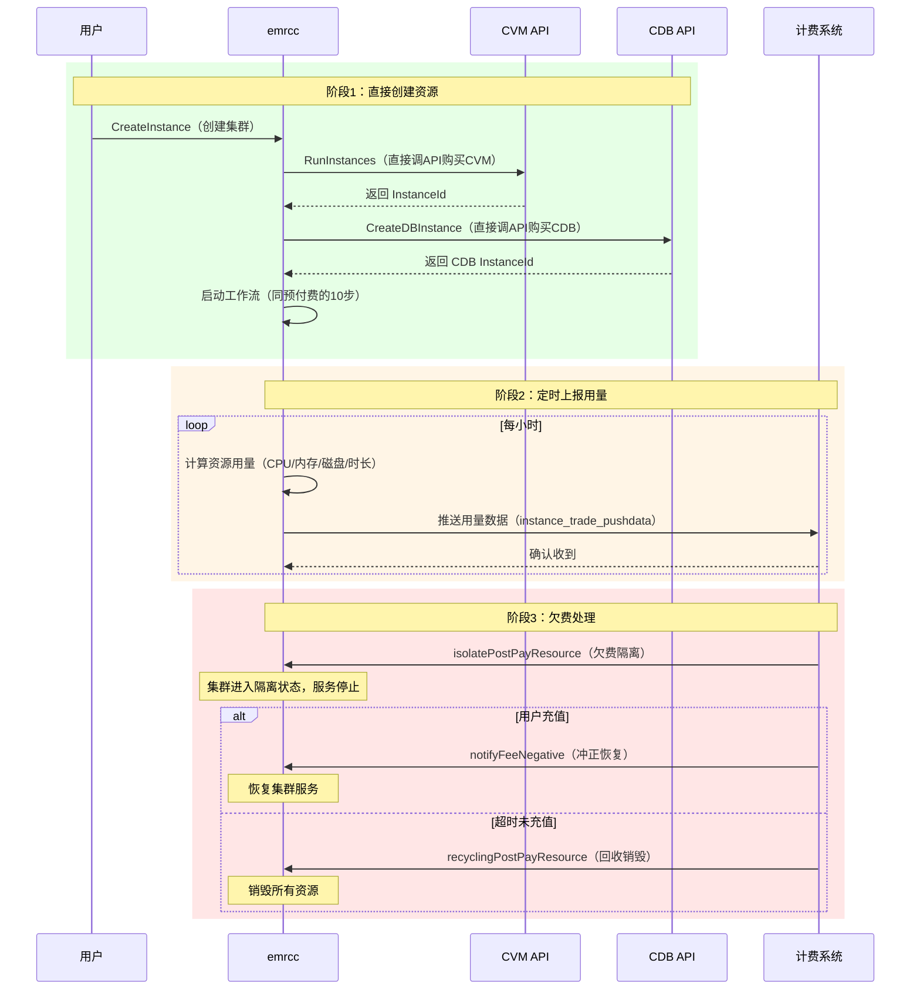
```mermaid
sequenceDiagram
    participant 用户
    participant emrcc
    participant CVM as CVM API
    participant CDB as CDB API
    participant 计费 as 计费系统

    rect rgb(230, 255, 230)
    Note over 用户,CDB: 阶段1：直接创建资源
    用户->>emrcc: CreateInstance（创建集群）
    emrcc->>CVM: RunInstances（直接调API购买CVM）
    CVM-->>emrcc: 返回 InstanceId
    emrcc->>CDB: CreateDBInstance（直接调API购买CDB）
    CDB-->>emrcc: 返回 CDB InstanceId
    emrcc->>emrcc: 启动工作流（同预付费的10步）
    end

    rect rgb(255, 245, 230)
    Note over emrcc,计费: 阶段2：定时上报用量
    loop 每小时
        emrcc->>emrcc: 计算资源用量（CPU/内存/磁盘/时长）
        emrcc->>计费: 推送用量数据（instance_trade_pushdata）
        计费-->>emrcc: 确认收到
    end
    end

    rect rgb(255, 230, 230)
    Note over 计费,emrcc: 阶段3：欠费处理
    计费->>emrcc: isolatePostPayResource（欠费隔离）
    Note over emrcc: 集群进入隔离状态，服务停止
    alt 用户充值
        计费->>emrcc: notifyFeeNegative（冲正恢复）
        Note over emrcc: 恢复集群服务
    else 超时未充值
        计费->>emrcc: recyclingPostPayResource（回收销毁）
        Note over emrcc: 销毁所有资源
    end
    end
```

**后付费的关键差异：**

| 维度 | 预付费 | 后付费 |
|------|--------|--------|
| **CVM 创建方式** | 计费系统下单生产 | emrcc 直接调 `RunInstances` API |
| **触发入口** | 计费系统支付回调 | 用户直接调 CreateInstance |
| **资源状态** | `POLL_WAIT(1)` → `READY(2)` | `POLL_WAIT(1)` → `POST_WAIT_PUSH(20)` → `READY(2)` |
| **计费方式** | 一次性支付 | 定时上报用量，按小时结算 |
| **欠费处理** | 到期隔离 | 欠费隔离 → 冲正恢复 / 超时销毁 |
| **用量上报** | 不需要 | 需要，写入 `resource_period` 和 `instance_trade_pushdata` 表 |

### 13.4 资源状态流转全景图

每个资源（CVM/CDB）在 `resources` 表中都有一个 `status` 字段，记录其生命周期状态：

```mermaid
graph TB
    INIT["INIT(0)<br/>初始化"] --> POLL["POLL_WAIT(1)<br/>轮询等待"]
    
    POLL -->|预付费| READY["READY(2)<br/>就绪可用"]
    POLL -->|后付费| POST_PUSH["POST_WAIT_PUSH(20)<br/>等待上报用量"]
    POST_PUSH --> READY

    subgraph 续费
        READY -->|续费| RENEW_WAIT["RENEW_WAIT(17)"]
        RENEW_WAIT -->|下单成功| RENEW_POLL["RENEW_POLL_WAIT(18)"]
        RENEW_POLL -->|确认CVM存在| READY
    end

    subgraph 变配
        READY -->|变配| COPY["复制记录"]
        COPY -->|旧| UNUSED["UNUSED(5)"]
        COPY -->|新| UPDATE_WAIT["UPDATE_WAIT(13)"]
        UPDATE_WAIT -->|确认新CVM| READY
    end

    subgraph 隔离与销毁
        READY -->|到期/欠费| ISOLATED["ISOLATED(6)<br/>已隔离"]
        ISOLATED -->|续费找回| READY
        ISOLATED -->|销毁| DESTROY_WAIT["DESTROY_WAIT(14)"]
        DESTROY_WAIT --> DESTROYED["DESTROYED(7)"]
    end

    subgraph 后付费特有
        READY -->|后付费变配| MODIFYING["MODIFYING(21)"]
        MODIFYING -->|确认| READY
        ISOLATED -->|用户充值| READY
    end

    style READY fill:#9f9
    style DESTROYED fill:#f99
    style ISOLATED fill:#ff9
```

### 13.5 关键数据表关系

```
clusterinfo（集群主表）
  ├── resource_order（订单表：记录每个大订单）
  │     └── resources（资源表：记录每个CVM/CDB的状态和生命周期）
  │           └── resource_period（后付费用量上报周期表）
  │                 └── instance_trade_pushdata（推送给计费的用量数据）
  ├── cluster_cdb_info（CDB 信息表）
  ├── server_hardwareinfo（CVM 硬件信息表）
  └── cluster_product_config（集群产品配置表）
```

---

## 十四、工作流步骤失败处理机制

### 14.1 整体失败处理架构

工作流的 10 步流水线中，每一步都可能失败。系统通过**多层防线**来保证失败时的正确处理：

```mermaid
graph TD
    A["TaskCenter 轮询调度"] --> B{步骤执行}
    B -->|TASK_SUCCESS| C["进入下一步"]
    B -->|TASK_IN_PROCESS| D["等待重试<br/>（轮询间隔可配置）"]
    B -->|TASK_FAIL| E{失败处理}
    
    D --> A
    
    E --> F["TaskCenter 自动重试<br/>（按配置的重试间隔）"]
    F --> G{重试是否成功?}
    G -->|是| C
    G -->|否，达到上限| H["流程标记为失败"]
    
    H --> I{失败阶段判断}
    I -->|CVM申请失败| J["部分退费<br/>PartsRefund"]
    I -->|CDB申请失败| K["退还已购CVM<br/>RefundLaunchFailed"]
    I -->|woodpecker部署失败| L{集群保留策略}
    L -->|销毁| M["自动销毁集群<br/>TerminateOnFailure"]
    L -->|保留| N["集群标记异常<br/>用户可手动重试"]
    
    style C fill:#9f9
    style H fill:#f99
    style J fill:#ff9
    style K fill:#ff9
    style M fill:#f66
```

### 14.2 TaskHandler 三态返回机制

每个 TaskHandler 的 `CompleteTask` 方法返回三种状态之一：

```go
const (
    TASK_SUCCESS    = 0   // 成功，进入下一步
    TASK_IN_PROCESS = 1   // 处理中，等待下次轮询
    TASK_FAIL       = -1  // 失败
)
```

**关键设计**：大部分步骤在遇到临时错误时返回 `TASK_IN_PROCESS` 而非 `TASK_FAIL`，利用 TaskCenter 的轮询机制实现**自动重试**。只有在确定性失败（如参数错误、资源不存在）时才返回 `TASK_FAIL`。

```go
// 示例：CVM 申请中，CVM 还没就绪，返回 IN_PROCESS 等待下次轮询
case model.CreateClusterApplying:
    return flow.NewTaskExecResponse(flow.TASK_IN_PROCESS, 0.1, "")
// CVM 申请完成
case model.CreateClusterApplied:
    return flow.NewTaskExecResponse(flow.TASK_SUCCESS, 0.1, "")
// CVM 申请失败（确定性失败）
case model.CreateClusterUnapply:
    return flow.NewTaskExecResponse(flow.TASK_FAIL, 0.1, "")
```

### 14.3 各步骤的具体失败处理

#### Step 1: lookupResources 失败

**场景**：查询子订单失败（计费系统不可用、网络超时等）

**处理**：返回 `TASK_IN_PROCESS`，TaskCenter 下次轮询时自动重试。因为此步骤是幂等的（查询+写入，有去重逻辑），重试不会产生副作用。

#### Step 2: applyCvm 失败

**场景**：CVM 购买失败（库存不足、配额超限、API 超时等）

**处理**：这是最复杂的失败场景，分为两种情况：

**情况 A：部分 CVM 成功，部分失败（LAUNCH_FAILED）**

系统通过 `pollAndMarkResources` 轮询每台 CVM 的状态：
- 状态为 `RUNNING` → 标记为就绪
- 状态为 `LAUNCH_FAILED` → 标记为需要部分退费（`PartsRefundWait`）

然后触发**部分退费流程**（`PartsRefundResource`）：

```go
// 部分退费逻辑：同一个 dealName 下的资源作为最小退费单元
type PartsRefundResourceContext struct {
    DealName           string              // 小订单号
    ResourceRealStales []*ResourceRealStale // 该订单下的所有资源
}
```

部分退费会：
1. 调用计费系统的退费接口，退还失败 CVM 的费用
2. 将失败的 CVM 资源状态标记为 `PartsRefunded`
3. 如果剩余成功的 CVM 数量满足最小节点要求，继续后续流程
4. 如果不满足最小节点要求，触发**发货失败退费**（`RefundLaunchFailed`）

**情况 B：全部 CVM 失败**

触发 `RefundLaunchFailedResource`，退还所有已购资源：

```go
func (impl *RefundResourceImpl) processRefundLaunchFailedCVM() (ok bool, err error) {
    resource := impl.curResource
    // 预付费：先退 CBS 云盘
    if resource.IsPrePay() {
        impl.RefundCBS(impl.curResource)
    }
    // 退还 CVM 实例
    impl.refundCVMInstance(true)
    // 后付费：解除计费锁定
    if resource.IsPostPay() {
        impl.unblockHour()
    }
    // 更新元数据
    impl.updateMetaInfoForLaunchFailed()
    // 更新资源状态
    resource.StatusExitRefundLaunchFailedWithTime("").UpdateToDB(impl.tx)
    return true, nil
}
```

#### Step 3: applyCDB 失败

**场景**：CDB 创建失败（配额不足、参数错误等）

**处理**：与 CVM 类似，返回 `TASK_FAIL` 后触发退费流程。由于 CDB 只有一个实例，不存在"部分成功"的情况，直接走 `RefundLaunchFailed` 退还所有已购资源（包括已成功的 CVM）。

#### Step 4-6: bindTags / createSecurityGroup / configCDB 失败

**场景**：标签绑定失败、安全组创建失败、CDB 配置失败

**处理**：这些步骤都是**可重试**的操作，返回 `TASK_IN_PROCESS` 由 TaskCenter 自动重试。如果持续失败，最终返回 `TASK_FAIL`，流程标记为失败，但已购买的 CVM/CDB 不会自动退还（需要人工介入或用户手动销毁）。

#### Step 7-8: addCVMAndCDBToWoodpecker / woodpeckerCreateCluster 失败

**场景**：woodpecker-server 不可用、集群创建参数错误等

**处理**：返回 `TASK_FAIL`，流程标记为失败。此时 CVM/CDB 已购买成功，集群处于异常状态。用户可以通过控制台手动重试。

#### Step 9: queryWoodpeckerFlow 失败

**场景**：大数据组件部署失败（HDFS 格式化失败、YARN 启动失败等）

**处理**：这是最关键的失败场景。`woodpeckerQueryStepsHandler` 会检查 woodpecker 返回的步骤状态：

```go
func (o *woodpeckerQueryStepsHandler) CompleteTask(request *flow.TaskExecRequest) (resp *flow.TaskExecResponse) {
    destroyCluster, finish, failedStep, err := queryStepsImpl.QuerySteps()
    if finish {
        if destroyCluster {
            // woodpecker 返回需要销毁集群
            return flow.NewTaskExecResponseWithParams(flow.TASK_SUCCESS, 0.1, "",
                map[string]string{constants.FLOW_PARAM_NAME_INSTANCE_TERMINATE_ON_FAILURE: "true"})
        }
        // 有失败步骤，标记部分失败原因
        if len(failedStep) > 0 {
            failedReason := fmt.Sprintf("step execution failed, failed step name: %s", 
                strings.Join(failedStepNames, ", "))
            return flow.NewTaskExecResponseWithParams(flow.TASK_SUCCESS, 0.1, "",
                map[string]string{constants.FLOW_PARAM_NAME_FAILED_REASON: failedReason})
        }
        return flow.NewTaskExecResponse(flow.TASK_SUCCESS, 0.1, "")
    }
    // 还在执行中，继续轮询
    return flow.NewTaskExecResponse(flow.TASK_IN_PROCESS, 0.1, "")
}
```

如果 woodpecker 返回 `destroyCluster=true`，会在 endPoint 步骤中触发**自动销毁集群**。

#### Step 10: endPoint 中的自动销毁逻辑

`endProcessHandler` 在流程结束时，会检查是否需要自动销毁集群：

```go
// DestroyCluster 逻辑
func (this *DestroyClusterClusterImpl) DestroyCluster() (finish bool, err error) {
    needDestroy := false
    // 需要销毁集群的场景:
    // 1. 集群保留策略为销毁（TerminateAtComplete）
    // 2. 集群保留策略为保留，但 step 中的策略为 Terminate（TerminateOnFailure）
    if this.JobFlowRequest.TerminateAtComplete() || 
       (2 == this.JobFlow.Result && this.TerminateOnFailure) {
        needDestroy = true
    }
    
    if needDestroy {
        // 调用内部销毁接口
        emr_inner.TerminateInstanceInternal(innerReq)
    }
}
```

### 14.4 重试机制详解

TaskCenter 的重试机制通过两个可配置参数控制：

```go
const (
    // 失败任务的重试间隔（毫秒）
    PARAM_DEFAULT_FAILED_TASK_DISPATCHER_TIME  = "flow.task.failed.dispatch.time"
    // 处理中任务的轮询间隔（毫秒）
    PARAM_DEFAULT_RUNNING_TASK_DISPATCHER_TIME = "flow.task.running.dispatch.time"
)
```

- **TASK_IN_PROCESS**：TaskCenter 按 `running.dispatch.time` 间隔轮询，直到返回 SUCCESS 或 FAIL
- **TASK_FAIL**：TaskCenter 按 `failed.dispatch.time` 间隔重试，直到成功或达到上限

### 14.5 用户侧的手动重试

当工作流最终失败后，用户可以通过控制台的"重试"按钮触发 `RetryFailedAction` 接口：

```go
func (*retryFailedAction) Process(req interface{}, eventId int64) {
    retryActionRequest := &models.RetryActionRequest{
        ActionId:     repData.ActionId,
        IsCheckRetry: isCheckRetry,
    }
    woodpeckerService := component.NewWoodpeckerService(reginId)
    woodpeckerService.RetryAction(retryActionRequest, eventId)
}
```

这会将失败的 Action 重新提交到 woodpecker-server 执行。

### 14.6 后付费用量上报的失败处理

后付费模式下，用量上报失败也有专门的处理机制：

```go
// 带重试的用量推送
func (this *TradeQbillingApi) PushDataWithRetry(deadline string, datas []*TradeApiPushData, 
    retryCount int, cid string) (err error) {
    for i := 0; i < retryCount; i++ {
        err = this.PushData(deadline, datas, cid)
        if err != nil {
            continue  // 失败重试
        }
        return nil    // 成功
    }
    return err        // 重试次数用完
}
```

如果推送失败：
1. 将推送状态标记为 `PUSH_DATA_STATUS_FAIL`
2. 定时任务 `TradeEmrInstancePushFailedTimeJob` 每 10 分钟扫描失败记录，进行**补推送**
3. 如果补推送也失败，触发告警通知运维人员

### 14.7 失败处理总结

| 失败阶段 | 处理策略 | 资源影响 |
|---------|---------|---------|
| lookupResources | 自动重试（IN_PROCESS） | 无，尚未购买资源 |
| applyCvm（部分失败） | 部分退费（PartsRefund） | 退还失败的 CVM，保留成功的 |
| applyCvm（全部失败） | 发货失败退费（RefundLaunchFailed） | 退还所有资源 |
| applyCDB | 发货失败退费 | 退还所有资源（含已成功的 CVM） |
| bindTags / createSG / configCDB | 自动重试 → 失败标记异常 | CVM/CDB 已购买，不自动退还 |
| woodpecker 部署失败 | 根据保留策略决定 | 销毁或保留集群 |
| endPoint | 更新状态 | 集群标记为运行中或异常 |
| 后付费用量上报 | 自动重试 + 定时补推 + 告警 | 不影响资源，影响计费准确性 |

### 14.8 一句话总结

**系统通过"三态返回 + TaskCenter 轮询重试 + 部分退费 + 发货失败退费 + 自动销毁"五层机制，保证了工作流在任意步骤失败时都能正确处理：临时错误自动重试，CVM 部分失败自动退费，部署失败根据策略销毁或保留，用量上报失败定时补推。整个过程对用户透明，用户只需关注最终的集群状态。**
